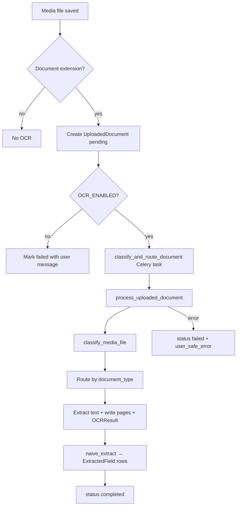

# OCR pipeline

> ⚠️ **SUSPENDED — future functionality.** The OCR / document-to-graph ingestion pipeline is
> currently **paused and not part of the active deployment**: `OCR_ENABLED` defaults to
> `false` (document uploads still succeed but no OCR runs), and the `ocr-worker` service has
> been removed from the running Docker stacks (definition preserved in git history). This
> document is retained for when the pipeline is revived. To re-enable, set `OCR_ENABLED=true`
> and restore the `ocr-worker` service.

This document describes how document text extraction runs in HeritageGraph: triggers, the unified processing function, classification, engine routing, persistence, and the API. For infrastructure (Celery, Docker, requirements) and history, see [OCR_INTEGRATION_SUMMARY.md](documentation/internal/OCR_INTEGRATION_SUMMARY.md).

## Purpose

When contributors upload PDFs or images, the system can extract text, store per-page results, produce lightweight structured **suggestions** (`ExtractedField`), and expose status and suggestions to the UI. Processing is asynchronous via Celery (synchronous in development if `CELERY_TASK_ALWAYS_EAGER` is enabled).

## End-to-end flow

## Entry points

1. **Automatic (primary)** — `post_save` on `heritage_data.Media` (`apps/document_processing/signals.py`):
   - Runs only for **new** `Media` rows.
   - File name must end with: `.pdf`, `.jpg`, `.jpeg`, `.png`, `.tiff`, `.tif`, `.webp`.
   - Creates an `UploadedDocument` linked to the media (`OneToOne`), copies `submission` / `cultural_entity` from the media, sets `status=pending`, then calls `classify_and_route_document.delay(str(doc.id))`.
   - If `OCR_ENABLED` is false, the document is marked failed immediately (no task).
   - Failures while starting OCR are logged; they do **not** break the `Media` save.

2. **Direct upload API** — `POST …/ocr-documents/upload/` (`UploadedDocumentViewSet.upload` in `views.py`):
   - Creates `Media` (and thus the same signal path) or ties to an existing flow per serializer; returns `media_id`, `uploaded_document_id`, and `status`.

3. **Retry** — `POST …/ocr-documents/<uuid>/retry/` (staff or permitted users):
   - Sets `status` to `pending` and re-queues `classify_and_route_document`.

## Task layer

- **Main task:** `classify_and_route_document` (`tasks.py`) — the only path that should run in production. It calls `process_uploaded_document(document_id=…)`.
- **Other named tasks** (`extract_text_pdfplumber`, `extract_text_tesseract`, `extract_structured_fields`, etc.) are **compatibility entrypoints**; they all delegate to the same `process_uploaded_document` for a single, unified pipeline.

## Unified pipeline: `process_uploaded_document`

Implemented in `apps/document_processing/services/pipeline.py`.

1. **Guard** — If `OCR_ENABLED` is false (via `get_ocr_settings()`), mark failed and exit.
2. **Reset** — Clears previous `raw_text`, errors, `DocumentPage` rows (and their `OCRResult` rows), and `ExtractedField` rows for a clean re-run.
3. **Status** — Sets `processing`, records `processing_started`.
4. **Size check** — Enforces `OCR_MAX_FILE_BYTES` by streaming the file.
5. **Classification** — `classify_media_file` updates `document_type` and `classification_confidence` on the `UploadedDocument`.
6. **Extraction** — Branches on `document_type` (see below).
7. **Validation** — If extractors return empty text, the pipeline may try **vision rescue** for some image types; if still empty, raises so the document is marked failed.
8. **Structured output** — `naive_extract(text=raw_text)` creates `ExtractedField` records.
9. **Success** — `status=completed`, `processing_finished` set, `raw_text` saved.

**Errors**

- `pytesseract.TesseractNotFoundError` → failed with a clear user-facing message about missing Tesseract.
- Any other exception → failed with a generic user-safe message; details in `error_message` for operators.

## Classification: `classify_media_file`

File: `apps/document_processing/services/classifier.py`.

The file is copied to a temp path, then:

- **PDF** — `pdfplumber` samples the first N pages (N = `OCR_MAX_PAGES_PER_DOCUMENT`) and computes a **text ratio** heuristic (`_pdf_text_ratio`).  
  - Ratio ≥ `0.35` → `pdf_digital` (higher confidence when more text is found).  
  - Otherwise → `pdf_scanned`.
- **Raster images** (by extension or `image/*` mime) → `image_print` (handwriting vs inscription is **not** inferred from the file alone in v1).
- **Fallback** → `image_print` with low confidence.

So for normal uploads, **`image_handwritten` and `image_inscription` are not produced by the classifier**. The pipeline still contains branches for those types if the type is set otherwise (e.g. manual admin edit or future logic).

## Extraction routing

| `document_type`   | Extraction path | Notes |
|------------------|-----------------|--------|
| `pdf_digital`    | `extract_pdf_digital` | `pdfplumber` per page; `OCRResult` engine `pdfplumber`. |
| `pdf_scanned`    | `extract_raster_ocr`  | PDF rendered to images (`pdf2image` @ 200 DPI), then Tesseract per page. |
| `image_print`    | `extract_raster_ocr`  | Single image → Tesseract. |
| `image_handwritten` | `extract_handwritten` | v1: **same as** `extract_raster_ocr` with label `htr_v1_raster` (TrOCR not wired here). |
| `image_inscription` | `run_vision_rescue` | Claude Vision; on failure, falls back to `extract_raster_ocr` as `inscription_fallback`. |
| **else**         | `extract_raster_ocr` | Default raster path. |

**Empty text recovery** — If the routed path still yields no text, for `image_inscription`, `image_print`, or `image_handwritten` the pipeline attempts `run_vision_rescue` once (if configured).

## Engines (implementation details)

### Digital PDF — `services/pdf.py`

- Uses `pdfplumber` to extract text per page (up to `max_pages`).
- Per page: `DocumentPage` + `OCRResult` with engine `pdfplumber`, confidence `0.95` if the page has text, else `0.0`.
- Returns joined non-empty pages.

### Raster / Tesseract — `services/raster_ocr.py`

- **Tesseract** configuration tries **Devanagari + English** first (`-l deva+eng`, `--oem 1 --psm 3`), then **English** only.
- Word-level confidences from `image_to_data` are averaged; compared to `OCR_CONFIDENCE_THRESHOLD` from settings.
- **PDF:** `pdf2image` + Poppler: rasterizes up to `max_pages`, 200 DPI; each page stored with engine `tesseract` and `metadata` including `source` (e.g. `raster_ocr`, `inscription_fallback`).
- **Image:** one page, same OCR path.

### Handwriting — `services/htr.py`

- Delegates to `extract_raster_ocr` (Tesseract). Documented in code as v1; model-based HTR is a future/optional worker concern.

### Vision rescue — `services/vision_rescue.py`

- Requires `ANTHROPIC_API_KEY`.
- Enforces a per-document cap: `OCR_CLAUDE_VISION_MAX_CALLS_PER_DOCUMENT` (increments `claude_vision_invocations` on the `UploadedDocument`).
- PDF: only the **first page** is rasterized and sent.
- Optional Tesseract “pre-pass” on the same image is included in the prompt.
- Model: `claude-3-5-sonnet-20241022` (as coded); response stored as `OCRResult` engine `claude_vision`.

### “NER” / structured fields — `services/ner.py`

- v1 **`naive_extract`**: regex years (`date_year_hint`) and a first-line title hint (`title_line_hint`) for short text — not a full NER/LLM stack.

## Persistence — `services/persistence.py`

- `upsert_page` — `DocumentPage` by `(document, page_number)` with `raw_text` and numeric `confidence`.
- `append_ocr_result` — append-only `OCRResult` per engine pass (audit trail).

## Runtime settings — `services/ocr_settings.py`

| Setting | Role |
|--------|------|
| `OCR_ENABLED` | Master switch. |
| `OCR_CONFIDENCE_THRESHOLD` | Tesseract pass/fail vs trying next config (not EasyOCR in this path). |
| `OCR_MAX_PAGES_PER_DOCUMENT` | Classifier sample + max pages to extract. |
| `OCR_MAX_FILE_BYTES` | Upload/processing size limit. |
| `OCR_CLAUDE_VISION_MAX_CALLS_PER_DOCUMENT` | Vision API budget per document. |
| `TESSERACT_PATH` | Optional path to the `tesseract` binary. |

Environment variables for Celery/Redis and keys are also described in `.env.example` and the integration summary.

## HTTP API (DRF)

Mounted under the app’s URL include; router basename is `ocr-document` (e.g. `/data/ocr-documents/…` depending on `urls.py` prefix).

| Method | Path (relative to mount) | Purpose |
|--------|---------------------------|---------|
| `POST` | `ocr-documents/upload/` | Upload; creates `Media` / `UploadedDocument` and returns ids + status. |
| `GET`  | `ocr-documents/<uuid>/`  | Status (via retrieve/list and serializer fields). |
| `GET`  | `ocr-documents/<uuid>/suggestions/` | Suggestion map from `ExtractedField` rows. |
| `POST` | `ocr-documents/<uuid>/retry/` | Requeue processing (permission-gated). |

**Permissions** — Staff see all documents; non-staff users see documents tied to their submissions or cultural entities (`IsStaffOrDocumentOwner`).

## Operational notes

- **Development** — `CELERY_TASK_ALWAYS_EAGER=True` runs tasks in-process (see settings).
- **Production** — Run Redis + a Celery worker with OCR dependencies (`requirements-ocr.txt` / `ocr-worker` image) so Tesseract and optional vision keys are available.
- **EasyOCR** — Listed in `requirements-ocr.txt` but the current raster path does **not** call EasyOCR; the integration summary tracks it as a future fallback.

## Source map (pipeline-related)

| Area | Path |
|------|------|
| Orchestration | `heritage_graph/apps/document_processing/services/pipeline.py` |
| Classification | `…/services/classifier.py` |
| PDF text | `…/services/pdf.py` |
| Tesseract / raster | `…/services/raster_ocr.py` |
| Handwriting v1 | `…/services/htr.py` |
| Vision | `…/services/vision_rescue.py` |
| Suggestions | `…/services/ner.py` |
| Tasks | `…/tasks.py` |
| Signal | `…/signals.py` |
| API | `…/views.py`, `…/serializers.py`, `…/urls.py` |
| Models | `…/models.py` |

This reflects the v1 implementation: end-to-end wiring is in place; handwriting-specific models, EasyOCR fallback in code paths, and rich NER are still evolution items (see [OCR_INTEGRATION_SUMMARY.md](documentation/internal/OCR_INTEGRATION_SUMMARY.md) **Current Limitations**).
