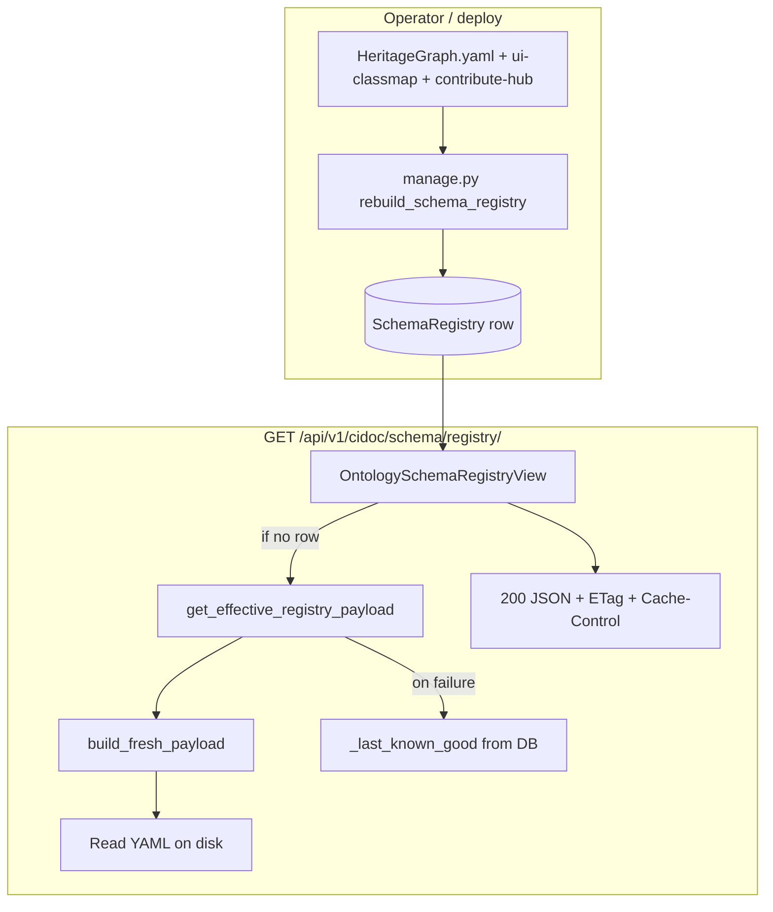

# Backend schema registry (Django)

This document describes **how the Django backend** loads LinkML YAML, materializes a **registry JSON document**, stores it in the database, and serves it over HTTP. It complements the shorter summary in [YAML-driven schema](yaml-driven-schema.md).

---

## Scope: two different “schema” layers

1. **Business data (entities)**  
   Person, structures, events, and similar records live in normal Django models and migrations. Editing `ontology/HeritageGraph.yaml` does **not** automatically alter those tables or rewrite rows. Changing the ontology may require separate migrations if you add new persisted fields on typed models.

2. **Ontology registry snapshot (API payload)**  
   The schema registry is a **derived JSON document** (classes, enums, UI-oriented metadata, contribute hub, hashes, version). It is built from YAML (and a few auxiliary files), optionally cached in memory, and **persisted** in `cidoc_schema_registry` as the latest `SchemaRegistry` row. Clients read this via **`GET /api/v1/cidoc/schema/registry/`** (no authentication required; same shape as the committed `registry.generated.*` snapshot).

---

## Primary code locations

| Piece | Path |
|-------|------|
| Registry document construction (LinkML → dict) | `heritage_graph/apps/cidoc_data/ontology_builder.py` |
| Path resolution, `build_fresh_payload`, in-process cache, degraded fallback | `heritage_graph/apps/cidoc_data/linkml_loader.py` |
| HTTP handler (DB-first, ETag, cache headers) | `heritage_graph/apps/cidoc_data/views.py` → `OntologySchemaRegistryView` |
| Persist snapshot | `heritage_graph/apps/cidoc_data/management/commands/rebuild_schema_registry.py` |
| Model | `heritage_graph/apps/cidoc_data/models.py` → `SchemaRegistry` |

URL routes include `/cidoc/schema/registry/` and `/api/v1/cidoc/schema/registry/` (see `heritage_graph/apps/cidoc_data/urls.py`).

---

## Data model: `SchemaRegistry`

Table: `cidoc_schema_registry`.

- **`registry_json`** — Full API payload (classes, enums, `contribute_hub`, `schema_version`, `core_hash`, `generated_at`, etc.).
- **`schema_version`** — Content hash / version string used for ETag and drift detection (see `compute_schema_version` in `ontology_builder.py`).
- **`core_hash`** — Hash over core inputs (main YAML plus optional `tools/ui-classmap.yaml` and `tools/contribute-hub.yaml` as joined in `build_fresh_payload`).
- **`extension_hash`** — Optional; when `HERITAGEGRAPH_SCHEMA_EXTENSION_PATH` points at a file, its SHA-256 prefix is stored.
- **`created_at`** — Rows are **append-only** in practice: each rebuild **creates** a new row. The API uses the **latest** row by `created_at` descending.

The model docstring describes the row as **last materialized ontology registry JSON for cold start / degraded mode** — meaning it is both the **fast path** for normal requests and a **fallback** when live YAML build fails.

---

## Building a fresh payload: `build_fresh_payload()`

Defined in `linkml_loader.py`. It:

1. Resolves the main schema path: `HERITAGEGRAPH_SCHEMA_PATH`, or by default `ontology/HeritageGraph.yaml` relative to `BASE_DIR`’s parent layout as implemented (see `_schema_path()`).
2. Optionally includes an **extension** file via `HERITAGEGRAPH_SCHEMA_EXTENSION_PATH`.
3. Calls `build_registry_document(schema_path)` from `ontology_builder.py` (LinkML `SchemaView` when available, otherwise a PyYAML-oriented path) to produce **`classes`** and **`enums`**.
4. Computes **`schema_version`** via `compute_schema_version(...)`.
5. Reads **`tools/ui-classmap.yaml`** and **`tools/contribute-hub.yaml`** (when present) for `core_hash` and for **`contribute_hub`** via `load_contribute_hub_payload`.
6. Returns a single dict including at least:  
   `schema_version`, `core_hash`, `extension_hash`, `generated_at`, `tenant_id`, `degraded` (false for a successful fresh build), `classes`, `enums`, `contribute_hub`.

If the main YAML file is missing, `build_fresh_payload` raises (e.g. `FileNotFoundError`), which propagates to callers that handle it (see below).

---

## In-process cache: `get_effective_registry_payload()`

Also in `linkml_loader.py`. Intended for code paths that need a **live** build (not the HTTP view’s DB-first path):

1. Calls `build_fresh_payload()`. On **any** exception, logs the error and delegates to **`_last_known_good_or_raise()`** (see Degraded mode).
2. If an in-memory cache exists and `fresh["schema_version"] == _CACHE_VERSION`, returns the cached dict (same version as previous successful build).
3. Otherwise updates the module-level cache and returns the new payload.

**Note:** Each successful invocation still runs `build_fresh_payload()` first; the cache mainly avoids retaining stale pointers when the version string is unchanged. **Request latency for the public registry endpoint is dominated by the database snapshot path** (see next section), not this function, in typical deployments.

---

## Degraded mode: `_last_known_good_or_raise()`

When `build_fresh_payload()` fails inside `get_effective_registry_payload()`:

1. Load the latest `SchemaRegistry` row (`order_by("-created_at").first()`).
2. If `registry_json` is non-empty, return a **copy** of that JSON and set **`degraded: true`** if not already present.
3. If there is no usable row, raise `RuntimeError` (“No schema cache available and YAML load failed”).

So **degraded** means: “YAML build failed; you are seeing the last persisted snapshot.” Any consumer (e.g. the Next.js app) can surface a warning when `degraded === true`.

---

## HTTP API: `OntologySchemaRegistryView`

`GET` is **public** (`AllowAny`): callers do not need a Bearer token. Optional `Authorization: Bearer` is still accepted if sent (e.g. the Next.js client).

### Resolution order

1. **Database first (preferred)**  
   `SchemaRegistry.objects.order_by("-created_at").first()`.  
   If the row exists and `registry_json` is truthy, the response body is **exactly that JSON** (copied to a dict). **No YAML parsing** happens on this path — good for steady-state production traffic.

2. **Live build**  
   If there is no row or `registry_json` is empty, call `get_effective_registry_payload(tenant=None)`. That may build from YAML or fall back to degraded DB content as above.

3. **503**  
   If the live path raises (e.g. no DB snapshot and YAML build failed), return JSON  
   `{"error": "Schema unavailable and no last-known-good cache exists."}`  
   with status **503 Service Unavailable**.

### Caching headers

- **`ETag`**: `"<schema_version>"` (quoted value matches HTTP semantics).
- **`If-None-Match`**: If the client sends a matching ETag, respond **304 Not Modified** with the same `ETag` and `Cache-Control`.
- **`Cache-Control`**: `private`, `max-age=<HERITAGEGRAPH_SCHEMA_CACHE_TTL>` (default **60** seconds from settings).

---

## Operations: `rebuild_schema_registry`

Management command (run from the `heritage_graph` Django project directory):

```bash
python manage.py rebuild_schema_registry
```

Steps:

1. **`invalidate_registry_cache()`** — Clears the module-level cache in `linkml_loader.py` so the next in-process build does not serve stale memory.
2. **`build_fresh_payload()`** — Full rebuild from disk.
3. **`SchemaRegistry.objects.create(...)`** — Inserts a **new** row with `registry_json=payload` and related hashes/version fields.

After deploy or ontology edits, operators should run this so the **DB snapshot** matches the committed YAML (and auxiliary files). The HTTP endpoint will then serve the new document without relying on a cold-start live parse.

---

## Configuration (environment / settings)

| Variable | Role |
|----------|------|
| `HERITAGEGRAPH_SCHEMA_PATH` | Override path to main LinkML file (default resolves under project layout to `ontology/HeritageGraph.yaml`). |
| `HERITAGEGRAPH_SCHEMA_EXTENSION_PATH` | Optional extra schema file; included in versioning / `extension_hash`. |
| `HERITAGEGRAPH_SCHEMA_CACHE_TTL` | `max-age` for `Cache-Control` on the registry response (default `60`). |

See `.env.example` for project conventions.

---

## Verification checklist

| Goal | How |
|------|-----|
| Confirm API payload matches expectations | `GET /api/v1/cidoc/schema/registry/` (no auth required); inspect `schema_version`, spot-check `classes` / `enums`. |
| Confirm DB row | Django shell or SQL on `cidoc_schema_registry`: latest `created_at`, `registry_json` size/content. |
| Compare to offline generator | `registry.generated.json` from `make ontology` should be broadly aligned with API output for the same commit (same YAML + classmap + contribute hub). |
| After YAML change | `make ontology` (frontend snapshot + CI), then `python manage.py rebuild_schema_registry` on the server. |

---

## Summary diagram (logical flow)



---

## Related documentation

- [YAML-driven schema](yaml-driven-schema.md) — user and developer overview, troubleshooting, env vars.
- [YAML schema workflow (developer guide)](guides/developers/yaml-schema-workflow.md) — end-to-end workflow including CI and Next.js.
