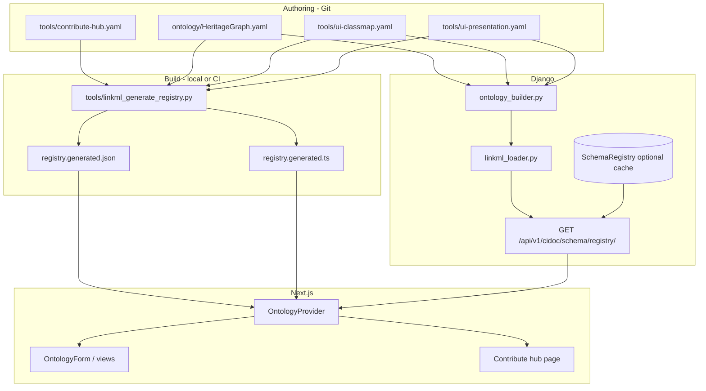

# YAML-driven schema: end-to-end developer workflow

This guide describes **how the HeritageGraph ontology flows from LinkML YAML into running forms and APIs**, what you must do at each step, and how the pieces fit together. It is aimed at **developers** maintaining the schema, backend, or frontend.

For a shorter overview, see [YAML-driven schema (user & developer guide)](../../yaml-driven-schema.md). For field-level form mechanics, the repository root `FORMS.md` remains the detailed reference until fully merged into these docs.

---

## Table of contents

1. [Goals and constraints](#1-goals-and-constraints)
2. [Architecture at a glance](#2-architecture-at-a-glance)
3. [The three YAML sources of truth](#3-the-three-yaml-sources-of-truth)
4. [Build time: generator and emitted artifacts](#4-build-time-generator-and-emitted-artifacts)
5. [Python registry builder](#5-python-registry-builder)
6. [Runtime: Django schema registry API](#6-runtime-django-schema-registry-api)
7. [Runtime: Next.js `OntologyProvider`](#7-runtime-nextjs-ontologyprovider)
8. [Registry payload shape](#8-registry-payload-shape)
9. [Aligning Django with the schema](#9-aligning-django-with-the-schema)
10. [Required actions by task](#10-required-actions-by-task)
11. [Deployment and database cache](#11-deployment-and-database-cache)
12. [CI and drift prevention](#12-ci-and-drift-prevention)
13. [Graceful failure modes in the UI](#13-graceful-failure-modes-in-the-ui)
14. [Troubleshooting](#14-troubleshooting)
15. [Reference: key files](#15-reference-key-files)

---

## 1. Goals and constraints

**Goals**

- **One semantic source** for domain structure: classes, slots, enums, RDF `class_uri` / `slot_uri`.
- **No hand-maintained TypeScript registry** for entity definitions; the UI consumes a **generated** registry plus an optional **live** refresh from the API.
- **Predictable offline behavior**: committed `registry.generated.*` so the app works before sign-in or when the API is down (with clear UX).

**Constraints**

- **Django models remain the system of record** for persisted data. LinkML describes the intended shape; serializers expose `fields = '__all__'` (or explicit lists) that must stay aligned with generated **field keys**.
- The schema registry HTTP endpoint is **public** (no `Bearer` required). The Next.js app still uses the **bundled snapshot** when the user is not signed in or when `OntologyProvider` does not call the API (see section 7).

---

## 2. Architecture at a glance



**End-to-end path**

1. Editors change **LinkML** (and optionally **ui-classmap** / **contribute-hub**).
2. **`make ontology`** runs the generator; **commit** `registry.generated.json` and `registry.generated.ts`.
3. **Django** rebuilds the same logical document at runtime (or serves a **cached** `SchemaRegistry` row).
4. **Signed-in** browsers (per `OntologyProvider`) fetch the live API; others use the **embedded snapshot** from `registry.generated.ts`. The API itself allows anonymous `GET` if you call it directly (e.g. `curl`).

---

## 3. YAML sources of truth

| File | Role |
|------|------|
| `ontology/HeritageGraph.yaml` | **LinkML ontology**: `classes`, `slots`, `enums`, inheritance (`is_a`), `class_uri`, `slot_uri`, slot/class **annotations** for UI hints (`ui_section`, `ui_order`, `ui_columns`, etc.). **Cardinality** can be expressed with `minimum_cardinality` / `maximum_cardinality` on slots or `slot_usage`; these surface as `minimumCardinality` / `maximumCardinality` on registry fields. |
| `tools/ui-classmap.yaml` | **UI routing map**: each row links a **LinkML class name** to a stable **registry key** (used in URLs like `/contribute/<key>`), **label**, **`apiEndpoint`** (must match Django URL registration — usually `heritage_graph/apps/cidoc_data/urls.py` for CIDOC types; **`CulturalEntity`** uses `/data/api/cultural-entities/` under `heritage_data`), **icon**, **category**, **navigable**. Only classes listed here appear in the generated registry. |
| `tools/ui-presentation.yaml` | **Optional presentation overrides**: keyed by **LinkML slot name**, same keys as slot annotations (`ui_section`, `ui_order`, `ui_placeholder`, `ui_widget`). Merged **after** LinkML annotations so presentation can be edited without changing the ontology file. |
| `tools/contribute-hub.yaml` | **Contribute landing only**: `hubCategories` (tabs), `intents` (`registryKey`, `route`, `emoji`, copy, `difficulty`, `hubCategory`), `quickStart`. **`registryKey`** must match a **`key`** in `ui-classmap.yaml`. |

**Why split files?**

- LinkML stays portable and standards-oriented.
- **Classmap** avoids hardcoding API paths and keys in Python for every new type.
- **Presentation** keeps purely UI tweaks out of semantic YAML when desired.
- **Contribute hub** separates marketing/UX copy from ontology semantics.

**Repository rule:** There is **no** second ontology copy at the repo root. A root file named `Heritagegraph.yaml` will cause **`make ontology-check`** to fail — the only canonical path is `ontology/HeritageGraph.yaml`.

---

## 4. Build time: generator and emitted artifacts

**Commands** (from repository root):

```bash
# Regenerate JSON + TS snapshot
make ontology
# Equivalent:
python3 tools/linkml_generate_registry.py
```

**Verify committed artifacts match sources** (used in CI):

```bash
make ontology-check
# Fails if registry.generated.* is stale OR if repo-root Heritagegraph.yaml exists
# Equivalent check (generator only):
python3 tools/linkml_generate_registry.py --check
```

**Outputs**

| Output | Purpose |
|--------|---------|
| `heritage_graph_ui/src/lib/ontology/registry.generated.json` | Pretty-printed JSON; source of truth for diff review. |
| `heritage_graph_ui/src/lib/ontology/registry.generated.ts` | `export const generatedOntologyRegistry = ...` — imported by `OntologyProvider` as the **baseline** snapshot. |

The generator loads `build_registry_document()` from `apps.cidoc_data.ontology_builder`, merges **`contribute_hub`** from `tools/contribute-hub.yaml`, attaches **`registry_jsonschema`** (per-class JSON Schema bundle for validation), and writes a single payload whose **`schema_version`** hashes schema + classmap + presentation + hub + emitted classes/enums (see `compute_schema_version` in `ontology_builder.py`).

**Frontend package script** (optional):

```bash
cd heritage_graph_ui && npm run generate:ontology
```

---

## 5. Python registry builder

**Module**: `heritage_graph/apps/cidoc_data/ontology_builder.py`

**Responsibilities**

1. **Resolve classes to emit** — Iterate `tools/ui-classmap.yaml`; for each row, if the LinkML class exists, compute **induced slots** (LinkML `SchemaView` when available, else PyYAML inheritance walk).
2. **Map slot ranges to UI field types** — e.g. enum → `select`, LinkML class → `relation`, primitives → `text` / `number` / `date`, etc.
3. **Emit `enums`** — Permissible values with labels for the global `enums` map.
4. **Inline `options` on `select` fields** — For each field whose range is an enum name, copy `enums[EnumName]` into `field.options` and set `field.enum_range` for debugging.
5. **Wire relations** — Set `relationEndpoint` from the target class’s `apiEndpoint` in the classmap when the slot range is another mapped class.
6. **Apply annotations** — Slot and class annotations override section, order, placeholder, widget, columns, etc.
7. **Merge presentation** — Optional `tools/ui-presentation.yaml` `slots.<slotName>` overrides the same UI keys (takes precedence over LinkML annotations for those keys).
8. **Cardinality** — Emit `minimumCardinality` / `maximumCardinality` on fields when present on the slot or `slot_usage`.

**Versioning**

- `GENERATOR_VERSION` in `ontology_builder.py` participates in hashing when you need to invalidate snapshots after builder logic changes.

---

## 6. Runtime: Django schema registry API

**Loader**: `heritage_graph/apps/cidoc_data/linkml_loader.py`

- **`build_fresh_payload()`** — Calls `build_registry_document()`, attaches **`contribute_hub`**, computes **`schema_version`**, **`core_hash`**, **`generated_at`**, and returns the same shape the frontend expects.
- **In-process cache** — Invalidates when `schema_version` changes.
- **Fallback** — If YAML fails, can serve a **degraded** last-known-good row from the database (see below).

**View**: `OntologySchemaRegistryView` in `heritage_graph/apps/cidoc_data/views.py`

- **`GET /api/v1/cidoc/schema/registry/`** (also under `/cidoc/schema/registry/` depending on URL config).
- **Default (production):** serves the latest **`SchemaRegistry.registry_json`** row when present (fast path, avoids parsing YAML on every request).
- **Fresh YAML:** when **`DEBUG`** is true, query param **`?fresh=1`** is set, or **`HERITAGEGRAPH_SCHEMA_REGISTRY_PREFER_FRESH`** is enabled (see `.env.example`), the view builds from **live LinkML** via `get_effective_registry_payload`, falling back to the DB row if YAML fails.
- Response header **`X-HG-Schema-Source`** is `cache` or `yaml` so clients and operators can see which path was used.
- **ETag** = quoted `schema_version`; supports **`304 Not Modified`** via `If-None-Match`.
- **`Cache-Control`**: `private`, `max-age` from `HERITAGEGRAPH_SCHEMA_CACHE_TTL`.

**Authentication**

- **`OntologySchemaRegistryView`** uses **`AllowAny`**: no token required. Clients may send optional **`Authorization: Bearer`** (e.g. NextAuth Google ID token); it is ignored for authorization.
- Baseline UX still uses the **generated** file when the app does not fetch (users who are not signed in, per `OntologyProvider`).

---

## 7. Runtime: Next.js `OntologyProvider`

**Files**

- `heritage_graph_ui/src/lib/ontology/OntologyProvider.tsx`
- `heritage_graph_ui/src/lib/ontology/load-registry.ts`

**Behavior**

1. **Baseline** — `normalizeRegistry(generatedOntologyRegistry)` so `contribute_hub` is always defined (empty object if missing). The snapshot also carries **`registry_jsonschema`** when regenerated, and optional **`schema_version`** for display.
2. **No `NEXT_PUBLIC_API_URL`** — Keep baseline; `degradedReason: unconfigured_api` (see `ApiBaseWarning` elsewhere).
3. **Not signed in** — Baseline only; `degradedReason: unauthenticated`.
4. **Signed in** — `GET /api/v1/cidoc/schema/registry/` (Bearer optional); replace registry; set `schema_version`; if API marks `degraded`, surface it.
5. **Fetch error** — Fall back to generated snapshot; `degraded: true`, `degradedReason: snapshot` (banner in dashboard).

**Consumers**

- **`ContributeOntologyForm`** — Resolves `ontologyKey` → `OntologyClass`; if missing, **`OntologyUnavailablePanel`** explains causes and fixes.
- **`OntologyForm`** — Renders fields; handles empty field list, load errors, and empty select options with actionable copy.
- **Contribute hub page** — Builds cards from `contribute_hub` × `registry.classes`.
- **`formRole`** — Optional prop on `OntologyProvider` (`curator` | `reviewer` | `ontology_engineer`) reserved for role-specific form affordances.

---

## 8. Registry payload shape

Conceptual JSON (see OpenAPI: `specs/004-yaml-driven-schema/contracts/openapi-schema-registry.v1.yaml`):

```json
{
  "schema_version": "<opaque hash>",
  "tenant_id": null,
  "degraded": false,
  "classes": {
    "<registryKey>": {
      "key": "...",
      "label": "...",
      "labelPlural": "...",
      "description": "...",
      "classUri": "...",
      "icon": "...",
      "apiEndpoint": "/cidoc/.../",
      "category": "tangible | conceptual | event | social | spatiotemporal | provenance | kumari",
      "navigable": true,
      "sections": [{ "key": "basic", "label": "..." }],
      "fields": [
        {
          "key": "<django_field_name>",
          "label": "...",
          "type": "text | select | relation | ...",
          "options": [{ "value": "", "label": "", "description": "" }],
          "enum_range": "EnumNameIfSelect",
          "relationEndpoint": "/cidoc/.../",
          "slot_uri": "...",
          "section": "...",
          "order": 1,
          "required": false,
          "minimumCardinality": 1,
          "maximumCardinality": 3
        }
      ],
      "columns": [...]
    }
  },
  "enums": { "EnumName": [...] },
  "registry_jsonschema": {
    "version": 1,
    "byClassKey": {
      "<registryKey>": { "$schema": "https://json-schema.org/draft/2020-12/schema", "type": "object", "properties": {}, "required": [], "additionalProperties": true }
    }
  },
  "contribute_hub": {
    "hubCategories": [...],
    "intents": [...],
    "quickStart": ["structure", "source", ...]
  }
}
```

---

## 9. Aligning Django with the schema

The UI posts **`{ [field.key]: value }`**. DRF serializers must accept those keys.

**Checklist for a new field**

1. Add **slot** in `HeritageGraph.yaml` and add it to the class’s `slots` / `slot_usage`.
2. Add **model field** on the corresponding Django model with the **same name** as the slot key.
3. Expose it via **serializer** (`fields = '__all__'` or explicit list including the new name).
4. Run **`make ontology`** and commit generated files.
5. **`makemigrations` / `migrate`**.

**Checklist for a new entity type**

1. LinkML **class** + slots + enums as needed.
2. **`tools/ui-classmap.yaml`** row (`linkml`, `key`, `apiEndpoint`, labels, category).
3. Django **model**, **serializer**, **ViewSet**, **`router.register`** in `urls.py`.
4. **`tools/contribute-hub.yaml`** intents (if it should appear on the contribute hub).
5. Next.js routes under `contribute/<slug>` and `knowledge/<domain>` as needed (often thin wrappers around `ContributeOntologyForm`).
6. **`make ontology`**, commit, deploy, **`rebuild_schema_registry`** if you use DB cache (see below).

**Cultural entity (`registry` key `entity`)** — Defined in LinkML as class **`CulturalEntity`** with slots `name`, `category`, `description`. Maps to **`/data/api/cultural-entities/`** (Django app `heritage_data`). Contribute page uses the same `OntologyForm` as other registry types.

---

## 10. Required actions by task

### A. Add an enum value

1. Edit `enums.<Name>.permissible_values` in `HeritageGraph.yaml`.
2. `make ontology` — updates `enums` and any **`select`** `options` on fields using that enum.
3. If Django uses **choices**, update the model choices to match **permissible value strings**.
4. Migrate if needed.

### B. Add a slot to an existing class

1. Define slot under global `slots:` (with `range`, `slot_uri`, descriptions).
2. Add slot name to `classes.<ClassName>.slots` or `slot_usage`.
3. Add Django field **same name**.
4. `make ontology`, migrate, test form.

### C. New contribute card only (copy / route / difficulty)

1. Edit **`tools/contribute-hub.yaml`** (`intents`, `hubCategories`, `quickStart`).
2. `make ontology` (hub is hashed into `schema_version` and embedded in generated files).

### D. Change labels or API path for a type

1. Prefer **`tools/ui-classmap.yaml`** for `label`, `apiEndpoint`, `category`, `icon`.
2. `make ontology`.

---

## 11. Deployment and database cache

**Environment** (see `.env.example`)

| Variable | Role |
|----------|------|
| `HERITAGEGRAPH_SCHEMA_PATH` | Path to LinkML file (default `ontology/HeritageGraph.yaml`). |
| `HERITAGEGRAPH_SCHEMA_EXTENSION_PATH` | Optional extension ontology (future multi-tenant). |
| `HERITAGEGRAPH_SCHEMA_CACHE_TTL` | `Cache-Control` max-age for registry responses. |
| `HERITAGEGRAPH_SCHEMA_REGISTRY_PREFER_FRESH` | If true, registry API prefers live YAML over the DB snapshot (see section 6). |

**SchemaRegistry database rows**

- The API may return the latest **`SchemaRegistry.registry_json`** without re-parsing YAML. The row also stores **`jsonschema_blob`** (copy of **`registry_jsonschema`**) for tooling that reads the DB directly.
- After shipping YAML or generator changes, operators should run:

```bash
cd heritage_graph
python manage.py rebuild_schema_registry
```

This **invalidates stale DB snapshots** so clients do not see old `classes`/`contribute_hub` until the next manual rebuild.

**Frontend**

- `NEXT_PUBLIC_API_URL` must point at the Django origin for live registry fetch.

---

## 12. CI and drift prevention

- **Workflow**: `.github/workflows/ontology-registry.yml` runs **`make ontology-check`** when ontology-related paths change (includes generator `--check` and rejects a repo-root `Heritagegraph.yaml`).
- **Local**: `make ontology-check` before opening a PR that touches schema, `tools/ui-classmap.yaml`, `tools/ui-presentation.yaml`, `tools/contribute-hub.yaml`, or generated files.

---

## 13. Graceful failure modes in the UI

| Situation | User-facing behavior |
|-----------|------------------------|
| Registry class missing for route key | `heritage_graph_ui/src/components/ontology/OntologyUnavailablePanel.tsx` — explains snapshot vs auth vs misconfiguration; **Retry** calls `reload()`. |
| Class exists but **zero fields** | `OntologyForm` amber alert — schema generation / classmap issue. |
| **Select** with no `options` | Inline message; references `enum_range` and `make ontology`. |
| Edit load fails | Destructive alert with API message + typical causes (permission, deleted row, session). |
| Contribute hub resolves **no intents** | Dedicated alert on contribute page; distinguishes empty hub payload vs key mismatch. |
| API down / fetch error | Fallback snapshot + optional **DegradedSchemaBanner** (`DegradedSchemaBanner.tsx`). |

---

## 14. Troubleshooting

| Symptom | Likely cause | What to do |
|---------|----------------|------------|
| Banner: fallback snapshot | Not signed in, API URL wrong, or fetch failed | Set `NEXT_PUBLIC_API_URL`, sign in, check backend logs. |
| `503` on registry | YAML parse error and no `SchemaRegistry` row | Fix YAML; run `rebuild_schema_registry`. |
| Form missing field | Slot not on class, or not in classmap | LinkML + `ui-classmap`; `make ontology`. |
| Dropdown empty | Enum not linked to slot range, or enum empty | Check `range` on slot; regenerate. |
| Contribute page empty | `contribute_hub` missing from payload or intent keys ≠ registry keys | Hub YAML + classmap alignment; rebuild DB cache. |
| Stale schema in prod | Old `SchemaRegistry` row | `rebuild_schema_registry` after deploy. |

---

## 15. Reference: key files

| Area | Path |
|------|------|
| LinkML ontology | `ontology/HeritageGraph.yaml` |
| UI class map | `tools/ui-classmap.yaml` |
| UI presentation overrides | `tools/ui-presentation.yaml` |
| Contribute hub | `tools/contribute-hub.yaml` |
| Generator | `tools/linkml_generate_registry.py` |
| Builder | `heritage_graph/apps/cidoc_data/ontology_builder.py` |
| Loader / payload | `heritage_graph/apps/cidoc_data/linkml_loader.py` |
| API view | `heritage_graph/apps/cidoc_data/views.py` (`OntologySchemaRegistryView`) |
| Management command | `heritage_graph/apps/cidoc_data/management/commands/rebuild_schema_registry.py` |
| OpenAPI contract | `specs/004-yaml-driven-schema/contracts/openapi-schema-registry.v1.yaml` |
| Frontend provider | `heritage_graph_ui/src/lib/ontology/OntologyProvider.tsx` |
| Frontend fetch | `heritage_graph_ui/src/lib/ontology/load-registry.ts` |
| Generated snapshot | `heritage_graph_ui/src/lib/ontology/registry.generated.ts` |
| Types | `heritage_graph_ui/src/lib/ontology/types.ts` |
| Client validation helper | `heritage_graph_ui/src/lib/ontology/validate-registry-payload.ts` |
| Form IR types (MT7) | `heritage_graph_ui/src/lib/ontology/form-ir.ts` |
| Step UI (extracted) | `heritage_graph_ui/src/components/ontology-form/step-nav.tsx`, `progress-bar.tsx` |

---

*Last updated: April 2026 — YAML-driven registry, `registry_jsonschema`, presentation YAML, cultural entity in LinkML, registry API fresh/cache behavior.*
