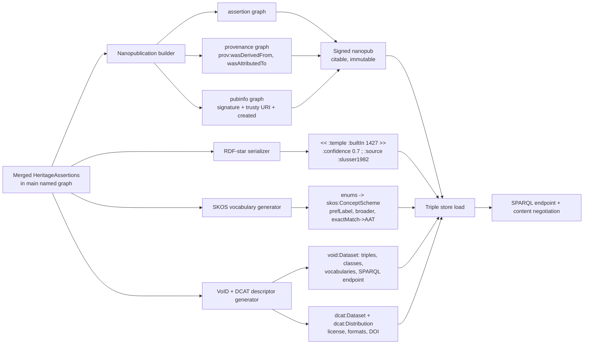

# HeritageGraph — End-to-End Contribution & Linked-Open-Data Publication Workflow

> Provenance-first · community-curated · CIDOC-CRM + PROV-O native · published as nanopublications, RDF-star, SKOS vocabularies and VoID/DCAT-described datasets over SPARQL.

This document extends the original project-based contribution workflow. The original flow stopped at *"update the SPARQL endpoint."* The real end of the line for a Linked Open Data platform is **dereferenceable, citable, machine-discoverable, provenance-bearing RDF** — so this version carries every contribution all the way through to nanopublication, vocabulary publishing, dataset description, and agent/crawler consumption, then loops it back through supersession and re-review.

Class and slot names below refer to the canonical LinkML schema (`ontology/HeritageGraph.yaml`, v1.0.0).

---

## 0. The five invariants that shape the whole pipeline

Every phase is constrained by these, so they're worth stating before the map:

1. **Nothing enters the graph without a source.** Every `HeritageAssertion` requires `was_derived_from_source` (min cardinality 1), `generated_at_time`, `asserted_property` and `asserted_value`. No source → no assertion → no merge.
2. **Nothing enters the graph without an author.** Every assertion is `prov:wasAttributedTo` a `Person` (ideally ORCID-identified). Authorship is minted at edit time, not at merge time.
3. **Edits never overwrite — they supersede.** Updates form a chain via `supersedes_assertion` (`prov:invalidated`). The "current truth" is the assertion with no incoming `prov:invalidated`. History is never destroyed.
4. **The model is event-centric.** A temple is not "built by X"; it is `was_produced_by_event` → `Production` → `carried_out_by` X. Contributors fill forms; the system materialises the event nodes. This is what makes the data reusable and CIDOC-conformant.
5. **Access is CARE-gated from ingest, not bolted on at publish.** `access_tier` and `care_labels` travel with the data from the moment a file is uploaded, so sensitive/indigenous knowledge is never accidentally exposed at the SPARQL or IIIF layer.

---

## 1. Master end-to-end map

```mermaid
flowchart TD
    subgraph P0 [Phase 0 · Identity]
        A0["Register / sign in<br>Google OAuth via NextAuth"] --> A1["Link ORCID<br>(researcher identity)"]
        A1 --> A2["Role resolved<br>contributor / reviewer / curator"]
    end

    subgraph P1 [Phase 1 · Project]
        A2 --> B0["Create project<br>title, bbox, temporal scope, license"]
        B0 --> B1["Mint project PID<br>w3id.org/heritagegraph/project/{id}"]
        B1 --> B2["ProjectCreationActivity<br>prov:wasGeneratedBy"]
        B2 --> B3["Add collaborators<br>roles: viewer / editor / manager"]
    end

    subgraph P2 [Phase 2 · Ingest]
        B3 --> C0["Upload heterogeneous files<br>images / PDF / CSV / audio / notes"]
        C0 --> C1["Blob storage + file PID + version"]
        C0 --> C2["Type each as DataSource subclass<br>FieldSurveyDataset / OralHistoryRecording / ArchivalRecord"]
        C2 --> C3["Attach DataCite metadata<br>identifier, creator, publisher, resourceType"]
        C0 --> C4["Apply CARE / TK labels<br>access_tier + care_labels"]
        C0 --> C5["Per-type processing<br>IIIF manifest / OCR / transcription stub"]
    end

    subgraph P3 [Phase 3 · Model & assert]
        C5 --> D0["Form editor<br>(only ui-classmap.yaml classes)"]
        D0 --> D1["Create entities<br>Temple, Deity, RitualEvent, Guthi, Person, Place..."]
        D1 --> D2["System materialises events<br>Production / Consecration / Enshrinement / Custody"]
        D2 --> D3["Every field edit ->  HeritageAssertion<br>property, value, source, author, time, confidence"]
        D3 --> D4["Wrap in DocumentationActivity<br>FieldSurvey / OralHistory / generic"]
        D4 --> D5["Write to project named graph<br>.../project/{id}/graph"]
    end

    subgraph P4 [Phase 4 · Validate & reason]
        D5 --> E0["LinkML validation<br>required fields, ranges, cardinality"]
        E0 --> E1["SHACL shapes<br>e.g. Production must have produced_object"]
        E1 --> E2["DL reasoner (ALCIQ-D)<br>disjointness + consistency"]
        E2 --> E3["PID uniqueness check"]
    end

    subgraph P5 [Phase 5 · Reconcile]
        E3 --> F0["Reconcile against authorities<br>Wikidata / Getty AAT+TGN / GeoNames"]
        F0 --> F1["Suggest exact/close mappings<br>skos:exactMatch / closeMatch"]
        F1 --> F2["Duplicate detection vs main graph"]
    end

    subgraph P6 [Phase 6 · Preview]
        F2 --> G0["Graph / timeline / map views"]
        G0 --> G1["Iterate (Git-like commits)"]
        G1 -->|more edits| D0
        G1 --> G2["Validate clean"]
    end

    subgraph P7 [Phase 7 · Merge request]
        G2 --> H0["Open MergeRequest<br>whole graph or subset"]
        H0 --> H1["Change summary + justification"]
        H1 --> H2["Pre-flight conflict diff vs main"]
        H2 --> H3["Status = pending"]
    end

    subgraph P8 [Phase 8 · Review]
        H3 --> I0["Notify reviewers<br>domain expert + data steward"]
        I0 --> I1["RDF-star diff view<br>proposed vs main"]
        I1 --> I2["Check: every entity has a DataSource"]
        I2 --> I3["Check: DocumentationActivity present"]
        I3 --> I4["Optional Verification activity<br>cross-check / expert review"]
        I4 --> J{Decision}
    end

    J -->|request changes| K0["Feedback to contributor"]
    K0 --> D0
    J -->|reject| K1["Archive MergeRequest + reason"]
    K1 --> K2["Contributor may appeal / resubmit"]
    J -->|approve| L0

    subgraph P9 [Phase 9 · Merge & mint]
        L0["Apply triples to main graph"] --> L1["Mint global PIDs for new entities"]
        L1 --> L2["Record MergeActivity<br>prov:wasDerivedFrom project graph<br>prov:qualifiedAssociation reviewer"]
        L2 --> L3["Freeze project graph as archival snapshot"]
    end

    subgraph P10 [Phase 10 · LOD publication]
        L3 --> M0["Emit each assertion as a nanopublication<br>assertion + provenance + pubinfo graphs, signed"]
        M0 --> M1["RDF-star reification<br>confidence / source on quoted triples"]
        M1 --> M2["Publish enums as SKOS concept schemes<br>+ Getty AAT mappings"]
        M2 --> M3["Regenerate VoID + DCAT descriptors<br>counts, vocabularies, distributions"]
        M3 --> M4["Load to triple store<br>main + named graphs"]
        M4 --> M5["Refresh SPARQL endpoint + indexes"]
    end

    subgraph P11 [Phase 11 · Access & discover]
        M5 --> N0["Dereferenceable URIs<br>content negotiation: TTL / JSON-LD / RDF-XML / HTML"]
        N0 --> N1["REST API + IIIF image API"]
        N1 --> N2["CARE enforcement at query time<br>access_tier gates results"]
        N2 --> N3["schema.org + sitemaps<br>for crawlers, agents, chatbots"]
        N3 --> N4["Mint DataCite DOI for dataset version<br>+ citation"]
        N4 --> N5["Register in LOD cloud / re3data"]
    end

    subgraph P12 [Phase 12 · Maintain & loop]
        N5 --> O0["Community feedback / new evidence"]
        O0 --> O1["New assertion supersedes old<br>supersedes_assertion chain"]
        O1 --> O2["Periodic re-reconciliation<br>authorities drift over time"]
        O2 --> O3["New dataset version<br>DCAT version + new DOI"]
        O1 -->|re-enters review| H0
    end

    L2 --> P["Notify contributor:<br>new PIDs + nanopub URIs + citation"]
```



---

## 2. Phase detail

### Phase 0 — Identity & roles
Authentication is Google OAuth through NextAuth, with the Django backend verifying the Google ID token. On top of that, **ORCID linking** is what makes provenance citable: it lets `was_attributed_to_agent` resolve to a globally unique researcher identity rather than an internal user ID. Roles (`contributor`, `reviewer`, `expert curator`) come from `ReviewerRole` / the `Reviewers` and `Moderators` groups and decide who can *open* merge requests versus who can *approve* them. A contributor who is also a reviewer cannot approve their own merge request — keep that as a hard rule in the review service.

### Phase 1 — Project creation
A project is a provenance container, not just a folder. Minting the **project PID** up front means every downstream assertion can point back to it, and the `ProjectCreationActivity` (a `prov:Activity`) anchors the whole bundle. Capture license here (defaults to `CC-BY-4.0`, matching the schema) because it propagates into the DCAT distribution later. Collaborator roles (viewer/editor/manager) are project-scoped and independent of platform roles.

### Phase 2 — Heterogeneous ingest
Each uploaded file becomes a typed `DataSource` immediately, not a loose blob:

| Upload | Schema class | CIDOC anchor | Processing |
|--------|--------------|--------------|------------|
| Field survey report / CSV | `FieldSurveyDataset` | `crm:E31_Document` | column→property mapping |
| Audio / interview transcript | `OralHistoryRecording` | `crm:E33_Linguistic_Object` | transcription stub |
| Government / institutional record | `ArchivalRecord` | `crm:E31` + `rico:Record` | archival_location captured |
| Images (TIFF/JPEG) | digital object | `crmdig:D1_Digital_Object` | IIIF manifest + thumbnails |
| PDF | `DataSource` | `crm:E73` | OCR, page-level PIDs |

Two things that are easy to skip and shouldn't be: attach **DataCite metadata** (`datacite_identifier`, `datacite_creator`, `datacite_publisher`, `datacite_resource_type`) so each source is independently citable, and set **`access_tier` / `care_labels`** at this point. CARE labelling at ingest is the only reliable way to keep sensitive material out of the public SPARQL endpoint later — retrofitting it is error-prone.

### Phase 3 — Modelling becomes assertions
This is the conceptual heart. The contributor sees friendly forms (driven by `tools/ui-classmap.yaml` — note the LUX interop classes like `Acquisition`, `DigitalObject`, `Birth` are deliberately *excluded*, so no forms generate for them). Behind each form:

- The contributor names a `Temple`, picks an `ArchitecturalStyleEnum`, links a `Deity`.
- The system **materialises the event layer**: a construction date doesn't go on the temple, it creates a `Production` (`was_produced_by_event` / `produced_object`) carrying `has_timespan`, `carried_out_by`, `commissioned_by`. A deity-in-temple link becomes an `Enshrinement` (`enshrined_deity` + `enshrined_in_structure`). Activating a `Murti` becomes a `Consecration` (`makes_deity_present`).
- **Every individual field edit is captured as a `HeritageAssertion`** with `asserted_property`, `asserted_value`, `was_derived_from_source`, `was_attributed_to_agent`, `generated_at_time`, and an optional `confidence_score`. Those assertions are grouped under a `DocumentationActivity` (specialised as `FieldSurveyActivity`, `OralHistoryInterview`, or generic project documentation) via `generated_assertion`.
- Dates use the multi-calendar model: a `TimeSpan` carries `calendar_system` (Bikram Sambat, Nepal Sambat, Gregorian via the `CalendarSystem` class with `year_offset_from_gregorian`) and `date_precision` so a "circa 1427" entry stays honest.

All of this lands in the **project named graph** `…/project/{id}/graph`, isolated from the main graph.

### Phase 4 — Validation & reasoning
Three layers, run continuously, not just at submit:
1. **LinkML** enforces required fields and cardinality (`Temple.has_architectural_style` required; `ArchitecturalStructure.has_current_location` exactly 1; `Enshrinement.enshrined_in_structure` exactly 1).
2. **SHACL** enforces shape rules that LinkML cardinality can't express cleanly (a `Production` must `produced_object` ≥ 1; an assessment must carry a `ConditionState`).
3. **DL reasoning** — the schema advertises `ALCIQ(D)` expressivity and is dense with `disjoint_with` axioms (`Temple` ⊥ `WaterStructure`, `Stupa` ⊥ `Chaitya`, `Deity` ⊥ `Person`…). Run a reasoner to catch a contributor who, e.g., typed the same node as both a `Temple` and a `DhungeDhara`. This is cheap insurance against logically inconsistent data reaching the main graph.

### Phase 5 — Reconciliation & entity linking
The schema is saturated with `exact_mappings` / `close_mappings` / `broad_mappings` to **Wikidata, Getty AAT, Getty TGN, GeoNames, DBpedia, schema.org, Europeana EDM**. Use them: when a contributor adds "Boudhanath," suggest `wikidata:Q177980`; when they pick the `Jatra` ritual type, attach `aat:300069290` (processions). Emit these as `skos:exactMatch` / `skos:closeMatch` on the entity. Reconciliation is what turns an island of local triples into genuine *Linked* Open Data, and it's also your strongest duplicate-detection signal against the main graph.

### Phases 6–8 — Preview, merge request, review
Preview gives graph/timeline/map views and Git-like commit history with rollback. The **merge request** can be whole-graph or a subset; it carries a human change summary plus justification for any conflicts ("newly discovered stone spout, not previously documented"), and runs a pre-flight diff. Review is done by a **domain expert + data steward** pair against an **RDF-star diff** (so reviewers see not just the triple but its attached confidence and source). Reviewers verify the two invariants — every entity traces to a `DataSource`, every change traces to a `DocumentationActivity` — and may run a `Verification` activity (`verification_method`, `verified_by_expert`) that itself becomes provenance. Decision is approve / request-changes (loops to Phase 3) / reject (archived with reason, appealable).

### Phase 9 — Merge & PID minting
On approval: triples are applied to the main graph, **global PIDs** are minted for genuinely new entities, and a `MergeActivity` (a `DocumentationActivity` subtype) records `prov:wasDerivedFrom` the project graph and `prov:qualifiedAssociation` to the reviewer. The project graph is **frozen as an archival snapshot, never deleted** — it's the evidentiary record behind the merge.

---

## 3. The LOD publication pipeline (Phase 10, expanded)

This is the part the original flowchart was missing entirely. Each of the four outputs below is generated from the *same* merged assertions.



### 3.1 Nanopublications — one per assertion
Each `HeritageAssertion` maps almost one-to-one onto the nanopublication pattern, which is why this model fits so well. A nanopub has three named graphs:

- **Assertion graph** — the claim itself (e.g. *Bhairabnath Temple was produced circa 1427*).
- **Provenance graph** — `prov:wasDerivedFrom` the `DataSource`, `prov:wasAttributedTo` the ORCID author, `prov:generatedAtTime`. Your assertion slots populate this directly.
- **Publication-info graph** — a cryptographic signature and a **trusty URI** (content-hash-based), making the nanopub immutable and independently citable.

Worked example (Trig, abbreviated):

```trig
:np1 {
  :np1 np:hasAssertion :np1_assertion ;
       np:hasProvenance :np1_prov ;
       np:hasPublicationInfo :np1_pubinfo .
}
:np1_assertion {
  hg:bhairabnath crm:P108i_was_produced_by hg:prod_bhairabnath .
  hg:prod_bhairabnath crm:P4_has_time-span [ crm:P82a_begin_of_the_begin "1427"^^xsd:gYear ] .
}
:np1_prov {
  :np1_assertion prov:wasDerivedFrom hg:source/slusser-1982 ;
                 prov:wasAttributedTo orcid:0000-0002-xxxx-xxxx ;
                 prov:generatedAtTime "2026-02-10T09:00:00Z"^^xsd:dateTime .
}
:np1_pubinfo {
  :np1 dcterms:created "2026-02-10T09:00:00Z"^^xsd:dateTime ;
       npx:hasAlgorithm "RSA" ; npx:hasSignature "…" .
}
```

The supersession chain (`supersedes_assertion` / `prov:invalidated`) maps onto **nanopub retraction/superseding** — you never edit `:np1`, you publish `:np2` that `npx:supersedes :np1`. This gives you a fully append-only, tamper-evident provenance record, which is the whole point of "provenance-first."

### 3.2 RDF-star — assertion metadata without graph explosion
Full nanopubs are heavy if you only need to annotate confidence inline for querying. RDF-star lets you attach `confidence_score`, `reconciliation_status`, and source directly to a quoted triple:

```turtle
<< hg:bhairabnath crm:P108i_was_produced_by hg:prod_bhairabnath >>
    hg:confidence_score 0.7 ;
    hg:reconciliation_status "unverified" ;
    prov:wasDerivedFrom hg:source/slusser-1982 .
```

Practical split: **nanopublications** are the citable, signed, archival unit (one per merged assertion); **RDF-star** is the convenience layer in the live triple store so a SPARQL user can filter `WHERE { ... } ?confidence > 0.5` without joining four graphs. Generate both from the same assertion record.

### 3.3 SKOS vocabularies — publish the enums as concept schemes
Every controlled vocabulary in the schema (`RitualTypeEnum`, `GuthiTypeEnum`, `ArchitecturalStyleEnum`, `ConditionTypeEnum`, `SyncreticTypeEnum`, `ExistenceStatusEnum`, `DatePrecisionEnum`) should be published as a **`skos:ConceptScheme`** so external tools can resolve and reuse your terms:

```turtle
hg:ritualTypeScheme a skos:ConceptScheme ;
    skos:prefLabel "HeritageGraph Ritual Types"@en .

hg:Jatra a skos:Concept ;
    skos:inScheme hg:ritualTypeScheme ;
    skos:prefLabel "Jatra"@en ;
    skos:definition "Festival procession ritual"@en ;
    skos:broadMatch aat:300069290 .       # processions, from the enum's broad_mappings

hg:ChariotProcession a skos:Concept ;
    skos:inScheme hg:ritualTypeScheme ;
    skos:broader hg:Jatra ;
    skos:broadMatch aat:300069290 .
```

The `meaning:` and `broad_mappings:` already in each enum value are exactly the `skos:exactMatch` / `skos:broadMatch` targets — the generator just reads them out. The `ArchitecturalStyleEnum` even declares `enum_uri: crm:E55_Type`, so its concepts type cleanly as CIDOC types.

### 3.4 VoID + DCAT — describe the dataset so it can be found
Two descriptors, regenerated on every publish:

- **VoID** (`void:Dataset`) — the *technical* description: triple count, entity/class counts, distinct vocabularies used (CIDOC-CRM, PROV-O, SKOS, GeoSPARQL, Getty…), the SPARQL endpoint URL, example resources, and `void:subset` links to the per-project named graphs.
- **DCAT** (`dcat:Dataset` + `dcat:Distribution`) — the *discovery* description: title, description, license (`CC-BY-4.0`), publisher (CAIR-Nepal), spatial/temporal coverage, themes, and one `dcat:Distribution` per serialization (Turtle dump, JSON-LD, SPARQL endpoint, IIIF), each with its `dcat:mediaType` and access URL.

```turtle
hg:dataset a void:Dataset, dcat:Dataset ;
    dcterms:title "HeritageGraph — Nepalese Cultural Heritage LOD" ;
    dcterms:license <https://creativecommons.org/licenses/by/4.0/> ;
    dcterms:publisher hg:CAIR-Nepal ;
    void:sparqlEndpoint <https://w3id.org/heritagegraph/sparql> ;
    void:triples 1284322 ;
    void:vocabulary crm:, prov:, skos:, geo: ;
    dcat:distribution hg:dist-ttl, hg:dist-jsonld, hg:dist-sparql .

hg:dist-ttl a dcat:Distribution ;
    dcat:mediaType "text/turtle" ;
    dcat:downloadURL <https://w3id.org/heritagegraph/dumps/latest.ttl> .
```

DCAT versioning (`dcat:version`) ties each published snapshot to a **DataCite DOI**, so a researcher can cite the exact dataset state they queried — closing the loop back to provenance.

---

## 4. Access, discovery & agent consumption (Phase 11)

The platform's stated goal is that *crawlers crawl, agents interact, developers query, users ask chatbots.* That maps to concrete outputs:

- **Dereferenceable `w3id.org` URIs** with content negotiation — same URI returns Turtle, JSON-LD, RDF/XML, or human HTML depending on `Accept` header.
- **SPARQL endpoint + REST API + IIIF** image API for zoomable source imagery.
- **CARE enforcement at query time** — `access_tier` filters results so `sensitive_indigenous` / `community_only` triples never leave the boundary for an unauthorised caller. This is the payoff for labelling at ingest (Phase 2).
- **`schema.org` markup + sitemaps + a `llms.txt`-style entrypoint** so search crawlers and LLM agents can discover and ground on the data. JSON-LD embedded in the HTML representation is what makes a chatbot able to answer "what is Bhairabnath Temple" with your data.
- **DataCite DOI + generated citation** returned to the contributor alongside their new PIDs and nanopub URIs.

---

## 5. The maintenance loop (Phase 12) — why it's not a dead end

LOD rots if it's published once and abandoned. Three feedback mechanisms keep it live:

1. **Supersession** — new evidence creates a new `HeritageAssertion` that `supersedes_assertion` the old one; it re-enters the merge-request flow (Phase 7), gets reviewed, and on merge publishes a *new* nanopub that retracts the old. The old nanopub stays resolvable forever (immutable trusty URI) — you just stop treating it as current.
2. **Re-reconciliation** — Wikidata/Getty/GeoNames identifiers and labels drift. A scheduled job re-checks `exactMatch` links and flags broken ones for a curator.
3. **Dataset versioning** — periodic snapshots get a fresh `dcat:version` and DOI, so the historical record of *the dataset itself* is citable, not just the entities in it.

---

## 6. Where this differs from the original flowchart — quick diff

| Original flow | This end-to-end version adds |
|---------------|------------------------------|
| Login → project → upload → model → merge → SPARQL | Same spine, plus everything below |
| "Auto-generate RDF triples" | Explicit **assertion capture** with source/author/time/confidence per edit |
| Validation = LinkML + SHACL | Adds **DL reasoning** (disjointness, ALCIQ(D) consistency) and **PID uniqueness** |
| — | **Reconciliation** against Wikidata/Getty/GeoNames (entity linking) |
| "Update SPARQL endpoint" | **Nanopublications**, **RDF-star**, **SKOS concept schemes**, **VoID/DCAT** descriptors |
| — | **CARE/TK access tiers** enforced ingest→query |
| "Provide citation" | **DataCite DOI** per dataset version + per-assertion nanopub URIs |
| Reject → appeal | **Supersession loop**, **re-reconciliation**, **dataset re-versioning** |

---

*Schema reference: `ontology/HeritageGraph.yaml` v1.0.0 (CIDOC-CRM v7.2.1 + PROV-O, CC-BY-4.0). UI-contributable classes in `tools/ui-classmap.yaml`.*