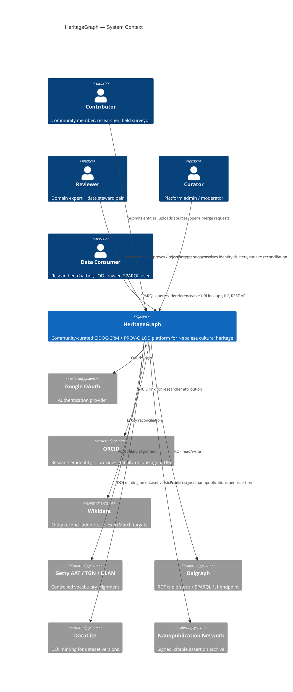
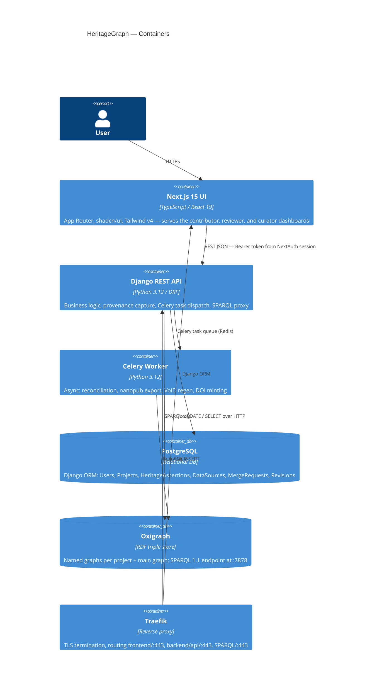
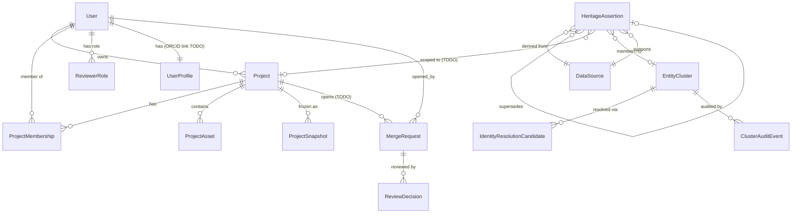

# System Overview — Diagrams & Architecture

> Source: `docs/en/plan.md` (12-phase spec) + `docs/en/IMPLEMENTATION_PLAN.md` (grounded tasks)

---

## 1. System Context Diagram

---

## 2. Container Diagram

---

## 3. Master End-to-End Process Diagram

Condensed from plan.md's 12-phase flowchart — annotated with implementation status.

```mermaid
flowchart TD
    A0["🔑 Login via Google OAuth\n[DONE]"] --> A1["Link ORCID\n[TODO]"]
    A1 --> A2["Role resolved\ncontributor / reviewer / curator\n[DONE]"]

    A2 --> B0["Create Project\ntitle · scope · license\n[DONE - model exists]"]
    B0 --> B1["Mint project PID\nw3id.org/heritagegraph/project/id\n[TODO]"]
    B1 --> B2["Add collaborators\nviewer / editor / manager\n[DONE - ProjectMembership]"]

    B2 --> C0["Upload files\nimage · PDF · CSV · audio\n[PARTIAL]"]
    C0 --> C1["Type as DataSource subclass\nFieldSurvey / OralHistory / Archival\n[TODO - type field missing]"]
    C1 --> C2["Attach DataCite metadata\n[TODO]"]
    C1 --> C3["Apply CARE / TK labels\naccess_tier + care_labels\n[PARTIAL]"]

    C3 --> D0["Contribute entity\nform driven by ui-classmap.yaml\n[DONE]"]
    D0 --> D1["System materialises event layer\nProduction / Enshrinement / Consecration\n[PARTIAL]"]
    D1 --> D2["Capture HeritageAssertion\nproperty · value · source · author · confidence\n[DONE]"]
    D2 --> D3["Write to project named graph\n[PARTIAL]"]

    D3 --> E0["LinkML validation\n[DONE - partial]"]
    E0 --> E1["SHACL shapes check\n[TODO - pyshacl gate]"]
    E1 --> E2["DL reasoning consistency\n[TODO - HermiT]"]
    E2 --> F0["Reconcile vs Wikidata/Getty\n[PARTIAL - service.py exists]"]
    F0 --> G0["Preview: graph · timeline · map\n[PARTIAL]"]
    G0 --> H0["Open MergeRequest\n[TODO - model missing]"]

    H0 --> I0["Notify reviewers\n[TODO]"]
    I0 --> I1["RDF-star diff view\n[TODO]"]
    I1 --> J{Decision}

    J -->|changes requested| K0["Feedback to contributor\n[TODO]"]
    K0 --> D0

    J -->|approved| L0["Apply triples to main graph\n[TODO - merge.py]"]
    L0 --> L1["Mint global PIDs\n[TODO]"]
    L1 --> L2["MergeActivity provenance triple\n[TODO]"]
    L2 --> L3["Freeze project snapshot\n[DONE - ProjectSnapshot model]"]

    L3 --> M0["Emit nanopublications\n[PARTIAL - export command exists]"]
    M0 --> M1["RDF-star annotations\n[PARTIAL - rdfstar_export.py]"]
    M1 --> M2["Regenerate VoID + DCAT\n[TODO - generator missing]"]
    M2 --> M3["SPARQL endpoint refresh\n[DONE]"]

    M3 --> N0["Dereferenceable URIs\ncontent negotiation\n[PARTIAL - lod_views.py]"]
    N0 --> N1["CARE enforcement at query time\n[TODO - SPARQL proxy]"]
    N1 --> N2["schema.org + sitemaps\n[TODO]"]
    N2 --> N3["DataCite DOI\n[TODO]"]

    N3 --> O0["New evidence → supersedes assertion\n[PARTIAL - supersedes FK]"]
    O0 -->|re-enters review| H0

    style A1 fill:#f9a,stroke:#c66
    style B1 fill:#f9a,stroke:#c66
    style C2 fill:#f9a,stroke:#c66
    style E1 fill:#f9a,stroke:#c66
    style E2 fill:#f9a,stroke:#c66
    style H0 fill:#f9a,stroke:#c66
    style L0 fill:#f9a,stroke:#c66
    style M2 fill:#f9a,stroke:#c66
    style N1 fill:#f9a,stroke:#c66
    style N2 fill:#f9a,stroke:#c66
    style N3 fill:#f9a,stroke:#c66
```

> Red nodes = `[TODO]` in IMPLEMENTATION_PLAN.md — the critical path.

---

## 4. Data Model Overview

