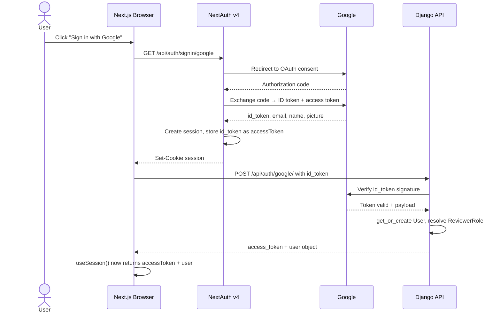
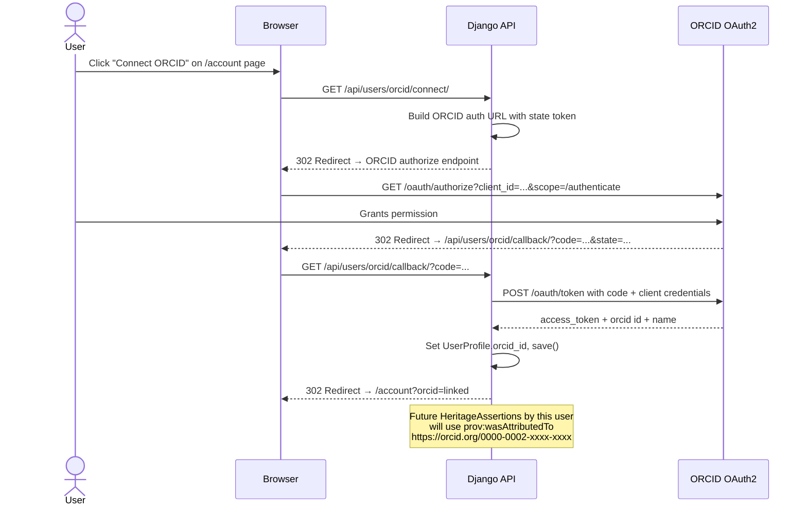

# Phase 0 — Identity & Auth

> Covers: Google OAuth login (DONE), ORCID linking (TODO), role resolution (DONE).
> Implementation tasks: `IMPLEMENTATION_PLAN.md § 0-A, 0-B`

---

## Feature Spec: ORCID Linking

| Field | Value |
|-------|-------|
| Feature | ORCID OAuth2 link to user account |
| Status | `[TODO]` |
| Files | `apps/users/models.py`, `apps/users/views.py`, `heritage_graph_ui/src/app/(dashboard)/account/page.tsx` |
| Why | `was_attributed_to_agent` on every `HeritageAssertion` must resolve to a globally-unique researcher URI; required for nanopublication provenance graph and npj HS submission |
| Acceptance | After linking, `UserProfile.orcid_id` is non-empty; HeritageAssertion `was_attributed_to_agent` = `https://orcid.org/{id}` |

---

## Sequence: Google Login



---

## Sequence: ORCID Linking (TODO)



---

## Wireframe: Account Page (`/account`)

```
┌─────────────────────────────────────────────────────────────────────┐
│  HeritageGraph                              [Nabin ▾]   [Logout]    │
├──────────────┬──────────────────────────────────────────────────────┤
│              │                                                       │
│  Dashboard   │   Account Settings                                    │
│  Atlas       │   ────────────────────────────────────────────────   │
│  Knowledge   │                                                       │
│  Contribute  │   Profile                                             │
│  Review      │   ┌──────────────────────────────────────────────┐   │
│  Curation    │   │  Name       Nabin Oli                         │   │
│  Community   │   │  Email      cairnepalcursor@cair-nepal.org    │   │
│  ─────────── │   │  Role       Contributor                       │   │
│  Account  ← │   │  Joined     2026-01-15                        │   │
│              │   └──────────────────────────────────────────────┘   │
│              │                                                       │
│              │   Researcher Identity                                 │
│              │   ┌──────────────────────────────────────────────┐   │
│              │   │  ORCID      ⚠ Not linked                     │   │
│              │   │                                               │   │
│              │   │  [Connect ORCID →]                           │   │
│              │   │                                               │   │
│              │   │  Linking your ORCID ensures every assertion   │   │
│              │   │  you make is citeable by other researchers.   │   │
│              │   └──────────────────────────────────────────────┘   │
│              │                                                       │
│              │   Roles & Permissions                                 │
│              │   ┌──────────────────────────────────────────────┐   │
│              │   │  Platform role    Contributor                 │   │
│              │   │  Reviewer groups  (none)                      │   │
│              │   │                                               │   │
│              │   │  [Apply to become a Reviewer →]              │   │
│              │   └──────────────────────────────────────────────┘   │
└──────────────┴──────────────────────────────────────────────────────┘
```

**After ORCID link:**

```
│   Researcher Identity                                 │
│   ┌──────────────────────────────────────────────┐   │
│   │  ORCID      ✓ 0000-0002-1234-5678            │   │
│   │             Nabin Oli · CAIR-Nepal            │   │
│   │                                               │   │
│   │  [View ORCID profile ↗]  [Unlink]            │   │
│   └──────────────────────────────────────────────┘   │
```

---

## Role Resolution Process Diagram

```mermaid
flowchart TD
    A[User authenticates via Google] --> B{UserProfile exists?}
    B -->|No| C[Create UserProfile\ndefault role: contributor]
    B -->|Yes| D[Load existing profile]
    C --> E{ORCID linked?}
    D --> E
    E -->|No| F[was_attributed_to_agent =\nhg:user/{username}]
    E -->|Yes| G[was_attributed_to_agent =\nhttps://orcid.org/{orcid_id}]
    F --> H{In Reviewers group?}
    G --> H
    H -->|Yes| I[Role: reviewer\nCan approve MergeRequests\nCannot approve own]
    H -->|No| J{Is staff?}
    J -->|Yes| K[Role: curator\nFull admin access]
    J -->|No| L[Role: contributor\nCan open MergeRequests\nCannot approve]
```
