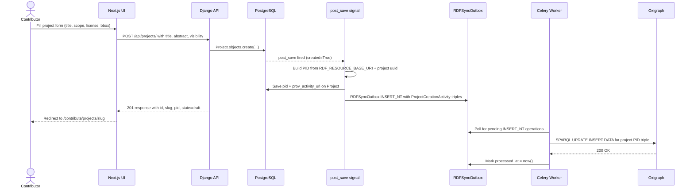

# Phase 1 — Project Creation & Management

> Covers: Project creation (model DONE), PID minting (TODO), named graph isolation (PARTIAL), collaborator management (DONE).
> Implementation tasks: `IMPLEMENTATION_PLAN.md § 1-A, 1-B`

---

## Feature Spec: Project PID Minting

| Field | Value |
|-------|-------|
| Feature | Mint `w3id.org/heritagegraph/project/{uuid}` on Project creation |
| Status | `[TODO]` |
| Trigger | `post_save` signal on `Project` (first creation only) |
| Files | `apps/heritage_data/signals.py`, `apps/heritage_data/models.py` (add `pid` field) |
| RDF output | `hg:project/{uuid} a prov:Activity, hg:ProjectCreationActivity ; prov:wasAssociatedWith <user_uri> ; prov:startedAtTime <now> .` written via `RDFSyncOutbox` |
| Acceptance | `Project.pid` is non-empty within 1 second of creation; triple appears in Oxigraph main graph |

---

## Feature Spec: Project Named Graph Isolation

| Field | Value |
|-------|-------|
| Feature | Each Project's assertions write to `hg:project/{uuid}/graph` not the main graph |
| Status | `[PARTIAL]` — `partitions.py` exists, `HeritageAssertion` lacks `project` FK and `named_graph` field |
| Why | Reviewers must diff *project graph vs main graph* — requires isolation |
| Files | `apps/cidoc_data/models.py`, `apps/graph/kg_engine/partitions.py`, `apps/graph/kg_engine/assertion_projection.py` |
| Acceptance | SPARQL `SELECT * WHERE { GRAPH <hg:project/{uuid}/graph> { ?s ?p ?o } }` returns assertion triples; main graph unchanged until merge |

---

## Sequence: Create Project & Mint PID



---

## Wireframe: Projects Dashboard (`/contribute/projects`)

```
┌─────────────────────────────────────────────────────────────────────┐
│  HeritageGraph                                      [Nabin ▾]       │
├──────────────┬──────────────────────────────────────────────────────┤
│  Dashboard   │   My Projects                      [+ New Project]   │
│  ─────────── │   ────────────────────────────────────────────────   │
│  Contribute  │                                                       │
│   Projects ← │   Filter: [All ▾]  [Draft ▾]  Search: [________]    │
│   Assertion  │                                                       │
│   Structure  │   ┌──────────────────────────────────────────────┐   │
│   Person     │   │ 📁 Bhairabnath Temple Survey 2026            │   │
│   ...        │   │    draft  ·  3 entities  ·  12 assertions    │   │
│  ─────────── │   │    Updated 2 hours ago  ·  You + 1 member    │   │
│  Review      │   │    [Continue →]  [Open Merge Request]        │   │
│  Curation    │   └──────────────────────────────────────────────┘   │
│              │                                                       │
│              │   ┌──────────────────────────────────────────────┐   │
│              │   │ 📁 Kumari Traditions — Kathmandu Valley       │   │
│              │   │    in_review  ·  7 entities  ·  34 assertions │   │
│              │   │    Submitted 2026-06-10  ·  You + 3 members  │   │
│              │   │    [View →]  [Merge Request #12 →]           │   │
│              │   └──────────────────────────────────────────────┘   │
│              │                                                       │
│              │   ┌──────────────────────────────────────────────┐   │
│              │   │ 📁 Indra Jatra Festival Documentation         │   │
│              │   │    merged  ·  5 entities  ·  21 assertions   │   │
│              │   │    Merged 2026-05-20  ·  DOI: 10.5281/...    │   │
│              │   │    [View archive →]  [Cite dataset ↗]        │   │
│              │   └──────────────────────────────────────────────┘   │
└──────────────┴──────────────────────────────────────────────────────┘
```

---

## Wireframe: New Project Form (`/contribute/projects/new`)

```
┌─────────────────────────────────────────────────────────────────────┐
│  New Project                                                         │
│  ─────────────────────────────────────────────────────────────────  │
│                                                                      │
│  Title *                                                             │
│  ┌────────────────────────────────────────────────────────────────┐ │
│  │ e.g. "Bhairabnath Temple Survey 2026"                          │ │
│  └────────────────────────────────────────────────────────────────┘ │
│                                                                      │
│  Abstract                                                            │
│  ┌────────────────────────────────────────────────────────────────┐ │
│  │                                                                │ │
│  │                                                                │ │
│  └────────────────────────────────────────────────────────────────┘ │
│                                                                      │
│  Primary subject (guides class suggestions)                          │
│  ┌────────────────────────────────────────────────────────────────┐ │
│  │ e.g. "temple", "ritual", "guthi"                               │ │
│  └────────────────────────────────────────────────────────────────┘ │
│                                                                      │
│  License            [CC-BY-4.0 ▾]   (data license, propagates to DCAT)  │
│  Visibility         [Private ▾]                                     │
│  Languages          [ne] [en] [+ add]                               │
│                                                                      │
│  Collaborators                                                       │
│  ┌────────────────────────────────────────────────────────────────┐ │
│  │  Search users...                                               │ │
│  │  Tek Raj Chhetri    [Domain Expert ▾]  [✕]                   │ │
│  └────────────────────────────────────────────────────────────────┘ │
│                                                                      │
│  [Cancel]                              [Create Project →]            │
└──────────────────────────────────────────────────────────────────────┘
```

---

## Wireframe: Project Workspace (`/contribute/projects/[slug]`)

```
┌─────────────────────────────────────────────────────────────────────┐
│  📁 Bhairabnath Temple Survey 2026   [draft]   [Open Merge Request] │
│  ─────────────────────────────────────────────────────────────────  │
│                                                                      │
│  [Entities] [Assertions] [Sources] [History] [Settings]             │
│                                                                      │
│  Entities (3)                                      [+ Add Entity]   │
│  ┌──────────────────────────┬─────────┬────────────────────────┐   │
│  │ Name                     │ Type    │ Assertions             │   │
│  ├──────────────────────────┼─────────┼────────────────────────┤   │
│  │ Bhairabnath Temple       │ Temple  │ 8  ✓ valid  ⚠ 1 warn  │   │
│  │ Bhairab (deity)          │ Deity   │ 3  ✓ valid             │   │
│  │ Consecration Event 1427  │ Consec. │ 1  ⚠ missing source   │   │
│  └──────────────────────────┴─────────┴────────────────────────┘   │
│                                                                      │
│  Validation Status                                                   │
│  ┌────────────────────────────────────────────────────────────────┐ │
│  │  LinkML     ✓ 11/12 assertions valid (1 missing required field)│ │
│  │  SHACL      ⚠ Production must have produced_object (1 error)  │ │
│  │  DL reason  — not yet run                                      │ │
│  │                                                                │ │
│  │  Cannot open Merge Request until SHACL errors are resolved.   │ │
│  │  [Run validation →]                                            │ │
│  └────────────────────────────────────────────────────────────────┘ │
│                                                                      │
│  Named graph   hg:project/3f2a.../graph   [3 triples preview ↗]    │
│  PID           https://w3id.org/heritagegraph/project/3f2a...      │
└──────────────────────────────────────────────────────────────────────┘
```
