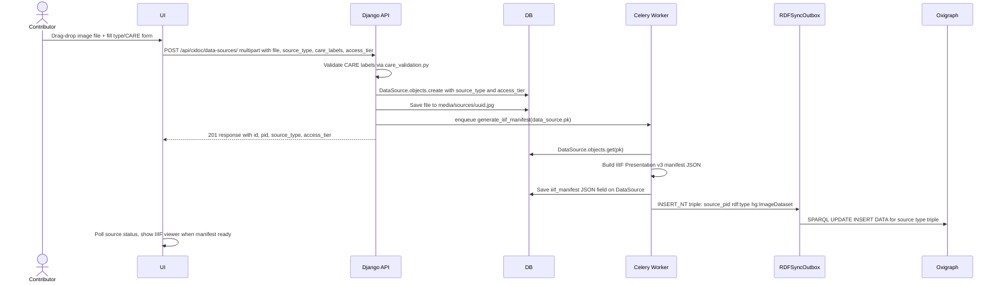

# Phase 2 — Heterogeneous Ingest & DataSource

> Covers: File upload (PARTIAL), DataSource type classification (TODO), DataCite metadata (TODO), CARE/TK labelling (PARTIAL), IIIF manifest generation (TODO).
> Implementation tasks: `IMPLEMENTATION_PLAN.md § 2-A, 2-B, 2-C`

---

## Feature Spec: DataSource Type Classification

| Field | Value |
|-------|-------|
| Feature | Classify each uploaded file as a typed `DataSource` subclass |
| Status | `[TODO]` — `source_type` field missing from model |
| Types | `field_survey`, `oral_history`, `archival`, `image`, `pdf` |
| CIDOC anchor | `FieldSurveyDataset` → `crm:E31_Document`; `OralHistoryRecording` → `crm:E33_Linguistic_Object` |
| Files | `apps/cidoc_data/models.py` (add `source_type`, `datacite_*` fields), `apps/cidoc_data/migrations/` |
| Acceptance | POST `/api/cidoc/data-sources/` with `source_type=oral_history` returns 201; field stored in DB and emitted in RDF as `rdf:type hg:OralHistoryRecording` |

---

## Feature Spec: CARE / TK Label Enforcement

| Field | Value |
|-------|-------|
| Feature | `access_tier` and `care_labels` travel with data from ingest; enforced at SPARQL query time |
| Status | `[PARTIAL]` — `care_validation.py` exists; SPARQL proxy not yet wired |
| Tiers | `public`, `org_only`, `community_only`, `sensitive_indigenous` |
| Files | `apps/cidoc_data/permissions.py` (add `CAREAccessPermission`), `apps/cidoc_data/views.py`, `apps/graph/sparql_proxy.py` |
| Acceptance | Unauthenticated SPARQL request cannot retrieve triples where `hg:access_tier "sensitive_indigenous"` |

---

## Process Diagram: File Ingest Pipeline

```mermaid
flowchart TD
    U[User uploads file] --> T{File type?}

    T -->|Image TIFF/JPEG| I0[Store blob\nDataSource source_type=image]
    T -->|PDF| P0[Store blob\nDataSource source_type=pdf]
    T -->|Audio/Interview| A0[Store blob\nDataSource source_type=oral_history]
    T -->|CSV/Spreadsheet| C0[Store blob\nDataSource source_type=field_survey]
    T -->|Document/scan| D0[Store blob\nDataSource source_type=archival]

    I0 --> I1[Celery: generate_iiif_manifest\nCantaloupe / static manifest]
    P0 --> P1[Celery: run_ocr_pipeline\ntesseract / Bhashini Dhruva]
    A0 --> A1[Celery: create_transcription_stub\nmanual or Whisper]
    C0 --> C1[Celery: map_columns_to_properties\nui-classmap.yaml lookup]
    D0 --> D1[Celery: extract_archival_metadata\narchival_location + date]

    I1 & P1 & A1 & C1 & D1 --> META[Attach DataCite metadata\ndatacite_identifier\ndatacite_creator\ndatacite_publisher\ndatacite_resource_type]

    META --> CARE[Apply CARE / TK labels\naccess_tier + care_labels]

    CARE --> RDF[Emit DataSource RDF\nrdf:type hg:FieldSurveyDataset\ndc:identifier · dc:creator · dc:rights]

    RDF --> ASSERT[Ready to cite in HeritageAssertion\nwas_derived_from_source]

    style I1 fill:#ffd,stroke:#aa0
    style P1 fill:#ffd,stroke:#aa0
    style A1 fill:#ffd,stroke:#aa0
    style META fill:#f9a,stroke:#c66
    style CARE fill:#fda,stroke:#c80
```



> Yellow = Celery async task · Red = TODO · Orange = PARTIAL

---

## Sequence: File Upload → DataSource Record



---

## Wireframe: Upload Source (`/contribute/data-source`)

```
┌─────────────────────────────────────────────────────────────────────┐
│  Add Data Source                                                      │
│  ─────────────────────────────────────────────────────────────────  │
│                                                                      │
│  File *                                                              │
│  ┌──────────────────────────────────────────────────────────────┐   │
│  │                                                              │   │
│  │          📎  Drag & drop or click to upload                  │   │
│  │          Supports: JPG, PNG, TIFF, PDF, MP3, WAV, CSV        │   │
│  │                                                              │   │
│  └──────────────────────────────────────────────────────────────┘   │
│                                                                      │
│  Source Type *                                                       │
│  ○ Field Survey Dataset   (CSV / spreadsheet / field notes)         │
│  ○ Oral History Recording (audio interview / transcript)            │
│  ○ Archival Record        (government doc / institutional record)   │
│  ○ Image Dataset          (photograph / TIFF / scan)                │
│  ○ PDF Document           (publication / report)                    │
│                                                                      │
│  DataCite Metadata                                                   │
│  ┌──────────────────────────────────────────────────────────────┐   │
│  │  Creator *    [____________________]                         │   │
│  │  Publisher    [CAIR-Nepal          ]                         │   │
│  │  Year         [2026]                                         │   │
│  │  Resource type [Dataset ▾]                                   │   │
│  └──────────────────────────────────────────────────────────────┘   │
│                                                                      │
│  Access & CARE Labels                                                │
│  Access tier   ● Public  ○ Org only  ○ Community only  ○ Sensitive  │
│                                                                      │
│  TK Labels     □ TK Attribution   □ TK Community Voice              │
│                □ TK Seasonal      □ TK Non-Commercial               │
│                                                                      │
│  ⚠  Sensitive / indigenous knowledge will be excluded from the      │
│     public SPARQL endpoint at query time.                           │
│                                                                      │
│  [Cancel]                                   [Upload Source →]        │
└──────────────────────────────────────────────────────────────────────┘
```

---

## Wireframe: Source Detail (with IIIF viewer)

```
┌─────────────────────────────────────────────────────────────────────┐
│  Source: Bhairabnath Survey Photo 2026                              │
│  Type: Image Dataset  ·  Access: Public  ·  Creator: Nabin Oli     │
│  ─────────────────────────────────────────────────────────────────  │
│                                                                      │
│  ┌──────────────────────────┐  Metadata                            │
│  │                          │  PID         hg:source/4c2a...       │
│  │   [IIIF Image Viewer]    │  DataCite ID  10.5281/zenodo.xxx     │
│  │                          │  License      CC-BY-4.0              │
│  │   🏛  Bhairabnath        │  IIIF         [View manifest ↗]      │
│  │      Temple facade       │                                       │
│  │      Zoom: [+][-]        │  CARE Labels                         │
│  │                          │  ✓ Public — no restrictions          │
│  └──────────────────────────┘                                       │
│                                                                      │
│  Assertions using this source (3)                                    │
│  ┌──────────────────────────────────────────────────────────────┐   │
│  │  Bhairabnath Temple · has_architectural_style · Shikhara     │   │
│  │  Bhairabnath Temple · condition_state · Good                 │   │
│  │  Bhairabnath Temple · has_current_location · Taumadhi Tole  │   │
│  └──────────────────────────────────────────────────────────────┘   │
└──────────────────────────────────────────────────────────────────────┘
```
