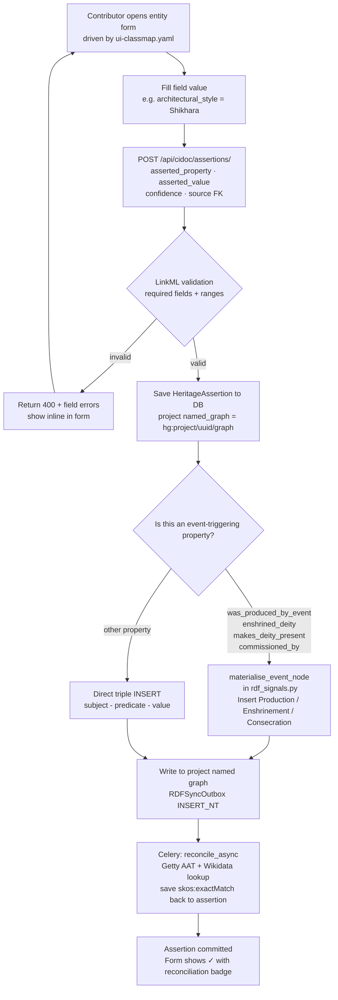
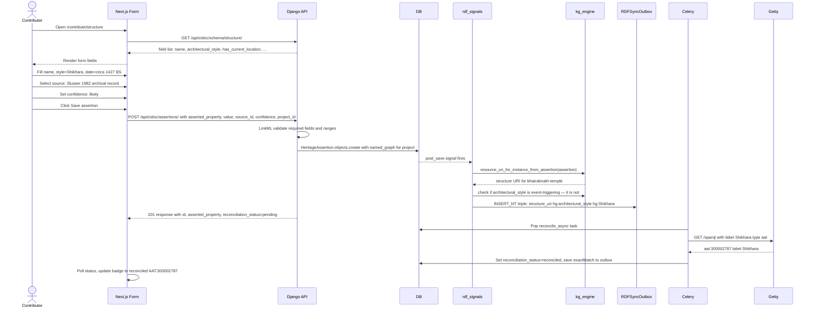
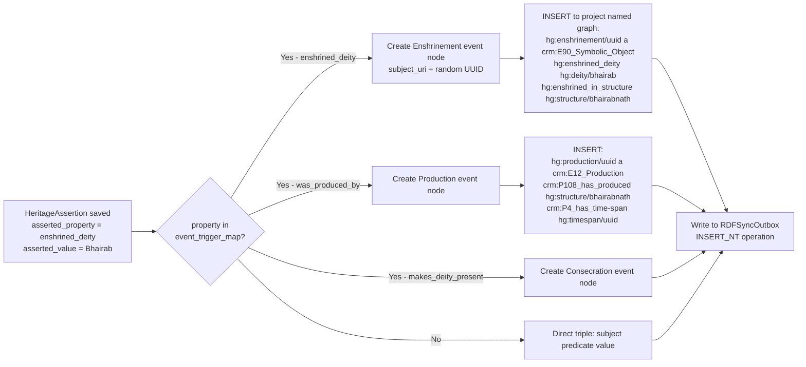

# Phase 3 — Modelling & Assertion Capture

> Covers: Entity contribution forms (DONE), HeritageAssertion capture (DONE), event materialisation (PARTIAL), multi-calendar TimeSpan (TODO).
> Implementation tasks: `IMPLEMENTATION_PLAN.md § 3-A, 3-B`

---

## Feature Spec: Event Materialisation on Field Save

| Field | Value |
|-------|-------|
| Feature | When a contributor sets a date or relationship field, the system materialises the CIDOC event node automatically |
| Status | `[PARTIAL]` — `rdf_signals.py` captures assertions; event node INSERT logic missing |
| Examples | Construction date → `Production` node; deity link → `Enshrinement`; murti activation → `Consecration` |
| Files | `apps/cidoc_data/rdf_signals.py`, `apps/graph/kg_engine/engine.py` (add `materialise_event_node`) |
| Acceptance | After setting `was_produced_by_event` on a Temple, SPARQL `DESCRIBE <temple_uri>` returns a `crm:E12_Production` blank node with `crm:P4_has_time-span` |

---

## Feature Spec: Multi-Calendar TimeSpan

| Field | Value |
|-------|-------|
| Feature | Store dates with calendar system (BS / NS / Gregorian) and precision (year / decade / circa) |
| Status | `[TODO]` |
| Schema | `HeritageGraph.yaml` `TimeSpan` class with `calendar_system`, `date_precision`, `year_offset_from_gregorian` |
| Files | `apps/cidoc_data/timespan.py` (dataclass + RDF emitter), `apps/cidoc_data/models.py` (add `calendar_system`, `date_precision` to `HeritageAssertion`) |
| Frontend | `heritage_graph_ui/src/components/CalendarDatePicker.tsx` |
| Acceptance | Assertion saved as BS 2083 emits `crm:E52_Time-Span` with `hg:calendar_system "bikram_sambat"` and Gregorian equivalent via `year_offset_from_gregorian = -57` |

---

## Process Diagram: Assertion Capture Flow



---

## Sequence: Contribute Temple Entity (Full)



---

## Wireframe: Temple Contribution Form (`/contribute/structure`)

```
┌─────────────────────────────────────────────────────────────────────┐
│  Add Structure                            Project: Bhairabnath 2026 │
│  ─────────────────────────────────────────────────────────────────  │
│                                                                      │
│  Basic Information                                                   │
│  Name *          [Bhairabnath Temple                    ]           │
│  Local name      [भैरबनाथ मन्दिर                        ]           │
│  Existence       [● Extant  ○ Destroyed  ○ Altered]                │
│                                                                      │
│  Classification                                                      │
│  Type *          [Temple ▾]                                         │
│  Architectural   [Shikhara ▾]    ✓ Reconciled: AAT:300002787       │
│  style *                                                             │
│  Syncretic       [Hindu-Buddhist ▾]                                 │
│  tradition                                                           │
│                                                                      │
│  Location *                                                          │
│  [Search or select place...   Taumadhi Tole ×]                     │
│                                                                      │
│  Temporal — Construction                                             │
│  Calendar  [● Gregorian  ○ Bikram Sambat  ○ Nepal Sambat]          │
│  Year      [1427      ]   Precision  [● circa  ○ year  ○ decade]   │
│  ── automatically converted: BS 1484, circa ──                      │
│                                                                      │
│  Associated deity / enshrinement                                     │
│  [Search deity...   Bhairab ×]   [+ Add deity]                     │
│  ⟶ System will create Enshrinement event node automatically         │
│                                                                      │
│  Source *                                                            │
│  [Select source...   Slusser 1982 (archival) ×]                    │
│  Confidence  [● Likely  ○ Confirmed  ○ Speculative]                │
│                                                                      │
│  [Save assertion]                          [Discard]                │
│                                                                      │
│  ─────────────────────────────────────────────────────────────────  │
│  Saved assertions (8)                                                │
│  ┌──────────────────┬────────────────────┬──────────┬───────────┐  │
│  │ Property         │ Value              │ Conf.    │ Status    │  │
│  ├──────────────────┼────────────────────┼──────────┼───────────┤  │
│  │ name             │ Bhairabnath Temple │ confirmed│ ✓ valid   │  │
│  │ architectural    │ Shikhara           │ likely   │ ✓ recon.  │  │
│  │ has_location     │ Taumadhi Tole      │ confirmed│ ✓ valid   │  │
│  │ construction ~   │ circa 1427 CE      │ likely   │ ✓ valid   │  │
│  │ enshrined_deity  │ Bhairab            │ confirmed│ ✓ event ↗ │  │
│  └──────────────────┴────────────────────┴──────────┴───────────┘  │
└──────────────────────────────────────────────────────────────────────┘
```

---

## Wireframe: CalendarDatePicker Component

```
┌──────────────────────────────────────────────────────┐
│  Date of construction                                 │
│                                                       │
│  Calendar system                                      │
│  [● Gregorian]  [○ Bikram Sambat]  [○ Nepal Sambat]  │
│                                                       │
│  Year     [  1427  ]                                  │
│  Month    [—  (unknown)  ▾]                           │
│  Day      [—  (unknown)  ▾]                           │
│                                                       │
│  Precision                                            │
│  [○ exact year]  [● circa]  [○ decade]  [○ century]  │
│                                                       │
│  ┌─────────────────────────────────────────────────┐ │
│  │  Stored as:  EDTF "1427~"                       │ │
│  │  Equivalent: BS 1484~ · NS 547~                 │ │
│  │  RDF: crm:E52_Time-Span                         │ │
│  │        hg:calendar_system "gregorian"           │ │
│  │        crm:P82a_begin "1427"^^xsd:gYear         │ │
│  │        hg:date_precision "circa"                │ │
│  └─────────────────────────────────────────────────┘ │
└──────────────────────────────────────────────────────┘
```

---

## Process Diagram: Event Node Materialisation


