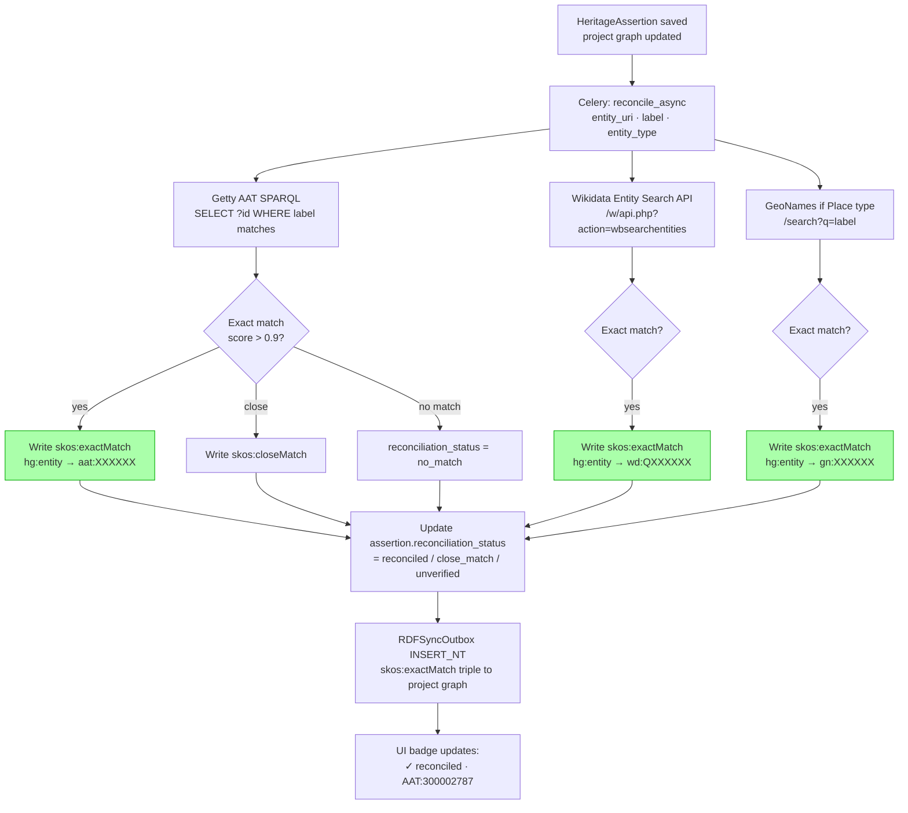
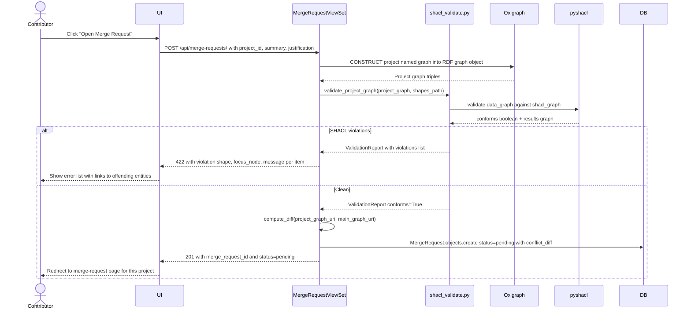

# Phases 4 & 5 — Validation, Reasoning & Reconciliation

> Covers: LinkML validation (DONE-partial), SHACL shapes (TODO as gate), DL reasoning (TODO), PID uniqueness (TODO), Wikidata/Getty reconciliation (PARTIAL), duplicate detection (TODO).
> Implementation tasks: `IMPLEMENTATION_PLAN.md § 4-A, 4-B, 4-C, 5-A, 5-B`

---

## Feature Spec: SHACL Validation Gate

| Field | Value |
|-------|-------|
| Feature | SHACL shapes run against the project named graph; MergeRequest cannot be opened until 0 violations |
| Status | `[TODO]` |
| Shape file | `ontology/shapes/generated-heritagegraph-minimal-shacl.ttl` |
| Library | `pyshacl` (add to `requirements.txt`) |
| Files | `apps/graph/shacl_validate.py`, `apps/graph/management/commands/shacl_validate.py`, wired into `MergeRequestViewSet.create()` |
| Key shapes | `Production` must have `produced_object ≥ 1`; `Enshrinement` must have `enshrined_in_structure = 1`; every `HeritageAssertion` must link a `DataSource` |
| Acceptance | `python manage.py shacl_validate --project <id>` exits 0 on clean graph; returns violation report on bad data; `POST /api/merge-requests/` returns 422 + report if violations > 0 |

---

## Feature Spec: DL Reasoning Consistency Check

| Field | Value |
|-------|-------|
| Feature | Run HermiT reasoner to detect CIDOC-CRM disjointness violations |
| Status | `[TODO]` |
| Key axioms | `Temple ⊥ WaterStructure`, `Stupa ⊥ Chaitya`, `Deity ⊥ Person` |
| Tool | `hermit.jar` in `infra/hermit/` invoked via `subprocess.run` |
| Files | `apps/graph/reasoning.py`, `apps/graph/management/commands/reason_check.py` |
| Acceptance | Unit test in `apps/graph/test_reasoning.py`: inject Temple + WaterStructure typed on same node → `check_consistency()` returns `False` |

---

## Process Diagram: Validation Pipeline

```mermaid
flowchart TD
    START[Contributor clicks\n"Open Merge Request"] --> PRE[Pre-flight: load project named graph\nfrom Oxigraph]

    PRE --> L{LinkML validation\nrequired fields · ranges · cardinality}
    L -->|violations| LE[Return 422\nLinkML violation list\nblock MR open]
    L -->|pass| S{SHACL shapes check\npyshacl against shapes.ttl}
    S -->|violations| SE[Return 422\nSHACL violation report\nshow in UI as error list]
    S -->|pass| D{DL reasoning\nHermiT consistency}
    D -->|inconsistent| DE[Return 422\nDisjointness violation\nshow conflicting types]
    D -->|consistent| P{PID uniqueness\nSPARQL vs main graph}
    P -->|collision| PE[Return 409\nExisting entity URI collision]
    P -->|unique| OK[Validation passed\nProceed to create MergeRequest]

    LE --> FIX[Contributor fixes in form]
    SE --> FIX
    DE --> FIX
    PE --> FIX
    FIX --> START

    style LE fill:#faa,stroke:#c00
    style SE fill:#faa,stroke:#c00
    style DE fill:#faa,stroke:#c00
    style PE fill:#faa,stroke:#c00
    style OK fill:#afa,stroke:#0a0
```

---

## Process Diagram: Reconciliation Pipeline



---

## Sequence: SHACL Validation on Merge Request Open



---

## Wireframe: Validation Status Panel (in Project Workspace)

```
┌──────────────────────────────────────────────────────────────────────┐
│  Validation Status                              [Run validation →]   │
│  ──────────────────────────────────────────────────────────────────  │
│                                                                       │
│  LinkML     ✓ 11 assertions pass · 1 warning                        │
│             ⚠ Enshrinement: enshrined_in_structure is required       │
│                                                                       │
│  SHACL      ✗ 1 violation                                            │
│             ✗ sh:Production requires produced_object ≥ 1            │
│                [Fix: Production event on Bhairabnath Temple →]      │
│                                                                       │
│  DL reason  — not run (resolve SHACL errors first)                  │
│                                                                       │
│  PID        ✓ no collisions with main graph                         │
│                                                                       │
│  ──────────────────────────────────────────────────────────────────  │
│                                                                       │
│  Reconciliation (8 assertions)                                       │
│  ✓ reconciled      6   (Getty AAT: 4, Wikidata: 2)                  │
│  ~ close match     1   (Taumadhi Tole → wd:Q123456, review needed)  │
│  ✗ no match        1   (has_architectural_style: "Pagoda variant")  │
│  ⏳ pending        0                                                  │
│                                                                       │
│  ⛔ Cannot open Merge Request — 1 SHACL error must be resolved.     │
└──────────────────────────────────────────────────────────────────────┘
```

---

## Wireframe: Duplicate Detection Warning

```
┌──────────────────────────────────────────────────────────────────────┐
│  ⚠  Possible duplicate detected                                      │
│  ──────────────────────────────────────────────────────────────────  │
│                                                                       │
│  The entity "Bhairabnath Temple" you are adding closely matches      │
│  an existing entity in the main graph:                               │
│                                                                       │
│  ┌────────────────────────────────────────────────────────────────┐  │
│  │  hg:structure/bhairabnath-taumadhi                            │  │
│  │  Name:     Bhairabnath Temple (Taumadhi)                      │  │
│  │  Type:     Temple                                              │  │
│  │  Location: Taumadhi Tole, Bhaktapur                           │  │
│  │  PID:      w3id.org/heritagegraph/structure/bhairabnath-...   │  │
│  │  [View existing entity ↗]                                     │  │
│  └────────────────────────────────────────────────────────────────┘  │
│                                                                       │
│  What would you like to do?                                          │
│                                                                       │
│  [● Use existing entity — add new assertions to it]                 │
│  [○ This is a different entity — continue creating]                 │
│  [○ Merge / supersede — my assertions update the existing record]   │
│                                                                       │
│  [Cancel]                                    [Continue →]            │
└──────────────────────────────────────────────────────────────────────┘
```
