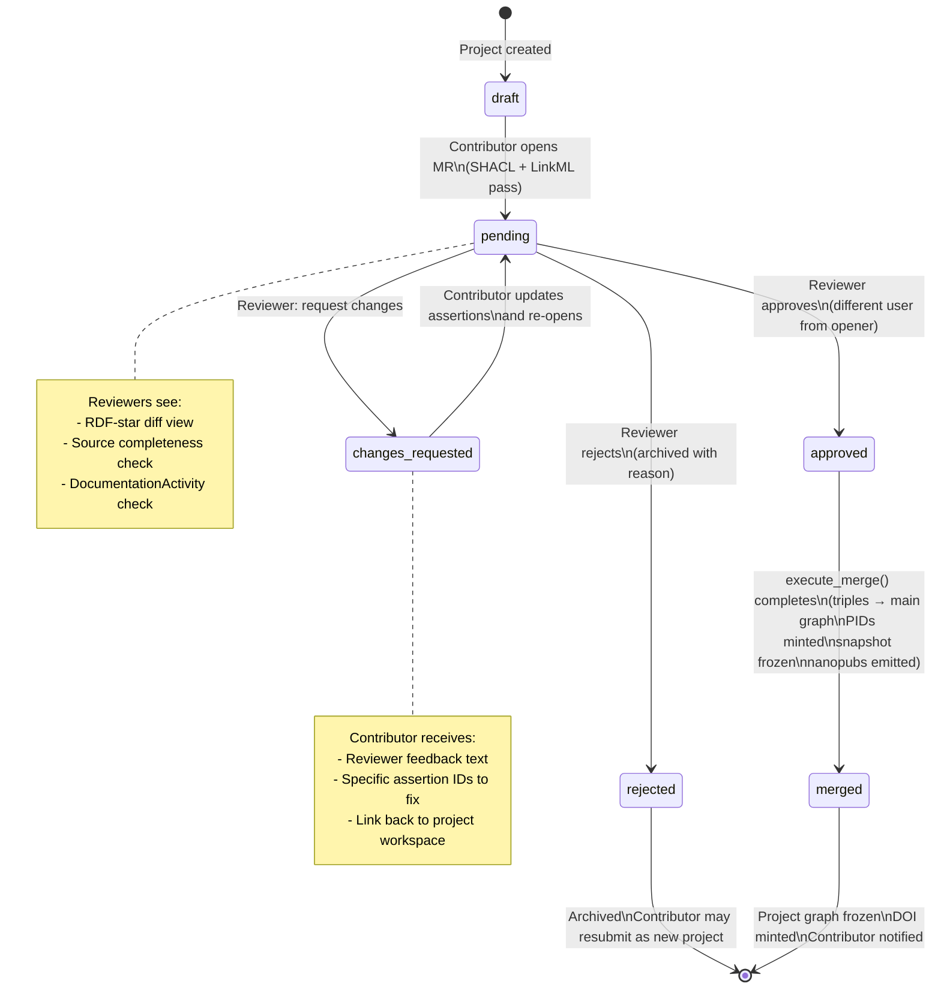
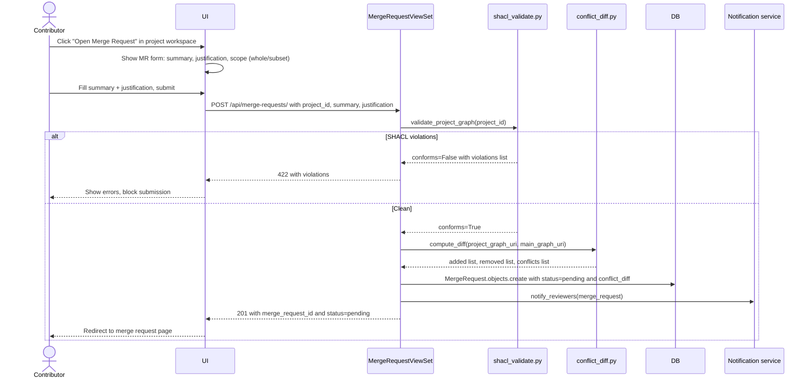
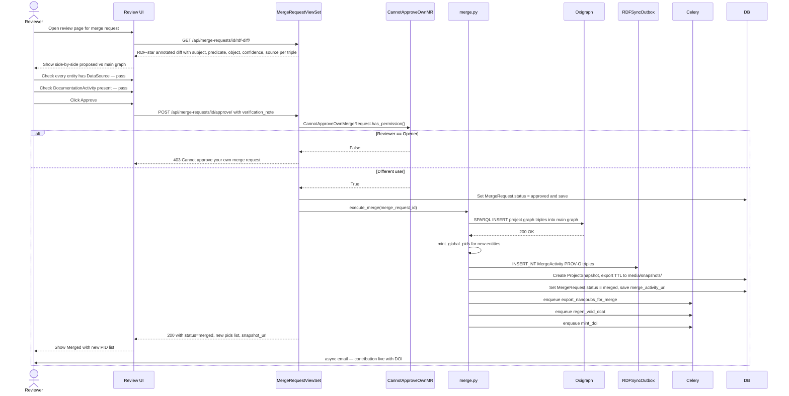

# Phases 7–9 — Merge Request, Review & Merge Execution

> Covers: MergeRequest model (TODO), pre-flight conflict diff (TODO), reviewer RDF-star diff view (TODO), approval workflow (TODO), merge execution (TODO), PID minting (TODO), snapshot freeze (DONE model).
> Implementation tasks: `IMPLEMENTATION_PLAN.md § 7-A, 7-B, 7-C, 8-A, 8-B, 9-A`

---

## Feature Spec: MergeRequest Model & Workflow

| Field | Value |
|-------|-------|
| Feature | Formal lifecycle model for proposing a project graph into the main graph |
| Status | `[TODO]` — model, serializer, ViewSet, permissions all missing |
| States | `pending → (changes_requested → pending) or approved → merged` or `rejected` |
| Hard rule | `opened_by` user cannot be the approver — enforced in `CannotApproveOwnMergeRequest` permission |
| Files | `apps/heritage_data/models.py`, `apps/heritage_data/serializers.py`, `apps/heritage_data/views.py`, `apps/heritage_data/permissions.py` |
| API routes | `POST /api/merge-requests/` · `GET /api/merge-requests/{id}/` · `POST /api/merge-requests/{id}/approve/` · `POST /api/merge-requests/{id}/reject/` · `POST /api/merge-requests/{id}/request-changes/` |

---

## Feature Spec: Merge Execution

| Field | Value |
|-------|-------|
| Feature | On approval, apply project graph triples to main graph, mint PIDs, record provenance, freeze snapshot |
| Status | `[TODO]` |
| Files | `apps/graph/merge.py` |
| Steps | (1) SPARQL INSERT from project graph to main; (2) mint global PIDs via `uris.py`; (3) write `MergeActivity` PROV-O triple to outbox; (4) `ProjectSnapshot` + export TTL; (5) `MergeRequest.status = merged`; (6) enqueue nanopub export + VoID regen Celery tasks |
| Acceptance | After approval, `SPARQL SELECT * WHERE { GRAPH <main> { hg:structure/bhairabnath-temple ?p ?o } }` returns the contributed triples |

---

## MergeRequest State Machine



---

## Sequence: Open Merge Request



---

## Sequence: Review & Approve



---

## Wireframe: Open Merge Request Form (`/contribute/projects/[slug]/merge-request`)

```
┌─────────────────────────────────────────────────────────────────────┐
│  Open Merge Request                                                  │
│  Project: Bhairabnath Temple Survey 2026                            │
│  ─────────────────────────────────────────────────────────────────  │
│                                                                      │
│  Pre-flight checks                                                   │
│  ┌────────────────────────────────────────────────────────────────┐ │
│  │  ✓ LinkML validation     11 assertions pass                    │ │
│  │  ✓ SHACL shapes          no violations                         │ │
│  │  ✓ DL consistency        no disjointness errors                │ │
│  │  ✓ PID uniqueness        no collisions with main graph         │ │
│  │  ✓ Every entity          has a DataSource                      │ │
│  └────────────────────────────────────────────────────────────────┘ │
│                                                                      │
│  Conflict diff preview                                               │
│  ┌────────────────────────────────────────────────────────────────┐ │
│  │  + 14 triples to add     (all new — Bhairabnath not in main)  │ │
│  │  ~ 0 conflicts           (no overlapping subjects)             │ │
│  │  - 0 triples to remove                                         │ │
│  │  [View full diff ↗]                                            │ │
│  └────────────────────────────────────────────────────────────────┘ │
│                                                                      │
│  Scope                                                               │
│  [● Whole project graph]  [○ Select subset of entities]             │
│                                                                      │
│  Summary *                                                           │
│  ┌────────────────────────────────────────────────────────────────┐ │
│  │ Documents Bhairabnath Temple with 3 CIDOC entities and 11      │ │
│  │ HeritageAssertions sourced from Slusser 1982 field survey.     │ │
│  └────────────────────────────────────────────────────────────────┘ │
│                                                                      │
│  Justification for any conflicts  (none required here)              │
│                                                                      │
│  [Cancel]                              [Open Merge Request →]        │
└──────────────────────────────────────────────────────────────────────┘
```

---

## Wireframe: Reviewer Diff View (`/review/[id]`)

```
┌─────────────────────────────────────────────────────────────────────┐
│  Merge Request #14  ·  Bhairabnath Temple Survey 2026   [pending]   │
│  Opened by: Nabin Oli  ·  2026-06-15  ·  Reviewer: You             │
│  ─────────────────────────────────────────────────────────────────  │
│                                                                      │
│  [Summary]  [RDF Diff]  [Entity Graph]  [Sources]  [History]        │
│                                                                      │
│  ── RDF-star Diff ─────────────────────────────────────────────────  │
│                                                                      │
│  Show: [● All]  [○ Added only]  [○ Conflicts only]                 │
│                                                                      │
│  ┌──────────────────────────────────────────────────────────────┐   │
│  │ + hg:structure/bhairabnath-temple                            │   │
│  │      rdf:type          hg:Temple                             │   │
│  │      hg:name           "Bhairabnath Temple"@en               │   │
│  │      hg:confidence     0.95  ·  source: Slusser 1982        │   │
│  │      hg:reconciled     aat:300007987                         │   │
│  ├──────────────────────────────────────────────────────────────┤   │
│  │ + hg:structure/bhairabnath-temple                            │   │
│  │      hg:architectural_style  hg:Shikhara                     │   │
│  │      hg:confidence           0.7  ·  source: Slusser 1982   │   │
│  │      hg:reconciled           aat:300002787  ✓               │   │
│  ├──────────────────────────────────────────────────────────────┤   │
│  │ + hg:enshrinement/3f2a...                                    │   │
│  │      rdf:type          crm:E90_Symbolic_Object               │   │
│  │      hg:enshrined_deity  hg:deity/bhairab                   │   │
│  │      (materialised event node — auto-generated)              │   │
│  └──────────────────────────────────────────────────────────────┘   │
│                                                                      │
│  Reviewer checklist                                                  │
│  ☑ Every entity traces to a DataSource                              │
│  ☑ DocumentationActivity present                                    │
│  ☐ Optional: add Verification activity note                         │
│  ┌────────────────────────────────────────────────────────────────┐ │
│  │  Verification note (optional)                                  │ │
│  │  [Cross-checked against DoA 1975 survey — consistent          ] │
│  └────────────────────────────────────────────────────────────────┘ │
│                                                                      │
│  [Request Changes]    [Reject ▾]    [Approve & Merge →]            │
└──────────────────────────────────────────────────────────────────────┘
```

---

## Wireframe: Post-Merge Notification

```
┌─────────────────────────────────────────────────────────────────────┐
│  ✓ Merge Request #14 — Merged                                       │
│  ─────────────────────────────────────────────────────────────────  │
│                                                                      │
│  Your contribution is now part of the HeritageGraph knowledge base. │
│                                                                      │
│  New global PIDs                                                     │
│  ┌────────────────────────────────────────────────────────────────┐ │
│  │  hg:structure/bhairabnath-temple-taumadhi                     │ │
│  │  hg:deity/bhairab-taumadhi                                    │ │
│  │  hg:enshrinement/bhairab-in-bhairabnath                       │ │
│  └────────────────────────────────────────────────────────────────┘ │
│                                                                      │
│  Nanopublications (11 assertions → 11 nanopubs)                     │
│  https://w3id.org/heritagegraph/nanopub/np_4f2a...                 │
│                                                                      │
│  Dataset citation                                                    │
│  ┌────────────────────────────────────────────────────────────────┐ │
│  │  DOI  10.5281/zenodo.xxxxxxx  [Copy citation] [View ↗]       │ │
│  │  CAIR-Nepal (2026). HeritageGraph — Nepalese Cultural         │ │
│  │  Heritage LOD, v1.3. Zenodo. doi:10.5281/zenodo.xxxxxxx      │ │
│  └────────────────────────────────────────────────────────────────┘ │
│                                                                      │
│  [View entities in Atlas →]  [Query SPARQL endpoint →]              │
└──────────────────────────────────────────────────────────────────────┘
```
