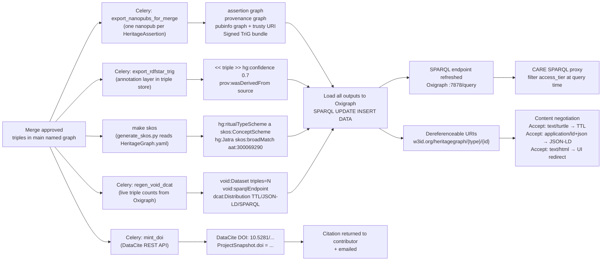
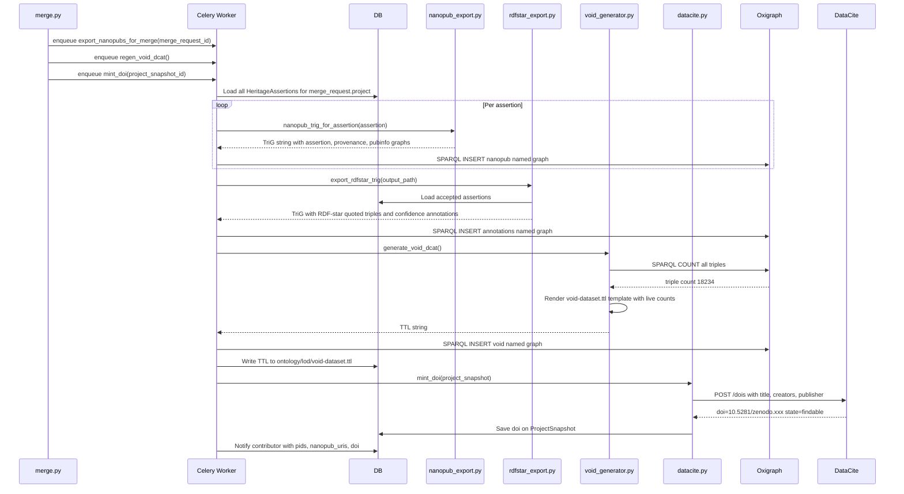

# Phases 10–11 — LOD Publication, Access & Discovery

> Covers: Nanopublication export (PARTIAL), RDF-star (PARTIAL), SKOS vocabularies (PARTIAL-static), VoID/DCAT (PARTIAL-static), content negotiation (PARTIAL), CARE SPARQL proxy (TODO), schema.org (TODO), DataCite DOI (TODO).
> Implementation tasks: `IMPLEMENTATION_PLAN.md § 10-A through 11-D`

---

## LOD Publication Pipeline — Process Diagram



---

## Feature Spec: Content Negotiation on Dereferenceable URIs

| Field | Value |
|-------|-------|
| Feature | Same `w3id.org/heritagegraph/structure/{id}` URI returns TTL, JSON-LD, RDF/XML, or HTML based on `Accept` header |
| Status | `[PARTIAL]` — `lod_views.py` exists; negotiation logic missing |
| Files | `apps/graph/lod_views.py` |
| Accept mapping | `text/turtle` → `rdflib` serialize from Oxigraph DESCRIBE · `application/ld+json` → JSON-LD plugin · `application/rdf+xml` → RDF/XML · `text/html` → 303 redirect to `/knowledge/{type}/{id}` |
| Acceptance | `curl -H "Accept: text/turtle" https://w3id.org/heritagegraph/structure/bhairabnath-temple` returns valid Turtle with CIDOC-CRM triples |

---

## Feature Spec: CARE-Aware SPARQL Proxy

| Field | Value |
|-------|-------|
| Feature | Proxy at `/sparql` injects `FILTER NOT EXISTS` clauses for `sensitive_indigenous` triples when caller is unauthenticated |
| Status | `[TODO]` |
| Files | `apps/graph/sparql_proxy.py`, `heritage_graph/urls.py` |
| Access tiers | `public` (no filter) · `org_only` (require org membership) · `community_only` (require community role) · `sensitive_indigenous` (require explicit grant) |
| Acceptance | Unauthenticated `SELECT ?s ?p ?o WHERE { ?s ?p ?o }` does not return any triple where subject has `hg:access_tier "sensitive_indigenous"` |

---

## Feature Spec: VoID + DCAT Generator

| Field | Value |
|-------|-------|
| Feature | Regenerate `void-dataset.ttl` with live triple counts after every merge |
| Status | `[TODO]` — static file exists; generator missing |
| Files | `apps/graph/kg_engine/void_generator.py`, `apps/graph/management/commands/regen_void.py` |
| SPARQL queries | `SELECT (COUNT(*) AS ?triples) WHERE { ?s ?p ?o }` · `SELECT DISTINCT ?type WHERE { ?s rdf:type ?type }` |
| Output | `ontology/lod/void-dataset.ttl` — overwritten with live counts, `dcat:version`, `dcat:issued = now()` |
| Acceptance | `python manage.py regen_void` produces valid TTL with correct triple count matching Oxigraph; `dcat:version` increments |

---

## Sequence: Full LOD Publication After Merge



---

## Wireframe: SPARQL Explorer (`/graphview` or public `/sparql`)

```
┌─────────────────────────────────────────────────────────────────────┐
│  HeritageGraph SPARQL Explorer                                       │
│  ─────────────────────────────────────────────────────────────────  │
│                                                                      │
│  Endpoint: https://w3id.org/heritagegraph/sparql                   │
│  Access:   [● Authenticated — full access]  or  [○ Anonymous]      │
│                                                                      │
│  ┌────────────────────────────────────────────────────────────────┐ │
│  │  PREFIX hg: <https://w3id.org/heritagegraph/>                 │ │
│  │  PREFIX crm: <http://www.cidoc-crm.org/cidoc-crm/>            │ │
│  │  PREFIX skos: <http://www.w3.org/2004/02/skos/core#>          │ │
│  │                                                                │ │
│  │  SELECT ?temple ?style ?match WHERE {                          │ │
│  │    ?temple a hg:Temple ;                                       │ │
│  │            hg:architectural_style ?style .                     │ │
│  │    OPTIONAL { ?style skos:exactMatch ?match }                  │ │
│  │  }                                                             │ │
│  │  LIMIT 20                                                      │ │
│  └────────────────────────────────────────────────────────────────┘ │
│  [Run Query →]  [Load example ▾]  [Federation: + Getty  + Wikidata]│
│                                                                      │
│  Results                                                             │
│  ┌──────────────────────────────────┬───────────┬────────────────┐  │
│  │ temple                           │ style     │ match          │  │
│  ├──────────────────────────────────┼───────────┼────────────────┤  │
│  │ hg:structure/bhairabnath-temple  │ Shikhara  │ aat:300002787  │  │
│  │ hg:structure/pashupatinath       │ Pagoda    │ aat:300002788  │  │
│  └──────────────────────────────────┴───────────┴────────────────┘  │
│  2 results  ·  0.043s  ·  CARE filter active (anonymous mode)       │
│                                                                      │
│  ⓘ 3 triples hidden by CARE access tier (sensitive_indigenous)      │
└──────────────────────────────────────────────────────────────────────┘
```

---

## Wireframe: Entity Dereference Page (`/knowledge/structure/[id]`)

```
┌─────────────────────────────────────────────────────────────────────┐
│  Bhairabnath Temple                                                  │
│  hg:structure/bhairabnath-temple-taumadhi                           │
│  ─────────────────────────────────────────────────────────────────  │
│                                                                      │
│  [Overview]  [Assertions (11)]  [Graph]  [Timeline]  [IIIF]  [RDF ▾]│
│                                                                      │
│  Type         Temple (crm:E22_Human-Made_Object)                    │
│  Location     Taumadhi Tole, Bhaktapur                              │
│               skos:exactMatch wd:Q177981                            │
│  Style        Shikhara  · AAT:300002787                             │
│  Built        circa 1427 CE (BS 1484~)                              │
│  Deity        Bhairab (via Enshrinement event)                      │
│  Condition    Good                                                   │
│                                                                      │
│  Provenance                                                          │
│  ┌────────────────────────────────────────────────────────────────┐ │
│  │  Source    Slusser 1982 (Archival Record)                      │ │
│  │  Author    Nabin Oli  ·  orcid:0000-0002-xxxx-xxxx            │ │
│  │  Project   Bhairabnath Temple Survey 2026                      │ │
│  │  Merged    2026-06-15  ·  Reviewer: Tek Raj Chhetri            │ │
│  │  DOI       10.5281/zenodo.xxxxxxx  [Cite ↗]                   │ │
│  └────────────────────────────────────────────────────────────────┘ │
│                                                                      │
│  Download as:  [Turtle ↓]  [JSON-LD ↓]  [RDF/XML ↓]               │
│                                                                      │
│  <script type="application/ld+json">                                │
│  { "@type": "schema:LandmarksOrHistoricalBuildings",                │
│    "name": "Bhairabnath Temple", "geo": {...} }                     │
│  </script>                                                          │
└──────────────────────────────────────────────────────────────────────┘
```

---

## Process Diagram: CARE SPARQL Proxy

```mermaid
flowchart TD
    REQ[Incoming SPARQL request\nGET /sparql?query=...] --> AUTH{Request\nauthenticated?}

    AUTH -->|No / anonymous| FILTER[Inject FILTER clause:\nFILTER NOT EXISTS\n{ ?s hg:access_tier sensitive_indigenous }\nFILTER NOT EXISTS\n{ ?s hg:access_tier community_only }]

    AUTH -->|Yes| ROLE{User role?}
    ROLE -->|Public user| FILTER2[Inject FILTER:\nhide sensitive_indigenous\nhide community_only]
    ROLE -->|Community member| FILTER3[Inject FILTER:\nhide sensitive_indigenous only]
    ROLE -->|Curator / explicit grant| PASSTHROUGH[No filter — full access]

    FILTER --> FORWARD[Forward modified query\nto Oxigraph :7878/query]
    FILTER2 --> FORWARD
    FILTER3 --> FORWARD
    PASSTHROUGH --> FORWARD

    FORWARD --> RESULT[Oxigraph returns results]
    RESULT --> ANNOTATE[Add X-CARE-Filtered header\nwith count of hidden triples]
    ANNOTATE --> RESP[Return response to caller]
```
