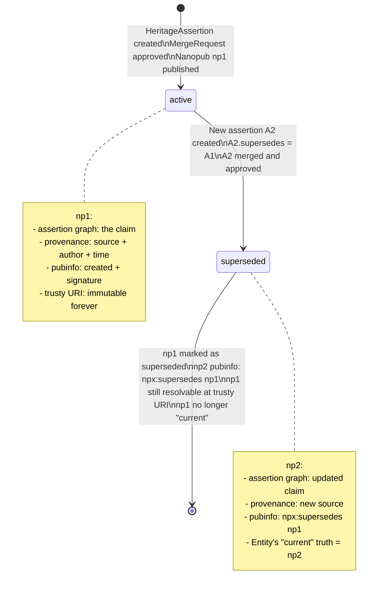
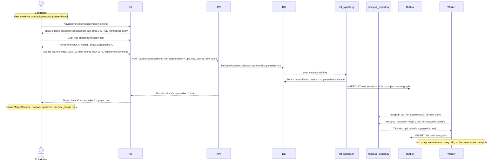

# Phase 12 — Maintenance Loop & Supersession

> Covers: Supersession chain (PARTIAL — FK exists), nanopub retraction (TODO), re-reconciliation Celery beat (TODO), dataset versioning (TODO).
> Implementation tasks: `IMPLEMENTATION_PLAN.md § 12-A, 12-B`

---

## Feature Spec: Supersession & Nanopub Retraction

| Field | Value |
|-------|-------|
| Feature | When new evidence supersedes an existing assertion, publish a retraction nanopub and mark the old one obsolete |
| Status | `[PARTIAL]` — `HeritageAssertion.supersedes` FK exists; retraction nanopub not emitted |
| Files | `apps/graph/kg_engine/nanopub_export.py` (add `nanopub_retraction_trig`), `apps/cidoc_data/rdf_signals.py` |
| RDF output | New nanopub with `npx:supersedes <old_np_uri>` in pubinfo graph; old URI remains resolvable forever |
| Acceptance | After saving a new assertion with `supersedes=<old_id>`, old nanopub's pubinfo graph contains `npx:supersedes` pointer; old nanopub still resolves at its trusty URI |

---

## Supersession State Diagram



---

## Sequence: Assertion Supersession



---

## Wireframe: Assertion History View (`/contribute/projects/[slug]/history`)

```
┌─────────────────────────────────────────────────────────────────────┐
│  Project History  ·  Bhairabnath Temple Survey 2026                 │
│  ─────────────────────────────────────────────────────────────────  │
│                                                                      │
│  Filter: [All assertions ▾]  Entity: [All ▾]  [Export CSV]         │
│                                                                      │
│  2026-06-15  14:32  Nabin Oli                                       │
│  ┌────────────────────────────────────────────────────────────────┐ │
│  │  + assertion  construction_date = "circa 1525 CE"              │ │
│  │    SUPERSEDES → construction_date = "circa 1427 CE"            │ │
│  │    source: DoA 1975 survey  ·  confidence: confirmed           │ │
│  │    [View diff]  [Rollback to prev]                             │ │
│  └────────────────────────────────────────────────────────────────┘ │
│                                                                      │
│  2026-06-13  09:10  Nabin Oli                                       │
│  ┌────────────────────────────────────────────────────────────────┐ │
│  │  + assertion  architectural_style = Shikhara                   │ │
│  │    source: Slusser 1982  ·  confidence: likely                 │ │
│  │    ✓ reconciled: AAT:300002787                                  │ │
│  └────────────────────────────────────────────────────────────────┘ │
│                                                                      │
│  2026-06-12  17:45  Nabin Oli                                       │
│  ┌────────────────────────────────────────────────────────────────┐ │
│  │  + assertion  name = "Bhairabnath Temple"                      │ │
│  │    source: Slusser 1982  ·  confidence: confirmed              │ │
│  └────────────────────────────────────────────────────────────────┘ │
│                                                                      │
│  ← Older                                                  Newer →   │
└──────────────────────────────────────────────────────────────────────┘
```

---

## Process Diagram: Re-Reconciliation Beat Task

```mermaid
flowchart TD
    BEAT[Celery beat: every Sunday 02:00 UTC\nrereconcile_all_entities.delay()] --> LOAD[Load all entities from DB\nwith reconciliation_status=reconciled]

    LOAD --> LOOP{For each entity}

    LOOP --> CHECK[HTTP GET: verify skos:exactMatch target still valid\ne.g. aat:XXXXXX → Getty SPARQL lookup]

    CHECK -->|Still valid| OK[No action\nreconciliation_status stays reconciled]
    CHECK -->|404 / redirected| STALE[Mark ReconciledLink.is_stale = True\nCreate CuratorAlert record]
    CHECK -->|Label drifted| DRIFT[Update skos:prefLabel from live source\nWrite updated triple to RDFSyncOutbox]

    OK --> LOOP
    STALE --> LOOP
    DRIFT --> LOOP

    LOOP -->|Done| NOTIFY[Email curators with stale link report\nN stale · M updated]
    NOTIFY --> DONE[Task complete]
```

---

## Wireframe: Curator Alert Panel (`/curation` — stale reconciliation alerts)

```
┌─────────────────────────────────────────────────────────────────────┐
│  Curation Dashboard                                                  │
│  ─────────────────────────────────────────────────────────────────  │
│                                                                      │
│  [Identity Clusters]  [Pending Merges]  [Stale Links ←]  [Admin]   │
│                                                                      │
│  Stale Reconciliation Links  (2 found · last checked 2026-06-14)   │
│                                                                      │
│  ┌────────────────────────────────────────────────────────────────┐ │
│  │  Entity:   hg:deity/kumari-kathmandu                           │ │
│  │  Link:     skos:exactMatch → wd:Q123456                        │ │
│  │  Issue:    Wikidata item merged into wd:Q789012                │ │
│  │  Detected: 2026-06-14                                          │ │
│  │  [Update link → wd:Q789012]  [Remove link]  [Ignore]          │ │
│  └────────────────────────────────────────────────────────────────┘ │
│                                                                      │
│  ┌────────────────────────────────────────────────────────────────┐ │
│  │  Entity:   hg:concept/jatra                                    │ │
│  │  Link:     skos:exactMatch → aat:300069290                     │ │
│  │  Issue:    AAT label changed "procession" → "processions"      │ │
│  │  Detected: 2026-06-14                                          │ │
│  │  [Accept label update]  [Keep old label]  [Ignore]            │ │
│  └────────────────────────────────────────────────────────────────┘ │
└──────────────────────────────────────────────────────────────────────┘
```
