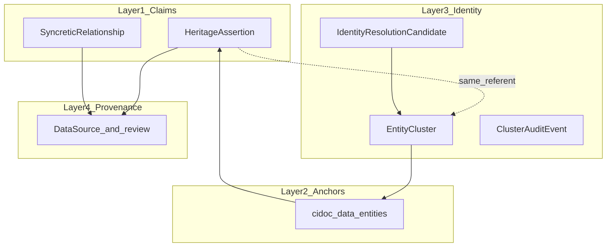

# HeritageGraph: Epistemic Platform Status (2026)

**Audience:** CAIR-Nepal / engineering / product.  
**Purpose:** Align the **claims-first, four-layer** design intent with **what exists in this repository today**, and point to actionable follow-ups ([platform-next-steps-checklist.md](platform-next-steps-checklist.md)).

---

## Executive summary

HeritageGraph is designed as a **knowledge representation system**: it stores **assertions about heritage** (with sources, agents, confidence, and supersession), not a single editorial "truth." The repository **implements the claim and provenance cores** (`HeritageAssertion`, `DataSource`, review and conflict flows, LinkML-driven registry UI), **implements the first-class identity layer** (`EntityCluster`, `IdentityResolutionCandidate`, `ClusterAuditEvent`, merge/split/lock API), and **has serializer codegen** (`BaseRegistrySerializer` + `make serializers`) reducing manual drift between LinkML and Django. The **"Why we believe"** story is **partially** surfaced in the UI via an assertions panel; competing identity clusters with weighted source evidence are not yet visualised as a narrative synthesis view.

---

## Design principles vs repository

### Everything is a claim (epistemology over naive ontology)

**Intent:** Facts are not “in the DB as truth”; they are **claims** backed by source, agent, time, and confidence.

| Aspect | Status | Notes |
|--------|--------|--------|
| Atomic claim record | **Implemented** | `HeritageAssertion` in [`heritage_graph/apps/cidoc_data/models.py`](../heritage_graph/apps/cidoc_data/models.py): generic FK to asserted subject, `asserted_property` / `asserted_value`, `source`, `confidence`, `supersedes`, `reconciliation_status`. |
| Ontology alignment | **Implemented** | `HeritageAssertion` in [`ontology/HeritageGraph.yaml`](../ontology/HeritageGraph.yaml) (e.g. `crminf:I2_Belief`, PROV mappings). |
| API | **Implemented** | `HeritageAssertionViewSet` and assertions query params in [`heritage_graph/apps/cidoc_data/views.py`](../heritage_graph/apps/cidoc_data/views.py). |

**Partial:** Not every user-facing flow may create or display assertions uniformly across all entity types; contributors still see **entity-shaped** forms as the primary metaphor.

### Entities as reference anchors (not truth objects)

**Intent:** Stable IDs cluster **claims**; “the entity” is not the same as “the one correct name.”

| Aspect | Status | Notes |
|--------|--------|--------|
| CIDOC-style entity models | **Implemented** | Persons, structures, places, deities, events, etc. under [`heritage_graph/apps/cidoc_data/models.py`](../heritage_graph/apps/cidoc_data/models.py). |
| Identity cluster / alias resolution layer | **Implemented** | `EntityCluster` (stable anchor), `ClusterAuditEvent` (append-only audit trail), `IdentityResolutionCandidate` (reviewer queue), and `IDENTITY_SAME_REFERENT_PROPERTY` predicate on `HeritageAssertion` — all in `cidoc_data/models.py`. Merge / split / lock / unlock actions in `EntityClusterViewSet` (`cidoc_data/views.py`) backed by `identity_services.py`. |
| Fork / merge of **contributions** | **Implemented (different concern)** | `Fork`, merge actions, and `CulturalEntity` lineage in [`heritage_graph/apps/heritage_data/`](../heritage_graph/apps/heritage_data/) address **contribution** branching, not the epistemic “same referent, many names” cluster problem. |

### Four-layer conceptual model

| Layer | Role | Status |
|-------|------|--------|
| 1 — Claims | Assertions, syncretic links, condition/survey outputs as modeled | **Implemented / partial** | `HeritageAssertion`, `SyncreticRelationship` (+ related CIDOC types). Condition/survey types exist in ontology and models where applicable. |
| 2 — Entity anchors | IDs for clustering claims | **Implemented** | Standard Django models + APIs. |
| 3 — Identity | Clusters, aliases, "same as" resolution | **Implemented** | `EntityCluster`, `IdentityResolutionCandidate`, `ClusterAuditEvent` in `cidoc_data/models.py`; merge/split/lock/unlock API in `EntityClusterViewSet`; identity resolution workspace UI at `/curation/identity/`. |
| 4 — Provenance | Sources, review, moderation | **Strong / partial** | `DataSource`, assertion provenance fields; review queue, three-panel review workspace, and schema-extension approval flows in UI under `/curation/`. |

---

## Architecture: LinkML, registry, Django

**Intent:** One pipeline from schema to UI and API contracts.

| Piece | Status | Evidence |
|-------|--------|----------|
| LinkML as schema source | **Implemented** | [`ontology/HeritageGraph.yaml`](../ontology/HeritageGraph.yaml). |
| Classmap + hub YAML | **Implemented** | [`tools/ui-classmap.yaml`](../tools/ui-classmap.yaml), [`tools/contribute-hub.yaml`](../tools/contribute-hub.yaml). |
| Registry generation | **Implemented** | [`tools/linkml_generate_registry.py`](../tools/linkml_generate_registry.py), [`heritage_graph/apps/cidoc_data/ontology_builder.py`](../heritage_graph/apps/cidoc_data/ontology_builder.py); snapshots [`heritage_graph_ui/src/lib/ontology/registry.generated.json`](../heritage_graph_ui/src/lib/ontology/registry.generated.json). |
| CI: generated files match YAML | **Implemented** | [`.github/workflows/ontology-registry.yml`](../.github/workflows/ontology-registry.yml) runs `make ontology-check` ([`Makefile`](../Makefile)). |
| Django models + DRF serializers — codegen | **Implemented** | `tools/generate_serializers.py` + `make serializers` emits 19 typed stub serializers in `cidoc_data/serializers.generated.py`; `make serializers-check` for CI. Reduces drift between LinkML and Django. See [`docs/new-entity-checklist.md`](new-entity-checklist.md). |
| Payload validation vs JSON Schema | **Implemented** | `BaseRegistrySerializer` mixin in `cidoc_data/serializers.py` auto-validates all mapped entities at `.validate()` time via [`registry_validation.py`](../heritage_graph/apps/cidoc_data/registry_validation.py); no-op if schema absent (safe drop-in). |
| New-entity workflow doc | **Implemented** | [`docs/new-entity-checklist.md`](new-entity-checklist.md) — 12-step guide for adding a new CIDOC entity. |

**Honest summary:** The YAML → registry pipeline is now three strong links: YAML → registry snapshots, optional payload → JSON Schema, and automated serializer stub generation. The remaining **process risk** is enum/choices alignment (LinkML enums ↔ Django `choices`) and classmap/router parity (tracked in [`FORMS.md`](../FORMS.md)).

---

## UI / UX

### What works

- **Task-first contribute hub** with progressive difficulty on intents: [`tools/contribute-hub.yaml`](../tools/contribute-hub.yaml).
- **Generated forms and tables** from registry: see [`FORMS.md`](../FORMS.md).
- **Reviewer flows:** review queue, triage filters, three-panel review workspace (`/curation/review/[id]`), conflict list (`/curation/conflicts`), forks queue (`/curation/forks`), activity log, reviewer dashboard.
- **Identity resolution workspace:** `/curation/identity/` lists candidates; `/curation/identity/[candidateId]` is the per-candidate workspace (merge/split/link aliases).
- **Schema extension proposals:** `/curation/schema-extensions/` — propose, review, and approve schema changes; lifecycle actions (submit/withdraw/approve/reject/publish) backed by `SchemaExtensionProposal` model.
- **Assertions on knowledge views:** [`heritage_graph_ui/src/components/knowledge/why-we-believe-panel.tsx`](../heritage_graph_ui/src/components/knowledge/why-we-believe-panel.tsx) loads heritage assertions for a record.

### Gaps vs recommended “four verbs”

The design essay groups work as **Describe** (anchors) / **Record** (events) / **Claim** (assertions) / **Verify** (sources). The UI today groups by **domain hubs** (Tangible, Events, Kumari, …), which is helpful but **does not encode epistemic role** in navigation or cards.

| Verb | Current approximation | Status |
|------|------------------------|--------|
| Describe | Structure, person, place, deity intents | **Partial** — same card weight as other intents. |
| Record | Ritual, festival, event intents | **Partial** |
| Claim | Heritage assertion, syncretic flows | **Partial** — expert-oriented; not isolated as a primary verb in the hub. |
| Verify | Sources, surveys | **Partial** |

**Contributor “basic vs advanced” mode:** Intent `difficulty` (`beginner` / `intermediate` / `advanced`) exists in the hub YAML; a **global** basic/advanced toggle that hides assertion and ontology complexity is **not** implemented as a first-class feature.

---

## Competing truth and narrative

| Capability | Status |
|------------|--------|
| Store multiple assertions per subject | **Implemented** |
| Supersede / reconcile assertions | **Implemented** (model + API) |
| UI: grouped assertion list (“why we believe”) | **Partial** — panel lists and groups by `asserted_property`; not identity-cluster competition or source-weighted narrative synthesis. |
| Query-time “best story” graph | **Gap** — product/research direction, not a dedicated surfaced layer in the app. |

---

## Scale and data types (forward-looking)

| Risk | Current state (repo) | Direction |
|------|----------------------|-----------|
| Identity explosion without clusters | **Resolved** — `EntityCluster`, merge/split/lock API, audit trail, and identity workspace all landed. | Remaining: conflict-detection pre-flight API (`conflict_check` action) + UI merge-blocked badge (P2 plan). |
| Schema drift | **Significantly reduced** — serializer codegen (`make serializers`/`make serializers-check`) + `BaseRegistrySerializer` runtime validation. Remaining gap: enum/choices alignment and classmap/router parity. | Add CI gates for enum + router checks. |
| Reviewer queue saturation | Queue UI + triage scoring exists (`TriagePolicy` weights, `triage_priority` on review-queue rows). | SLA enforcement — product backlog. |
| Geo / temporal queries | `coordinates` still `CharField` on `Location`, `ArchitecturalStructure`, `Monument`. | PostGIS `PointField` migration + EDTF validator (P2 plan). |
| Conflicting cluster merges | `merge_clusters()` blocks on locked/mismatched clusters; `conflicting_subject_assertion_ids()` exists. | Auto conflict-detection pre-flight + moderator escalation via `IdentityResolutionCandidate` (P2 plan). |

---

## Related reading

- [specs/005-identity-layer/spec.md](../specs/005-identity-layer/spec.md) — feature specification for the claim-first identity layer (now largely implemented: `EntityCluster`, same-referent membership claims, audit, workspace UI).
- [docs/new-entity-checklist.md](new-entity-checklist.md) — 12-step guide for adding a new CIDOC entity type end-to-end.
- [PLATFORM_PLAN.md](../PLATFORM_PLAN.md) — phased product plan.
- [ARCHITECTURE.md](../ARCHITECTURE.md) — system and review diagrams.
- [FORMS.md](../FORMS.md) — LinkML → registry → UI pipeline and field sync checklist.
- [specs/004-yaml-driven-schema/](../specs/004-yaml-driven-schema/) — YAML-driven registry spec and design artifacts.
- **Next steps (checkboxes):** [platform-next-steps-checklist.md](platform-next-steps-checklist.md).

---

*Last updated: April 2026. Reflects: identity layer (P0), serializer codegen (P1), reviewer/moderator UX (P1). Pending: P2 PostGIS, EDTF, relation standardization, perf indexes, merge-conflict detection.*
