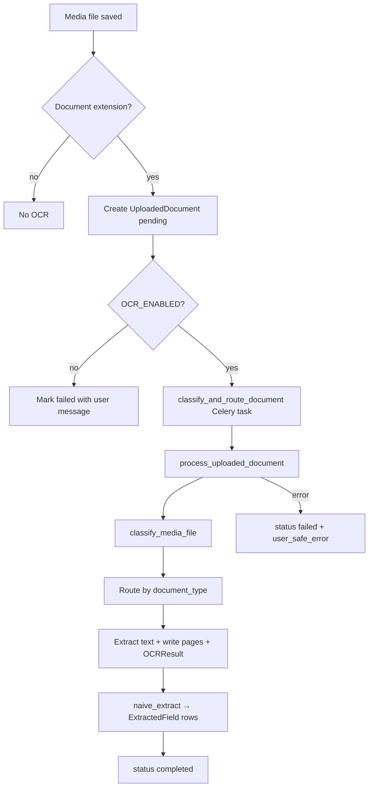

# OCR pipeline

> ⚠️ **SUSPENDED — future functionality.** The OCR / document-to-graph ingestion pipeline is
> currently **paused and not part of the active deployment**: `OCR_ENABLED` defaults to
> `false` (document uploads still succeed but no OCR runs), and the `ocr-worker` service has
> been removed from the running Docker stacks (definition preserved in git history). This
> document is retained for when the pipeline is revived. To re-enable, set `OCR_ENABLED=true`
> and restore the `ocr-worker` service.

This document describes how document text extraction runs in HeritageGraph: triggers, the unified processing function, classification, engine routing, persistence, and the API. Infrastructure (Celery, Docker, requirements) and implementation history are included in [§Infrastructure & implementation history](#infrastructure--implementation-history) below.

## Purpose

When contributors upload PDFs or images, the system can extract text, store per-page results, produce lightweight structured **suggestions** (`ExtractedField`), and expose status and suggestions to the UI. Processing is asynchronous via Celery (synchronous in development if `CELERY_TASK_ALWAYS_EAGER` is enabled).

## End-to-end flow



## Entry points

1. **Automatic (primary)** — `post_save` on `heritage_data.Media` (`apps/document_processing/signals.py`):
   - Runs only for **new** `Media` rows.
   - File name must end with: `.pdf`, `.jpg`, `.jpeg`, `.png`, `.tiff`, `.tif`, `.webp`.
   - Creates an `UploadedDocument` linked to the media (`OneToOne`), copies `submission` / `cultural_entity` from the media, sets `status=pending`, then calls `classify_and_route_document.delay(str(doc.id))`.
   - If `OCR_ENABLED` is false, the document is marked failed immediately (no task).
   - Failures while starting OCR are logged; they do **not** break the `Media` save.

2. **Direct upload API** — `POST …/ocr-documents/upload/` (`UploadedDocumentViewSet.upload` in `views.py`):
   - Creates `Media` (and thus the same signal path) or ties to an existing flow per serializer; returns `media_id`, `uploaded_document_id`, and `status`.

3. **Retry** — `POST …/ocr-documents/<uuid>/retry/` (staff or permitted users):
   - Sets `status` to `pending` and re-queues `classify_and_route_document`.

## Task layer

- **Main task:** `classify_and_route_document` (`tasks.py`) — the only path that should run in production. It calls `process_uploaded_document(document_id=…)`.
- **Other named tasks** (`extract_text_pdfplumber`, `extract_text_tesseract`, `extract_structured_fields`, etc.) are **compatibility entrypoints**; they all delegate to the same `process_uploaded_document` for a single, unified pipeline.

## Unified pipeline: `process_uploaded_document`

Implemented in `apps/document_processing/services/pipeline.py`.

1. **Guard** — If `OCR_ENABLED` is false (via `get_ocr_settings()`), mark failed and exit.
2. **Reset** — Clears previous `raw_text`, errors, `DocumentPage` rows (and their `OCRResult` rows), and `ExtractedField` rows for a clean re-run.
3. **Status** — Sets `processing`, records `processing_started`.
4. **Size check** — Enforces `OCR_MAX_FILE_BYTES` by streaming the file.
5. **Classification** — `classify_media_file` updates `document_type` and `classification_confidence` on the `UploadedDocument`.
6. **Extraction** — Branches on `document_type` (see below).
7. **Validation** — If extractors return empty text, the pipeline may try **vision rescue** for some image types; if still empty, raises so the document is marked failed.
8. **Structured output** — `naive_extract(text=raw_text)` creates `ExtractedField` records.
9. **Success** — `status=completed`, `processing_finished` set, `raw_text` saved.

**Errors**

- `pytesseract.TesseractNotFoundError` → failed with a clear user-facing message about missing Tesseract.
- Any other exception → failed with a generic user-safe message; details in `error_message` for operators.

## Classification: `classify_media_file`

File: `apps/document_processing/services/classifier.py`.

The file is copied to a temp path, then:

- **PDF** — `pdfplumber` samples the first N pages (N = `OCR_MAX_PAGES_PER_DOCUMENT`) and computes a **text ratio** heuristic (`_pdf_text_ratio`).  
  - Ratio ≥ `0.35` → `pdf_digital` (higher confidence when more text is found).  
  - Otherwise → `pdf_scanned`.
- **Raster images** (by extension or `image/*` mime) → `image_print` (handwriting vs inscription is **not** inferred from the file alone in v1).
- **Fallback** → `image_print` with low confidence.

So for normal uploads, **`image_handwritten` and `image_inscription` are not produced by the classifier**. The pipeline still contains branches for those types if the type is set otherwise (e.g. manual admin edit or future logic).

## Extraction routing

| `document_type`   | Extraction path | Notes |
|------------------|-----------------|--------|
| `pdf_digital`    | `extract_pdf_digital` | `pdfplumber` per page; `OCRResult` engine `pdfplumber`. |
| `pdf_scanned`    | `extract_raster_ocr`  | PDF rendered to images (`pdf2image` @ 200 DPI), then Tesseract per page. |
| `image_print`    | `extract_raster_ocr`  | Single image → Tesseract. |
| `image_handwritten` | `extract_handwritten` | v1: **same as** `extract_raster_ocr` with label `htr_v1_raster` (TrOCR not wired here). |
| `image_inscription` | `run_vision_rescue` | Claude Vision; on failure, falls back to `extract_raster_ocr` as `inscription_fallback`. |
| **else**         | `extract_raster_ocr` | Default raster path. |

**Empty text recovery** — If the routed path still yields no text, for `image_inscription`, `image_print`, or `image_handwritten` the pipeline attempts `run_vision_rescue` once (if configured).

## Engines (implementation details)

### Digital PDF — `services/pdf.py`

- Uses `pdfplumber` to extract text per page (up to `max_pages`).
- Per page: `DocumentPage` + `OCRResult` with engine `pdfplumber`, confidence `0.95` if the page has text, else `0.0`.
- Returns joined non-empty pages.

### Raster / Tesseract — `services/raster_ocr.py`

- **Tesseract** configuration tries **Devanagari + English** first (`-l deva+eng`, `--oem 1 --psm 3`), then **English** only.
- Word-level confidences from `image_to_data` are averaged; compared to `OCR_CONFIDENCE_THRESHOLD` from settings.
- **PDF:** `pdf2image` + Poppler: rasterizes up to `max_pages`, 200 DPI; each page stored with engine `tesseract` and `metadata` including `source` (e.g. `raster_ocr`, `inscription_fallback`).
- **Image:** one page, same OCR path.

### Handwriting — `services/htr.py`

- Delegates to `extract_raster_ocr` (Tesseract). Documented in code as v1; model-based HTR is a future/optional worker concern.

### Vision rescue — `services/vision_rescue.py`

- Requires `ANTHROPIC_API_KEY`.
- Enforces a per-document cap: `OCR_CLAUDE_VISION_MAX_CALLS_PER_DOCUMENT` (increments `claude_vision_invocations` on the `UploadedDocument`).
- PDF: only the **first page** is rasterized and sent.
- Optional Tesseract “pre-pass” on the same image is included in the prompt.
- Model: `claude-3-5-sonnet-20241022` (as coded); response stored as `OCRResult` engine `claude_vision`.

### “NER” / structured fields — `services/ner.py`

- v1 **`naive_extract`**: regex years (`date_year_hint`) and a first-line title hint (`title_line_hint`) for short text — not a full NER/LLM stack.

## Persistence — `services/persistence.py`

- `upsert_page` — `DocumentPage` by `(document, page_number)` with `raw_text` and numeric `confidence`.
- `append_ocr_result` — append-only `OCRResult` per engine pass (audit trail).

## Runtime settings — `services/ocr_settings.py`

| Setting | Role |
|--------|------|
| `OCR_ENABLED` | Master switch. |
| `OCR_CONFIDENCE_THRESHOLD` | Tesseract pass/fail vs trying next config (not EasyOCR in this path). |
| `OCR_MAX_PAGES_PER_DOCUMENT` | Classifier sample + max pages to extract. |
| `OCR_MAX_FILE_BYTES` | Upload/processing size limit. |
| `OCR_CLAUDE_VISION_MAX_CALLS_PER_DOCUMENT` | Vision API budget per document. |
| `TESSERACT_PATH` | Optional path to the `tesseract` binary. |

Environment variables for Celery/Redis and keys are also described in `.env.example` and the integration summary.

## HTTP API (DRF)

Mounted under the app’s URL include; router basename is `ocr-document` (e.g. `/data/ocr-documents/…` depending on `urls.py` prefix).

| Method | Path (relative to mount) | Purpose |
|--------|---------------------------|---------|
| `POST` | `ocr-documents/upload/` | Upload; creates `Media` / `UploadedDocument` and returns ids + status. |
| `GET`  | `ocr-documents/<uuid>/`  | Status (via retrieve/list and serializer fields). |
| `GET`  | `ocr-documents/<uuid>/suggestions/` | Suggestion map from `ExtractedField` rows. |
| `POST` | `ocr-documents/<uuid>/retry/` | Requeue processing (permission-gated). |

**Permissions** — Staff see all documents; non-staff users see documents tied to their submissions or cultural entities (`IsStaffOrDocumentOwner`).

## Operational notes

- **Development** — `CELERY_TASK_ALWAYS_EAGER=True` runs tasks in-process (see settings).
- **Production** — Run Redis + a Celery worker with OCR dependencies (`requirements-ocr.txt` / `ocr-worker` image) so Tesseract and optional vision keys are available.
- **EasyOCR** — Listed in `requirements-ocr.txt` but the current raster path does **not** call EasyOCR; the integration summary tracks it as a future fallback.

## Source map (pipeline-related)

| Area | Path |
|------|------|
| Orchestration | `heritage_graph/apps/document_processing/services/pipeline.py` |
| Classification | `…/services/classifier.py` |
| PDF text | `…/services/pdf.py` |
| Tesseract / raster | `…/services/raster_ocr.py` |
| Handwriting v1 | `…/services/htr.py` |
| Vision | `…/services/vision_rescue.py` |
| Suggestions | `…/services/ner.py` |
| Tasks | `…/tasks.py` |
| Signal | `…/signals.py` |
| API | `…/views.py`, `…/serializers.py`, `…/urls.py` |
| Models | `…/models.py` |

This reflects the v1 implementation: end-to-end wiring is in place; handwriting-specific models, EasyOCR fallback in code paths, and rich NER are still evolution items (see [OCR_INTEGRATION_SUMMARY.md](documentation/internal/OCR_INTEGRATION_SUMMARY.md) **Current Limitations**).


---

# Infrastructure & implementation history


## Overview
HeritageGraph now has infrastructure in place for document OCR processing. Two major phases completed:
- **Phase 0 (Infrastructure)**: Celery + Redis async task system configured
- **Phase 1 (Data Models)**: Document processing models and signals set up

## What Was Done

### Phase 0: Infrastructure Setup ✅

**Dependencies Added:**
- `celery==5.3.6` and `redis==5.0.1` (main requirements.txt)
- `requirements-ocr.txt` with heavy deps: pytesseract, easyocr, transformers, torch, trocr, anthropic, etc.

**Django Configuration:**
- Celery configured in [heritage_graph/settings/base.py](../heritage_graph/settings/base.py):
  - `CELERY_BROKER_URL` and `CELERY_RESULT_BACKEND` point to Redis
  - Serialization: JSON (safe for all data types)
  - Task time limits: 30min hard / 25min soft
- Development mode: `CELERY_TASK_ALWAYS_EAGER = True` (tasks run synchronously for easier debugging)
- Created [heritage_graph/celery_app.py](../heritage_graph/celery_app.py) app initialization
- Updated [heritage_graph/__init__.py](../heritage_graph/__init__.py) to load Celery on startup

**Docker Setup:**
- Added Redis service to docker-compose.yml (port 6379 internal)
- Added ocr-worker service: runs Celery worker with full OCR dependencies
- Updated Dockerfile.backend with 4-stage multi-stage build:
  - `base-builder`: Dependencies wheel building
  - `ocr-builder`: OCR-specific heavy dependencies
  - `runtime-lean`: Backend service (no OCR) — smaller image
  - `ocr-worker`: Full OCR worker with tesseract, torch, etc.

**Environment Variables Added (.env.example):**
- `CELERY_BROKER_URL`: Redis connection
- `CELERY_RESULT_BACKEND`: Redis result storage
- `OCR_ENABLED`: Enable/disable pipeline
- `TESSERACT_PATH`: Path to tesseract binary
- `ANTHROPIC_API_KEY`: Claude Vision API key
- `OCR_CONFIDENCE_THRESHOLD`, `OCR_MAX_PAGES_PER_DOCUMENT`, etc.

### Phase 1: Data Models & Document Processing App ✅

**App Created:** [heritage_graph/apps/document_processing/](../heritage_graph/apps/document_processing/)

**Models:**
1. **UploadedDocument** (`models.py`)
   - Central record for each uploaded document
   - Fields: document_type (PDF digital/scanned, image print/handwritten/inscription), status (pending/processing/completed/failed)
   - Tracks: classification_confidence, raw_text, processing_started/finished, error_message
   - Links to: Media (upload source), Submission (legacy), CulturalEntity (new workflow)
   - Indexes: status + created_at, document_type for fast filtering

2. **DocumentPage** (`models.py`)
   - Represents individual pages after splitting
   - Per-page OCR text + aggregated confidence score
   - Unique constraint: document + page_number

3. **OCRResult** (`models.py`)
   - Engine-specific results (audit trail)
   - Fields: engine (pdfplumber/tesseract/easyocr/trocr/claude_vision), text, confidence, metadata (JSONField)
   - Enables comparing outputs from multiple engines for same page

4. **ExtractedField** (`models.py`)
   - NER-extracted structured entities
   - Fields: field_name, field_value, source_entity_type (PERSON/LOCATION/DATE/etc.)
   - Scores: confidence (OCR) + vocabulary_match_score (Wikidata/AAT cross-check)
   - Used by frontend to pre-fill forms with "confidence badges"

**Celery Tasks** (`tasks.py`)
- Skeleton tasks (TODO implementations):
  - `classify_and_route_document()`: Main pipeline entry, determines engine routing
  - `extract_text_pdfplumber()`: Digital PDFs (direct text, no OCR)
  - `extract_text_tesseract()`: Printed Devanagari primary
  - `extract_text_easyocr_fallback()`: Mixed scripts, fallback on low confidence
  - `extract_text_trocr()`: Handwritten HTR
  - `vision_rescue_task()`: Claude Vision for hard inscriptions
  - `extract_structured_fields()`: NER extraction
  - `map_fields_to_form()`: Map entities to form fields
  - `cleanup_failed_documents()`: Periodic cleanup task

**Signal Handlers** (`signals.py`)
- Triggers on Media creation
- Auto-creates UploadedDocument + queues classify_and_route_document task
- Defensive: won't break if OCR init fails (catches exception)

**Admin Interface** (`admin.py`)
- Registered all 4 models in Django admin
- Features:
  - Color-coded badges for status/document_type
  - Inline search, filters, sorting
  - Bulk actions: "Retry OCR" (re-queue failed docs), "Delete results"
  - Fieldsets: collapse advanced fields for cleaner UI
  - Readonly fields for audit audit (id, timestamps, results)

**App Registration:**
- Added `apps.document_processing` to `INSTALLED_APPS` in base.py
- Signal handlers auto-registered in `apps.DocumentProcessingConfig.ready()`

**Database:**
- 4 models × 4 tables created (verified with `python manage.py check`)
- Migrations created and applied to SQLite/PostgreSQL

---

## Architecture Overview

```
User uploads document (PDF/image via heritage_graph_ui)
    ↓
POST /data/api/form-submit/ or /data/cultural-entities/
    ↓
Media model created (save file to storage)
    ↓
Signal: post_save on Media
    ↓
on_media_upload() handler:
  1. Check if file is document type (.pdf, .jpg, etc.)
  2. Create UploadedDocument (status='pending')
  3. Queue Celery task: classify_and_route_document.delay(doc_id)
    ↓
[Async / Development: runs immediately]
[Production: goes to Redis queue, Celery worker picks up]
    ↓
classify_and_route_document task:
  1. Load UploadedDocument by ID
  2. Read Media file
  3. Determine document_type + confidence (classifier logic — TODO)
  4. Route to engine tasks:
     - PDF digital → extract_text_pdfplumber
     - PDF scanned / Printed image → extract_text_tesseract (primary)
     - Printed + low confidence → extract_text_easyocr_fallback
     - Handwritten → extract_text_trocr
     - Stone inscription → vision_rescue_task
    ↓
Engine tasks (example: Tesseract):
  1. extract_text_tesseract(doc_id):
       - Load image from Media file
       - Run Tesseract with config: --oem 1 --psm 3 -l deva+eng
       - For each page: create DocumentPage + OCRResult
       - Get confidence scores
       - If confidence < threshold: queue extract_text_easyocr_fallback
       - Set UploadedDocument.raw_text = concatenated pages
    ↓
extract_structured_fields task:
  1. Load raw_text from UploadedDocument
  2. Call Instructor + Claude to extract entities:
     - PERSON: name, dates, roles, relation to heritage
     - LOCATION: name, coordinates, heritage significance
     - DATE: ranges, historical periods
     - ARTIFACT: type, material, dimensions
     - EVENT: name, date, participants
     - TRADITION: name, cultural significance
     - etc.
  3. For each entity: create ExtractedField with confidence + vocabulary_score
  4. Set document.status = 'completed'
    ↓
map_fields_to_form task:
  1. Load ExtractedFields for document
  2. Map to form fields (e.g., PERSON with name → person_name field)
  3. Generate pre-populate structure for frontend
    ↓
API (DRF) — also mirrored under `/api/v1/data/...` (recommended):
  POST   /data/ocr-documents/upload/              (multipart: `file` + `cultural_entity_id` or `submission_id`)
  GET    /data/ocr-documents/<uuid>/              (status)
  GET    /data/ocr-documents/<uuid>/suggestions/  (map of `ExtractedField` suggestions)
  POST   /data/ocr-documents/<uuid>/retry/        (staff: requeue)
    ↓
Frontend (MVP in `heritage_graph_ui`):
  `HeritageDocumentUpload` uploads + polls, then "Apply" merges suggestions into **empty** form fields
```

---

## Current Limitations / TODO

The unified pipeline in `apps.document_processing.services.pipeline` is a **v1** implementation: it is end-to-end wired (upload → process → `ExtractedField` rows → API), but some engines are still best-effort or intentionally lightweight.

1. **Classify/routing** is heuristic (PDF digital vs scanned vs image types) — can be improved with stronger signals and fixtures.
2. **EasyOCR** is not used on the “lean” path yet; `requirements-ocr.txt` includes it for worker experiments.
3. **TrOCR** is not wired; handwriting currently follows the Tesseract/raster path (`services/htr.py` v1).
4. **NER** is currently heuristic (`services/ner.py`) rather than instructor/LLM-structured extraction.
5. **Monitoring/metrics** beyond structured logs in tasks/services is still open.

### To Complete Phase 5 (Monitoring)
1. Add task status endpoint (admin only)
2. Add logging/metrics for engine performance

### To Complete Phase 6 (Testing)
1. Unit tests for each component
2. Fixtures with real test documents
3. Manual end-to-end test on dev

---

## How to Continue

### To test the current setup:
```bash
# Terminal 1: Start Redis
docker run --rm -p 6379:6379 redis:7-alpine

# Terminal 2: Start Celery worker (with eager mode in dev)
cd heritage_graph
source .venv/bin/activate
celery -A heritage_graph worker -l debug

# Terminal 3: Test task in Django shell
python heritage_graph/manage.py shell
>>> from apps.document_processing.models import UploadedDocument
>>> from apps.document_processing.tasks import classify_and_route_document
>>> # Upload a Media file, then:
>>> doc = UploadedDocument.objects.first()
>>> classify_and_route_document.delay(str(doc.id))
```

### To add Tesseract support:
```bash
# macOS
brew install tesseract

# Ubuntu
sudo apt-get install tesseract-ocr tesseract-ocr-nep tesseract-ocr-script-deva

# Then implement classifier.py and extract_text_tesseract() task
```

### To run with Docker:
```bash
docker-compose up -d redis ocr-worker
# Backend will connect to Redis at redis:6379
# ocr-worker will process tasks from the queue
```

---

## Files Modified/Created

**Created:**
- `heritage_graph/celery_app.py` — Celery app initialization
- `heritage_graph/__init__.py` — Celery setup on Django startup
- `heritage_graph/apps/document_processing/` — New app (5 files)
  - `models.py` — 4 data models
  - `tasks.py` — Celery task skeletons
  - `signals.py` — OCR trigger on Media upload
  - `admin.py` — Django admin interface
  - `apps.py` — App config + signal registration
  - `migrations/0001_initial.py` — Database schema
- `requirements-ocr.txt` — OCR dependencies (separate from main)

**Modified:**
- `requirements.txt` — Added celery, redis
- `heritage_graph/settings/base.py` — Added Celery config + document_processing to INSTALLED_APPS
- `heritage_graph/settings/development.py` — Added CELERY_TASK_ALWAYS_EAGER for dev
- `.env.example` — Added CELERY_* and OCR_* variables
- `docker-compose.yml` — Added redis + ocr-worker services, updated backend target
- `Dockerfile.backend` — Multi-stage build with runtime-lean + ocr-worker targets

---

## Next Session

Harden the v1 pipeline: improve `classifier.py` accuracy, add EasyOCR fallback where Tesseract is weak, wire optional TrOCR in the worker image, and expand `ner.py` from heuristics toward schema-guided extraction.
