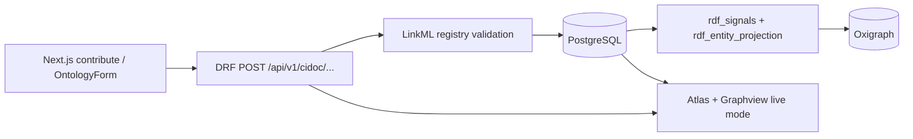

# HeritageGraph — Testing & Validation Guide

This document describes how to **test and validate** the HeritageGraph data path from frontend contribution through PostgreSQL, registry-aligned RDF, Oxigraph, and live visualization (Atlas + Graphview).

**Out of scope here:** OCR / document ingestion and the legacy `Submission` flat-field workflow unless noted.

**Canonical ontology:** [`ontology/HeritageGraph.yaml`](../../ontology/HeritageGraph.yaml)

---

## Table of contents

1. [Pipeline overview](#1-pipeline-overview)
2. [Prerequisites](#2-prerequisites)
3. [Ontology change workflow](#3-ontology-change-workflow)
4. [Automated backend validation](#4-automated-backend-validation)
5. [Oxigraph and RDF validation](#5-oxigraph-and-rdf-validation)
6. [Frontend visualization validation](#6-frontend-visualization-validation)
7. [Manual UI checklist](#7-manual-ui-checklist)
8. [CI and regression gates](#8-ci-and-regression-gates)
9. [Troubleshooting](#9-troubleshooting)
10. [Reference commands](#10-reference-commands)

---

## 1. Pipeline overview

### Data flow (what “working” means)



| Layer | Responsibility | Source of truth |
|--------|----------------|-----------------|
| Forms & API validation | Field types, enums, `slot_uri` | `ontology/HeritageGraph.yaml` → `linkml_loader` |
| Postgres | Authoritative records | Django ORM (`cidoc_data`, `heritage_data`) |
| RDF projection | Triples on save | Registry `class_uri` / `slot_uri` via `rdf_entity_projection` |
| Oxigraph | Queryable graph | `RDF_ENDPOINT_URL` / `RDF_QUERY_URL` (Docker) or local `oxigraph_db/` |
| Atlas / Graphview | Live corpus | `fetchInstanceGraphData` → CIDOC list APIs |

**Scientific rule:** Do not hand-edit generated registry files or duplicate RDF mappers. Regenerate artifacts with `make generate` and prove consistency with `make check` and the E2E command below.

### Single RDF write path

Registry-driven projection is handled only by:

- `heritage_graph/apps/cidoc_data/rdf_signals.py`
- `heritage_graph/apps/cidoc_data/rdf_entity_projection.py`

Legacy `graph_client` inserts for Person/Structure in `cidoc_data/signals.py` were removed to avoid duplicate subjects (`Person/` vs `person/` IRIs).

---

## 2. Prerequisites

### Local (venv)

```bash
cd heritagegraph
python3 -m venv .venv
source .venv/bin/activate   # Windows: .venv\Scripts\activate
pip install -r heritage_graph/requirements.txt linkml pyyaml
```

### Docker stack (recommended for Postgres + Oxigraph)

```bash
docker compose up -d postgres backend oxigraph frontend
```

Relevant environment (see [`docker-compose.yml`](../../docker-compose.yml) and [`.env.example`](../../.env.example)):

| Variable | Typical value (Compose) | Purpose |
|----------|-------------------------|---------|
| `RDF_SYNC_ENABLED` | `true` | Project triples on CIDOC save |
| `RDF_ENDPOINT_URL` | `http://oxigraph:7878/update` | SPARQL UPDATE |
| `RDF_QUERY_URL` | `http://oxigraph:7878/query` | SPARQL SELECT (proxy + diagnostics) |
| `RDF_RESOURCE_BASE_URI` | `https://w3id.org/heritagegraph/resource/` | Instance IRIs |
| `HERITAGEGRAPH_SCHEMA_PATH` | `ontology/HeritageGraph.yaml` | Registry build |

### Frontend

```bash
cd heritage_graph_ui
cp .env.example .env.local
# Set NEXT_PUBLIC_API_URL to your backend (e.g. http://localhost:8000)
npm install
npm run dev
```

Sign in with Google so Atlas/Graphview can call authenticated list endpoints when required.

---

## 3. Ontology change workflow

After editing **`ontology/HeritageGraph.yaml`** (and optionally `tools/ui-classmap.yaml`, `tools/contribute-hub.yaml`, `tools/ui-presentation.yaml`):

```bash
# From repo root — regenerates all derived artifacts
make generate
```

This runs, in order:

1. `make ontology` — `registry.generated.json` / `.ts` (UI offline fallback)
2. `make viz-config` — `enums.ts`, `heritage-viz-config.ts`, `apps/graph/ontology_config.py`
3. `make shacl` — `ontology/shapes/generated-heritagegraph-minimal-shacl.ttl`
4. `make serializers` — `serializers.generated.py`
5. `make entityrefs` — `EntityRef` backfill
6. `make schema-rebuild` — `SchemaRegistry` row in Postgres

Verify nothing is stale (same as CI):

```bash
make check
```

Commit **YAML + all generated files** in one PR.

**Still manual when adding a new entity type:** Django model, migration, ViewSet + `urls.py`, and a row in `heritage_graph/apps/cidoc_data/cidoc_registry_keys.py`.

More detail: [`ontology/README.md`](../../ontology/README.md), [`tools/README.md`](../../tools/README.md), [`specs/004-yaml-driven-schema/quickstart.md`](../../specs/004-yaml-driven-schema/quickstart.md).

---

## 4. Automated backend validation

### 4.1 End-to-end contribution → viz command

Simulates frontend-style API posts and validates Postgres, RDF projection, list APIs, and Atlas/Graphview visibility rules.

```bash
cd heritage_graph
DJANGO_ENV=development python manage.py validate_contribution_pipeline
```

**Options:**

| Flag | Effect |
|------|--------|
| `--json` | Machine-readable report on stdout |
| `--keep-data` | Leave seeded rows in DB for manual UI inspection |

**Example success output:**

```text
Contribution → Viz pipeline
  [PASS] api_post_location: ...
  [PASS] api_post_structure: ...
  [PASS] api_post_person: ...
  [PASS] postgres_location: ...
  [PASS] postgres_structure: ...
  [PASS] postgres_person: ...
  [PASS] postgres_cultural_entity: ...
  [PASS] rdf_projection_registry: ...
  [PASS] review_accept_publish: ...
  [PASS] oxigraph_store: ...
  [PASS] kg_graph_api: ...
  [PASS] api_list_location: ...
  [PASS] api_list_structure: ...
  [PASS] api_list_person: ...
  [PASS] graphview_nodes: ...
  [PASS] atlas_hydrate_entities: ...
  [PASS] atlas_globe_spatial: ...
  [PASS] atlas_location_coords: ...
Overall: PASSED
```

Implementation: [`heritage_graph/apps/cidoc_data/management/commands/validate_contribution_pipeline.py`](../../heritage_graph/apps/cidoc_data/management/commands/validate_contribution_pipeline.py)

**Note:** Records are created as `pending_review` (same as the UI), then the command **publishes** them (`CIDOC.status=accepted` + `CulturalEntity.accept_contribution`) before RDF/Atlas checks — matching the real reviewer workflow. It uses a **temporary local Oxigraph directory** when `RDF_ENDPOINT_URL` is empty. For Docker Oxigraph, use [§5](#5-oxigraph-and-rdf-validation) after a run with `--keep-data` or contribute via the UI.

### 4.2 Knowledge list API smoke test

Every navigable ontology class used by `/knowledge/<domain>` tables must return HTTP 200 from its DRF list endpoint (see [`../contribution/KNOWLEDGE_PAGES.md`](../contribution/KNOWLEDGE_PAGES.md)):

```bash
cd heritage_graph
DJANGO_ENV=development python manage.py test apps.cidoc_data.test_knowledge_list_apis -v2
```

Included in `make test-e2e` via `tests/config.py`.

### 4.3 Platform E2E (recommended gate)

Single command that runs **42 automated tests** across health, discovery, KG APIs, contribution + identity resolution, **CIDOC form → reviewer `decide` accept → kg/graph**, duplicate handling, review queue, RDF projection, museum enrichment, and cultural-entity sync:

```bash
make test-e2e
# or:
./tests/run_e2e.sh
```

**Faster smoke** (core pipeline only, 11 tests):

```bash
./tests/run_e2e.sh --skip-unit
```

**Optional live HTTP probes** (backend must already be running):

```bash
PLATFORM_E2E_LIVE_URL=http://127.0.0.1:8000 ./tests/run_e2e.sh
```

**Runners & config:** [`tests/run_platform_e2e.py`](../../tests/run_platform_e2e.py), [`tests/config.py`](../../tests/config.py), [`tests/README.md`](../../tests/README.md).

**Test modules** (Django discovery — stay under `heritage_graph/apps/`): [`test_platform_e2e.py`](../../heritage_graph/apps/graph/test_platform_e2e.py), [`test_e2e_pipeline.py`](../../heritage_graph/apps/cidoc_data/test_e2e_pipeline.py).

**Not covered by this suite** (manual or separate tooling): Next.js UI flows, Google OAuth login, OCR/document pipeline, OpenRouter assistant chat, Traefik TLS, production deploy smoke.

### 4.4 Django unit / integration tests

```bash
cd heritage_graph
DJANGO_ENV=development python manage.py test apps.cidoc_data.tests.FrontendContributionPipelineTest
DJANGO_ENV=development python manage.py test apps.cidoc_data.tests.RegistrySnapshotAlignmentTest
DJANGO_ENV=development python manage.py test apps.cidoc_data.tests.RegistryJsonSchemaCoercionTest
DJANGO_ENV=development python manage.py test apps.heritage_data.tests.test_contribution_queue_api
```

Broader CIDOC suite:

```bash
DJANGO_ENV=development python manage.py test apps.cidoc_data
```

### 4.5 Registry API smoke

```bash
curl -sS -H "Authorization: Bearer <token>" \
  "http://localhost:8000/api/v1/cidoc/schema/registry/" \
  | jq '.schema_version, (.classes | keys | length)'
```

Expect `schema_version` and a non-empty `classes` object. Repeat with `If-None-Match` from `ETag` → expect `304` when unchanged.

### 4.6 What the E2E command checks (mapping)

| Step | Validates |
|------|-----------|
| `api_post_*` | Same routes as UI per `tools/ui-classmap.yaml` (e.g. `/api/v1/cidoc/locations/`, `structures/`, `productions/`, `persons/`) |
| `postgres_*` | ORM persistence + `CulturalEntity` wrapper for persons |
| `rdf_projection_registry` | Triples use registry `classUri` and `name` `slot_uri` |
| `oxigraph_store` | `rdf_signals` writes quads (local store in command) |
| `api_list_*` | Records visible to `fetchInstanceGraphData` |
| `graphview_nodes` | Node IDs `location_{id}`, `structure_{id}`, `person_{id}` |
| `atlas_*` | API exposes `latitude`/`longitude`; enough entities for globe |

---

## 5. Oxigraph and RDF validation

### 5.1 Configuration diagnostic

```bash
cd heritage_graph
DJANGO_ENV=development python manage.py rdf_diagnose
```

Optional:

```bash
python manage.py rdf_diagnose --project-first   # one-row round-trip
python manage.py rdf_diagnose --project-all     # full rebuild (heavy)
```

### 5.2 Full triplestore rebuild (after schema or bulk import)

```bash
cd heritage_graph
DJANGO_ENV=development python manage.py rdf_rebuild --purge-imports
```

### 5.3 SPARQL sanity (Docker Oxigraph)

Instance IRIs use:

```text
https://w3id.org/heritagegraph/resource/{model_name_lower}/{pk}
```

Example (replace `65` with a real person id):

```sparql
PREFIX rdfs: <http://www.w3.org/2000/01/rdf-schema#>
SELECT ?p ?o WHERE {
  <https://w3id.org/heritagegraph/resource/person/65> ?p ?o .
}
LIMIT 50
```

Via API proxy (read-only):

```text
GET /api/v1/cidoc/sparql/?query=SELECT%20*%20WHERE%20%7B%20?s%20?p%20?o%20%7D%20LIMIT%2010
```

### 5.4 Semantic alignment checklist

| Check | How |
|-------|-----|
| Predicates match LinkML | Compare registry field `slot_uri` for a class with triple predicates in Oxigraph |
| One subject per row | No duplicate IRIs (`person/` vs `Person/`) |
| `RDF_SYNC_ENABLED` | `rdf_diagnose` prints `true` in Compose |
| Namespace | Predicates expand from `ontology/HeritageGraph.yaml` prefixes (`crm:`, `heritageGraph:`) |

---

## 6. Frontend visualization validation

### 6.1 Shared live data loader

Both **Atlas** and **Graphview** use:

- [`heritage_graph_ui/src/lib/instance-graph.ts`](../../heritage_graph_ui/src/lib/instance-graph.ts) — `fetchInstanceGraphData()`
- Atlas also uses [`heritage_graph_ui/src/lib/atlas-api-hydrate.ts`](../../heritage_graph_ui/src/lib/atlas-api-hydrate.ts) — `hydrateAtlasFromInstanceGraph()`

Live fetch pulls paginated CIDOC list endpoints under `/api/v1/cidoc/...` plus accepted assertions.

### 6.2 Graphview (`/graphview`)

1. Open **Graphview** in the dashboard.
2. Ensure mode is **Live** / instance data (not ontology schema-only demo).
3. Refresh data.
4. Confirm new entities appear as nodes (`person_123`, `location_456`, etc.).
5. Optional: export or inspect edge counts via UI stats.

**Expected:** Person nodes appear even without coordinates; edges depend on relations, location FKs, and description heuristics.

### 6.3 Heritage Atlas (`/atlas`)

1. Open **Atlas**.
2. Switch corpus to **Live** (not Demo).
3. Wait for “corpus ready” (see [`use-atlas-data-source.ts`](<../../heritage_graph_ui/src/app/(dashboard)/atlas/hooks/use-atlas-data-source.ts>)).
4. **Globe:** entities with `latitude` and `longitude` in API JSON show as points.
5. **Graph panel:** uses filtered entities and ontology edges from the same corpus.
6. **Search / entity panel:** should list contributed names.

**Important:** Persons without lat/lon appear in graph/search but **not** on the Cesium globe. For globe testing, contribute a **Location** or **Structure** with coordinates:

```json
{
  "latitude": 27.7172,
  "longitude": 85.324
}
```

(Also accepted on create via structure `point` CharField.)

### 6.4 Frontend ontology artifact check

```bash
cd heritage_graph_ui
npm run check:ontology
```

Runs `gen_heritage_viz_config.py --check` and `linkml_generate_registry.py --check`.

---

## 7. Manual UI checklist

Use after `validate_contribution_pipeline --keep-data` or a real contribute session.

| # | Action | Pass criteria |
|---|--------|----------------|
| 1 | Contribute a **Location** with lat/lon via `/contribute/location` | `201` from API; row in knowledge list |
| 2 | Contribute a **Structure** linked to that location | No `400` on relation fields; structure in DB |
| 3 | Contribute a **Person** | `CulturalEntity` in `pending_review`; appears in curation queue if applicable |
| 4 | `GET /api/v1/cidoc/schema/registry/` | Field definitions match form |
| 5 | Atlas **Live** mode | Location/structure visible on globe near coordinates |
| 6 | Graphview **Live** | All three node types visible |
| 7 | `python manage.py rdf_diagnose` (Docker) | Quad count increases after save |
| 8 | Knowledge view → open record | Detail page loads same data as form |

---

## 8. CI and regression gates

| Workflow / command | What it enforces |
|--------------------|------------------|
| [`.github/workflows/ontology-registry.yml`](../../.github/workflows/ontology-registry.yml) | `make check` on ontology-related changes |
| `make check` | Registry, viz config, SHACL, serializers, entityrefs, contribute routes |
| `make ontology-check` | `registry.generated.*` matches YAML |
| `make shacl-check` | SHACL TTL matches registry snapshot |
| `apps.cidoc_data.tests.FrontendContributionPipelineTest` | API → Postgres → RDF → viz rules |

**Recommended before merge:**

```bash
make check
cd heritage_graph && DJANGO_ENV=development python manage.py validate_contribution_pipeline
cd heritage_graph && DJANGO_ENV=development python manage.py test apps.cidoc_data.tests.FrontendContributionPipelineTest
```

---

## 9. Troubleshooting

### Structure create returns 400 with `has_current_location`

**Cause:** Registry JSON Schema expected a scalar relation id; FK was validated as a model instance.

**Fix:** Ensure `coerce_for_jsonschema` maps Django models to `pk` ([`registry_validation.py`](../../heritage_graph/apps/cidoc_data/registry_validation.py)). Relation fields in the UI should send numeric IDs.

### `structure_type` validation error

Use LinkML / model choices exactly (e.g. `"Temple"`, not `"temple"`). See `STRUCTURE_TYPE_CHOICES` in [`cidoc_data/models.py`](../../heritage_graph/apps/cidoc_data/models.py).

### Atlas shows “No entities” in live mode

- Confirm `NEXT_PUBLIC_API_URL` points at the backend that received the data.
- Confirm Atlas is on **Live**, not Demo.
- Check browser network tab: CIDOC list calls return `200` with `results`.
- Auth: some deployments require a signed-in user for writes; lists may be public.

### Oxigraph empty but Postgres has rows

- `RDF_SYNC_ENABLED=false` in env — set `true` (see `.env.example`).
- `rdf_diagnose` shows empty `RDF_ENDPOINT_URL` — in Docker, use `http://oxigraph:7878/update`.
- Run `python manage.py rdf_rebuild --purge-imports` after fixing config.

### `make entityrefs` / `schema-rebuild` fails with “No module named django”

Use the project venv (`make` targets use `.venv/bin/python`). Run `make setup` or create venv per [§2](#2-prerequisites).

### Duplicate or missing triples

- Only one writer: `rdf_signals`. Do not re-enable legacy `sync_person_to_graph` / `sync_structure_to_graph`.
- Subject IRI pattern: `{RDF_RESOURCE_BASE_URI}/{model_lower}/{pk}`.

### Graphview has nodes but Atlas globe is empty

Expected if records lack `latitude`/`longitude` in list API responses. Add coordinates on Location or Structure.

---

## 10. Reference commands

```bash
# ── Ontology pipeline ──
make generate
make check
make schema-diff OLD=ontology/HeritageGraph.yaml NEW=path/to/candidate.yaml

# ── Platform E2E (full suite) ──
make test-e2e
# or: ./tests/run_e2e.sh

# ── Contribution pipeline validator ──
cd heritage_graph
DJANGO_ENV=development python manage.py validate_contribution_pipeline
DJANGO_ENV=development python manage.py validate_contribution_pipeline --keep-data
DJANGO_ENV=development python manage.py validate_contribution_pipeline --json

# ── RDF / Oxigraph ──
DJANGO_ENV=development python manage.py rdf_diagnose
DJANGO_ENV=development python manage.py rdf_diagnose --project-first
DJANGO_ENV=development python manage.py rdf_rebuild --purge-imports

# ── Tests ──
DJANGO_ENV=development python manage.py test apps.cidoc_data.tests.FrontendContributionPipelineTest
DJANGO_ENV=development python manage.py test apps.cidoc_data

# ── Frontend ──
cd heritage_graph_ui && npm run check:ontology

# ── Health ──
curl -sS http://localhost:8000/health/detailed/ | jq .
```

---

## Related documentation

| Document | Topic |
|----------|--------|
| [`../contribution/FORMS.md`](../contribution/FORMS.md) | Ontology forms and registry |
| [`../ontology/ONTOLOGY.md`](../ontology/ONTOLOGY.md) | LinkML, SHACL, namespaces |
| [`heritage_graph_ui/src/lib/ontology/ONTOLOGY_PIPELINE.md`](../../heritage_graph_ui/src/lib/ontology/ONTOLOGY_PIPELINE.md) | UI-side ontology artifacts |
| [`../../AGENTS.md`](../../AGENTS.md) | Repo map for agents |

---

*Last updated to reflect the unified ontology pipeline (`make generate` / `make check`), `validate_contribution_pipeline`, registry-only RDF sync, and Atlas/Graphview live corpus validation.*
