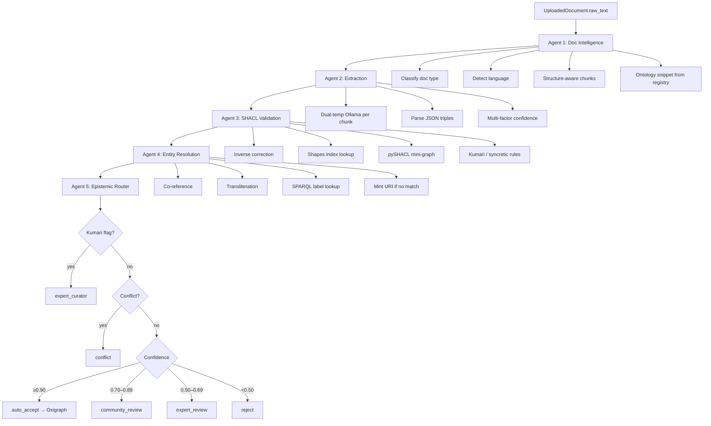

# HeritageGraph — Agentic KG Ingestion Pipeline

**Location:** `heritage_graph/apps/document_processing/services/agents/`  
**Version:** 2.1 (scientific rigor upgrade)  
**Purpose:** Transform OCR-extracted heritage documents into ontology-valid, provenance-rich knowledge graph assertions with epistemic routing for human curation.

---

## Table of contents

1. [System architecture](#system-architecture)
2. [Module layout](#module-layout)
3. [Data flow and contracts](#data-flow-and-contracts)
4. [Shared infrastructure](#shared-infrastructure)
5. [Agent reference](#agent-reference)
6. [Confidence and epistemics](#confidence-and-epistemics)
7. [Provenance and RDF](#provenance-and-rdf)
8. [Integration points](#integration-points)
9. [Configuration](#configuration)
10. [Docker and deployment](#docker-and-deployment)
11. [Testing](#testing)
12. [Security](#security)
13. [Known limitations and roadmap](#known-limitations-and-roadmap)

---

## System architecture

### Design principles

| Principle | Implementation |
|-----------|----------------|
| **Ontology-first** | CIDOC-CRM + HeritageGraph SHACL shapes constrain extraction and validation |
| **Epistemic transparency** | Decomposed `confidence_breakdown`; every assertion traceable to chunk + agent |
| **Fail-closed validation** | SHACL rejects unknown predicates by default; pySHACL errors reject unless `HERITAGEGRAPH_SHACL_FAIL_OPEN` |
| **Human-in-the-loop** | Multi-tier review queues before Oxigraph auto-insert |
| **Modularity** | Shared `ontology`, `sparql`, `confidence` modules; agents are thin orchestration layers |
| **Failure isolation** | `orchestrator.py` catches per-stage errors; partial results returned |

### Layered architecture

```
┌─────────────────────────────────────────────────────────────────────────────┐
│  INTEGRATION LAYER                                                          │
│  tasks.run_kg_pipeline (Celery)  ·  views (API trigger)  ·  pipeline.py OCR │
└─────────────────────────────────────────────────────────────────────────────┘
                                      │
┌─────────────────────────────────────────────────────────────────────────────┐
│  ORCHESTRATION LAYER                                                        │
│  orchestrator.run_kg_ingestion_pipeline()  ·  telemetry.PipelineMetrics   │
└─────────────────────────────────────────────────────────────────────────────┘
                                      │
        ┌─────────────┬───────────────┼───────────────┬─────────────┐
        ▼             ▼               ▼               ▼             ▼
   ┌─────────┐  ┌──────────┐  ┌──────────┐  ┌──────────┐  ┌──────────┐
   │ Agent 1 │  │ Agent 2  │  │ Agent 3  │  │ Agent 4  │  │ Agent 5  │
   │ Doc     │  │ Extract  │  │ SHACL    │  │ Entity   │  │ Epistemic│
   │ Intel   │  │          │  │ Validate │  │ Resolve  │  │ Route    │
   └─────────┘  └──────────┘  └──────────┘  └──────────┘  └──────────┘
        │             │               │               │             │
        └─────────────┴───────────────┴───────────────┴─────────────┘
                                      │
┌─────────────────────────────────────────────────────────────────────────────┐
│  SHARED SERVICES LAYER                                                      │
│  config · ontology · sparql · confidence · provenance · types                 │
└─────────────────────────────────────────────────────────────────────────────┘
                                      │
        ┌─────────────────────────────┼─────────────────────────────┐
        ▼                             ▼                             ▼
┌───────────────┐            ┌─────────────────┐            ┌─────────────────┐
│ Ollama (LLM)  │            │ Oxigraph        │            │ PostgreSQL      │
│ classification│            │ SPARQL SELECT/  │            │ HeritageAssertion│
│ + extraction  │            │ UPDATE + named  │            │ UploadedDocument │
│               │            │ graphs          │            │ .metadata       │
└───────────────┘            └─────────────────┘            └─────────────────┘
        ▲                             ▲
┌───────────────┐            ┌─────────────────┐
│ Schema        │            │ SHACL shapes    │
│ registry      │            │ (minimal TTL)   │
│ LinkML YAML   │            │                 │
└───────────────┘            └─────────────────┘
```

### Pipeline DAG (linear with optional skip)



### Execution modes

| Mode | Entry point | Django required | Oxigraph | Notes |
|------|-------------|-----------------|----------|-------|
| **Full pipeline** | `run_kg_ingestion_pipeline()` | Optional (`skip_epistemic_db`) | Yes (Agent 4–5) | Recommended for scripts |
| **Celery task** | `tasks.run_kg_pipeline(document_id)` | Yes | Yes | Production; updates `metadata` |
| **Per-agent** | `run_doc_intelligence`, etc. | Agent 5 only | Agents 4–5 | Testing / debugging |
| **OCR-only** | `pipeline.process_uploaded_document` | Yes | No | Runs Agent 1 only today |

---

## Module layout

```
agents/
├── __init__.py              # Public API exports
├── types.py                 # Dataclasses + enums (pipeline contracts)
├── config.py                # PipelineConfig + env vars
├── ontology.py              # CIDOC/HG URI maps, inverse map, minting
├── sparql.py                # Injection-safe Oxigraph client
├── confidence.py            # Multi-factor confidence calibration
├── provenance.py            # PROV-O + named graph builders
├── telemetry.py             # Stage timing metrics
├── orchestrator.py          # Unified 5-agent runner
├── doc_intelligence.py      # Agent 1
├── extraction_agent.py      # Agent 2
├── shacl_agent.py           # Agent 3
├── entity_resolution_agent.py  # Agent 4
├── epistemic_router_agent.py # Agent 5
└── AGENTS.md                # This file
```

**Related (outside this package):**

| Path | Role |
|------|------|
| `document_processing/tasks.py` | Celery `run_kg_pipeline` — production entry |
| `document_processing/views.py` | Triggers `run_kg_pipeline.delay()` after OCR |
| `document_processing/services/pipeline.py` | OCR routing; calls Agent 1 only |
| `cidoc_data/models.py` | `HeritageAssertion` ORM target |
| `cidoc_data/linkml_loader.py` | Schema registry for ontology snippets |
| `ontology/shapes/generated-heritagegraph-minimal-shacl.ttl` | SHACL shapes |
| `heritage_graph/settings/pipeline_e2e.py` | E2E test settings (no GDAL, Postgres) |
| `heritage_graph/scripts/run_kg_e2e_test.py` | Full Docker E2E test script |

---

## Data flow and contracts

### Type graph (agent hand-offs)

```
DocumentIntelligenceResult
    └── chunks: list[DocumentChunk]
            └── used by Agent 2

ExtractionResult
    └── candidates: list[CandidateAssertion]
            ├── triple: Triple
            ├── confidence_score: float          # composite after calibration
            ├── confidence_breakdown: dict       # audit trail
            └── source_chunk_id, char_start/end

ShaclValidationResult
    ├── validated: list[ValidatedAssertion]
    │       ├── candidate: CandidateAssertion  # may be corrected
    │       ├── checks_passed: list[str]       # e.g. "kumari_flag", "pyshacl_ok"
    │       └── corrected, correction_note
    └── rejected: list[RejectedAssertion]
            └── violation_type: str

EntityResolutionResult
    └── resolved: list[ResolvedAssertion]
            ├── subject_uri, object_uri
            ├── subject_is_new, object_is_new
            └── subject_resolution_score, object_resolution_score

EpistemicRoutingResult
    └── routed: list[RoutedAssertion]
            ├── route: RouteDecision
            ├── db_assertion_id: UUID | None
            ├── oxigraph_written: bool
            └── provenance_graph_uri: str | None
```

### `UploadedDocument.metadata` schema (Celery task)

Written incrementally by `tasks.run_kg_pipeline`:

```json
{
  "pipeline_status": "running | complete | failed",
  "pipeline_run_id": "uuid",
  "pipeline_started_at": "ISO-8601",
  "pipeline_finished_at": "ISO-8601",
  "pipeline_error": null,
  "agent_status": {
    "doc_intelligence": "pending | running | complete",
    "extraction": "complete",
    "shacl_validation": "complete",
    "entity_resolution": "complete",
    "epistemic_routing": "complete"
  },
  "agent_results": {
    "doc_intelligence": {
      "heritage_doc_type": "inscription",
      "heritage_doc_type_confidence": 0.9,
      "detected_language": "Nepali",
      "chunk_count": 12,
      "ontology_class_keys": ["structure", "iconography"],
      "ocr_quality_estimate": 1.0
    },
    "extraction": { "candidate_count": 5, "rejected_count": 0 },
    "shacl_validation": {
      "validated_count": 4,
      "rejected_count": 1,
      "rejection_reasons": [{ "subject": "...", "predicate": "...", "reason": "...", "violation_type": "..." }]
    },
    "entity_resolution": { "resolved_count": 4, "skipped_count": 0 },
    "epistemic_routing": { "counts": { "auto_accept": 2, "community_review": 2 } }
  },
  "assertions": [
    {
      "subject": "Pashupatinath",
      "predicate": "P108_was_produced_by",
      "object": "King Manadeva",
      "subject_uri": "https://w3id.org/heritagegraph/entity/...",
      "confidence_score": 0.887,
      "confidence_breakdown": { "extraction_agreement": 1.0, "composite": 0.887 },
      "route": "community_review",
      "kumari_flagged": false,
      "conflict_detected": false,
      "db_assertion_id": "uuid",
      "provenance_graph_uri": "https://w3id.org/heritagegraph/graph/document/<doc_id>"
    }
  ]
}
```

---

## Shared infrastructure

### `config.py` — `PipelineConfig`

Central env-driven configuration. Access via `DEFAULT_CONFIG` or `PipelineConfig.from_env()`.

All agents accept optional `config: PipelineConfig` kwarg; default is environment-based.

### `ontology.py` — URI resolution

| Export | Purpose |
|--------|---------|
| `CLASS_URI` | CIDOC + HeritageGraph class label → full URI |
| `INVERSE_MAP` | Inverse CIDOC predicate → forward form |
| `FORWARD_TO_INVERSE` | Forward → inverse (for SHACL index aliasing) |
| `KUMARI_CLASSES`, `KUMARI_PREDICATES` | High-stakes routing flags |
| `predicate_uri()`, `class_uri()` | Normalize LLM short forms |
| `is_literal_type()` | Skip entity resolution for literals |
| `mint_entity_uri()` | `hg:entity/<slug>-<uuid>` |
| `default_shapes_path()` | Resolves SHACL TTL (env → repo → `/app/ontology`) |
| `allowed_predicates_from_snippet()` | Predicate whitelist for extraction prompts |

**SHACL forward/inverse aliasing:** HeritageGraph shapes often declare inverse predicates (`P108i_was_produced_by`). The shapes index loader aliases each forward predicate (`P108_was_produced_by`) to the same constraint so LLM output in forward CIDOC form validates correctly.

### `sparql.py` — `SparqlClient`

| Method | Purpose |
|--------|---------|
| `select(sparql)` | SPARQL SELECT → list of binding dicts |
| `update(sparql)` | SPARQL UPDATE (INSERT) |
| `exact_label_lookup(label, class_uri)` | Case-insensitive `rdfs:label` match |
| `label_candidates(class_uri, limit)` | Fuzzy candidate pool |
| `existing_objects(subject, pred)` | Conflict detection |
| `insert_data(ntriples, graph_uri)` | Named-graph INSERT |

**Security:** `escape_sparql_string()`, `validate_uri()` — rejects injection in dynamic IRIs.

### `confidence.py` — calibration

`ConfidenceBreakdown` fields (weighted geometric mean → `composite`):

| Factor | Weight | Source |
|--------|--------|--------|
| `extraction_agreement` | 0.30 | Dual-temperature exact / fuzzy / single-run |
| `ontology_grounding` | 0.15 | Predicate in snippet + known classes |
| `shacl_validity` | 0.25 | Passed SHACL (0.92 if auto-corrected) |
| `entity_resolution` | 0.20 | Exact / fuzzy / minted URI match |
| `ocr_quality` | 0.10 | From `UploadedDocument.metadata` |

Updated after Agents 3 and 4 mutate the candidate.

### `provenance.py` — PROV-O

| Function | Purpose |
|----------|---------|
| `document_graph_uri(doc_id)` | `hg:graph/document/<uuid>` named graph |
| `assertion_activity_uri(assertion_id)` | `hg:activity/extraction/<uuid>` |
| `build_prov_ntriples(...)` | PROV Activity + `used` document + `generated` triple |
| `mint_pipeline_run_id()` | Correlates orchestrator telemetry |

### `telemetry.py` — observability

`stage_timer(metrics, name)` context manager logs:

```
pipeline.stage=extraction duration_ms=1234.5 in=12 out=5 errors=0
```

Returns `PipelineMetrics.to_dict()` on `PipelineResult.metrics`.

---

## Agent reference

### Agent 1 — Document Intelligence (`doc_intelligence.py`)

**Entry:** `run_doc_intelligence(text, *, use_ollama, chunk_max_tokens, chunk_overlap, ocr_quality_estimate, document_metadata, config)`

| Step | Implementation |
|------|----------------|
| Classification | Ollama JSON `{"type", "confidence"}` or keyword heuristics |
| Language | `langdetect` → Nepali / Sanskrit / English / Hindi / Newari |
| Chunking | `chonkie.SentenceChunker` or structure-aware fallback (paragraph / citation boundaries) |
| Ontology | `_DOC_TYPE_ONTOLOGY_MAP` → `get_effective_registry_payload()` snippet |
| OCR quality | Propagates `ocr_confidence` from document metadata into chunks |

**Doc type → ontology keys:**

| `HeritageDocType` | Registry class keys |
|-------------------|---------------------|
| inscription | structure, iconography |
| chronicle | structure, ritual, festival, tradition |
| survey_report | structure, iconography, tradition |
| oral_history | ritual, festival, tradition |
| gazette | structure, tradition |
| unknown | all keys |

**Output:** `DocumentIntelligenceResult` (agent_version `1.1`)

---

### Agent 2 — Ontology-Grounded Extraction (`extraction_agent.py`)

**Entry:** `run_extraction(di_result, *, min_confidence, config)`

| Step | Implementation |
|------|----------------|
| Per chunk | Build prompt with ontology snippet + **allowed predicate whitelist** |
| LLM | Dual Ollama calls: `extraction_temp_low` (0.1) + `extraction_temp_high` (0.4) |
| Parse | Strip fences; extract first JSON array; validate `subject/predicate/object` |
| Agreement | `rapidfuzz` fuzzy match (threshold from config); partial credit 0.75+ for fuzzy |
| Confidence | `calibrate()` with ontology grounding + OCR quality |

**Prompt constraints:** Explicit instruction to use only allowed predicates or standard CIDOC `P*` properties; three few-shot Nepalese heritage examples.

**Output:** `ExtractionResult` (agent_version `2.1`)

---

### Agent 3 — SHACL Validator (`shacl_agent.py`)

**Entry:** `run_shacl_validation(candidates, *, config)`

**Shapes file:** `HERITAGEGRAPH_SHACL_SHAPES_PATH` or `ontology/shapes/generated-heritagegraph-minimal-shacl.ttl`

| Layer | Action |
|-------|--------|
| 1. Inverse correction | Swap subject/object; rewrite to forward predicate |
| 2. Kumari / syncretic | Stamp `kumari_flag`; reject malformed `E13` |
| 3. Shapes index | Unknown predicate → reject; nodeKind IRI/literal checks |
| 4. pySHACL | Mini-graph per triple; filter `MinCountConstraintComponent` |
| Fail mode | **Closed** by default; `HERITAGEGRAPH_SHACL_FAIL_OPEN=true` skips layer 4 errors |

**Violation types:** `unknown_predicate`, `node_kind`, `cross_class`, `domain_range`, `validator_error`

**Output:** `ShaclValidationResult` (agent_version `3.1`)

---

### Agent 4 — Entity Resolution (`entity_resolution_agent.py`)

**Entry:** `run_entity_resolution(shacl_result, *, oxigraph_url, config)`

Uses shared `SparqlClient` (not inline HTTP).

| Priority | Action |
|----------|--------|
| 1 | Co-reference (`"the temple"`, `"the king"`, …) → last URI in chunk |
| 2 | Transliteration map (~30 Nepalese place/person variants) |
| 3 | Exact `rdfs:label` SPARQL (typed, then untyped) |
| 4 | Fuzzy match ≥ `entity_fuzzy_threshold` (default 85) |
| 5 | Mint `hg:entity/<class_slug>-<uuid4>` |

Updates `confidence_breakdown.entity_resolution` after resolution.

**Output:** `EntityResolutionResult` (agent_version `4.1`)

---

### Agent 5 — Epistemic Router (`epistemic_router_agent.py`)

**Entry:** `run_epistemic_routing(resolution_result, *, document_id, agent_label, oxigraph_url, config)`

> Requires Django ORM (`HeritageAssertion.objects.create`).

| Priority | Condition | Route | DB | Oxigraph |
|----------|-----------|-------|-----|----------|
| 1 | `kumari_flag` in checks | `expert_curator` | pending | — |
| 2 | SPARQL conflict | `conflict` | disputed | — |
| 3 | score ≥ 0.90 | `auto_accept` | accepted | INSERT + PROV |
| 4 | score ≥ 0.70 | `community_review` | pending | — |
| 5 | score ≥ 0.50 | `expert_review` | pending | — |
| 6 | else | `reject` | — | — |

**DB fields:** `assertion_content`, `asserted_property`, `asserted_value`, `confidence`, `confidence_score`, `attributed_to_agent`, `reconciliation_status`, `source_citation`, `data_quality_note` (includes confidence factors + resolution notes).

**Oxigraph insert (auto_accept only):**

- Named graph: `hg:graph/document/<document_id>`
- Core triple + `rdfs:label` / `rdf:type` stubs for new entities
- Optional PROV-O activity triples when `write_prov_triples=true`

**Output:** `EpistemicRoutingResult` (agent_version `5.1`)

---

## Confidence and epistemics

### Why not binary 0.5/1.0?

Dual-temperature agreement alone is not epistemically calibrated — it conflates model stochasticity with factual certainty. The pipeline uses a **weighted geometric mean** so weak signals in any layer pull down the composite score conservatively.

### Score propagation

```
Agent 2: extraction_agreement + ontology_grounding + ocr_quality
    → composite (initial)

Agent 3: shacl_validity recalculated
    → composite updated

Agent 4: entity_resolution recalculated
    → composite updated (used by Agent 5 routing)
```

### Routing vs categorical confidence

| `confidence_score` | `HeritageAssertion.confidence` |
|--------------------|-------------------------------|
| ≥ 0.90 | `certain` |
| ≥ 0.70 | `likely` |
| ≥ 0.50 | `uncertain` |
| < 0.50 | `speculative` (rejected — no DB row) |

---

## Provenance and RDF

### Namespaces

| Prefix | URI |
|--------|-----|
| `hg:` | `https://w3id.org/heritagegraph/` |
| `crm:` | `http://www.cidoc-crm.org/cidoc-crm/` |
| `prov:` | `http://www.w3.org/ns/prov#` |
| `rdfs:` | `http://www.w3.org/2000/01/rdf-schema#` |

### Named graph strategy

Each uploaded document's accepted triples live in:

```
GRAPH <https://w3id.org/heritagegraph/graph/document/{document_uuid}>
```

This supports document-level retraction, versioning, and curator audit without polluting the global default graph.

### PROV-O activity (auto_accept)

```
prov:Activity ─ prov:used ─▶ hg:document/{id}
              ─ prov:generated ─▶ subject URI
              ─ prov:wasAssociatedWith ─▶ agent label
```

---

## Integration points

### Celery task (`tasks.run_kg_pipeline`)

```python
# Triggered from views after OCR completes:
run_kg_pipeline.delay(str(doc.id))

# Synchronous (e.g. tests):
run_kg_pipeline.run(document_id=str(doc.id))
```

Progress is pollable via `GET` on the OCR document detail endpoint → `metadata.agent_status`.

### Orchestrator (library use)

```python
from apps.document_processing.services.agents import run_kg_ingestion_pipeline

result = run_kg_ingestion_pipeline(
    text=doc.raw_text,
    document_id=str(doc.id),
    document_metadata=doc.metadata,
)
# result.epistemic_routing, result.metrics, result.errors
```

### Public API (`__init__.py`)

```python
from apps.document_processing.services.agents import (
    run_kg_ingestion_pipeline,
    run_doc_intelligence,
    run_extraction,
    run_shacl_validation,
    run_entity_resolution,
    run_epistemic_routing,
    PipelineConfig,
    DEFAULT_CONFIG,
)
```

---

## Configuration

### Environment variables

| Variable | Default | Description |
|----------|---------|-------------|
| `HERITAGEGRAPH_OLLAMA_MODEL` | `llama3.1:70b` | LLM for classification + extraction |
| `OXIGRAPH_URL` | `http://localhost:7878` | Oxigraph SPARQL endpoint |
| `HERITAGEGRAPH_SHACL_SHAPES_PATH` | auto-resolve | Path to minimal SHACL TTL |
| `HERITAGEGRAPH_SHACL_FAIL_OPEN` | `false` | If `true`, pySHACL errors do not reject |
| `HERITAGEGRAPH_THRESHOLD_AUTO_ACCEPT` | `0.90` | Auto-insert threshold |
| `HERITAGEGRAPH_THRESHOLD_COMMUNITY_REVIEW` | `0.70` | Community queue lower bound |
| `HERITAGEGRAPH_THRESHOLD_EXPERT_REVIEW` | `0.50` | Expert queue lower bound |
| `HERITAGEGRAPH_FUZZY_AGREEMENT_THRESHOLD` | `82` | Extraction cross-run fuzzy match |
| `HERITAGEGRAPH_ENTITY_FUZZY_THRESHOLD` | `85` | Entity resolution fuzzy match |
| `HERITAGEGRAPH_ENTITY_LOOKUP_LIMIT` | `500` | Max labels fetched for fuzzy ER |
| `HERITAGEGRAPH_CHUNK_MAX_TOKENS` | `256` | Chunk size |
| `HERITAGEGRAPH_CHUNK_OVERLAP_TOKENS` | `20` | Chunk overlap |
| `HERITAGEGRAPH_MIN_EXTRACTION_CONFIDENCE` | `0.0` | Pre-SHACL candidate filter |
| `HERITAGEGRAPH_PROVENANCE_NAMED_GRAPH` | `true` | Use per-document named graphs |
| `HERITAGEGRAPH_WRITE_PROV_TRIPLES` | `true` | Emit PROV-O on auto_accept |
| `HERITAGEGRAPH_USE_OLLAMA_CLASSIFICATION` | `true` | LLM vs heuristic doc classification |

---

## Docker and deployment

### Required compose volumes (backend service)

```yaml
volumes:
  - ./heritage_graph:/app/heritage_graph
  - ./ontology:/app/ontology      # SHACL shapes
  - ./tools:/app/tools            # ui-classmap.yaml for schema registry
environment:
  OXIGRAPH_URL: http://oxigraph:7878
  HERITAGEGRAPH_SHACL_SHAPES_PATH: /app/ontology/shapes/generated-heritagegraph-minimal-shacl.ttl
```

### Service dependencies

| Service | Required for | Notes |
|---------|--------------|-------|
| **PostgreSQL** | Agent 5 (HeritageAssertion) | Migrations must be applied |
| **Oxigraph** | Agents 4–5 | Internal network `http://oxigraph:7878` |
| **Ollama** | Agents 1–2 (live extraction) | Not in compose by default; host or sidecar |
| **Redis/Celery** | Async `run_kg_pipeline` | `CELERY_TASK_ALWAYS_EAGER=true` in dev |

### Production checklist

- [ ] Add `pyshacl` to `requirements.txt` (backend image currently may lack it)
- [ ] Install GDAL or disable `django.contrib.gis` until PostGIS is ready
- [ ] Mount `ontology/` and `tools/` volumes
- [ ] Configure Ollama reachable from backend (or swap LLM backend)
- [ ] Set `HERITAGEGRAPH_SHACL_FAIL_OPEN=false` in production

---

## Testing

### Unit tests (no external services)

```bash
cd heritage_graph
PYTHONPATH=. python apps/document_processing/tests/test_agents.py
```

Covers: ontology URI resolution, confidence calibration, SPARQL escaping, parsing, transliteration.

### Integration smoke (mocked LLM + Oxigraph)

```bash
PYTHONPATH=. python apps/document_processing/tests/test_pipeline_smoke.py
```

Exercises Agents 1–4 with mocked Ollama and `MockSparqlClient`.

### Full E2E (Docker)

```bash
# Migrate DB first (once per fresh postgres volume)
docker exec -e DJANGO_SETTINGS_MODULE=heritage_graph.settings.pipeline_e2e \
  heritage-backend python /app/heritage_graph/manage.py migrate --noinput

# Run full pipeline (mocked LLM, live Oxigraph + Postgres)
docker exec \
  -e HERITAGEGRAPH_SHACL_FAIL_OPEN=true \
  heritage-backend python /app/heritage_graph/scripts/run_kg_e2e_test.py
```

Uses `heritage_graph/settings/pipeline_e2e.py` (development settings + Postgres, no GDAL).

---

## Security

| Risk | Mitigation |
|------|------------|
| SPARQL injection | `escape_sparql_string()`, `validate_uri()` in `sparql.py` |
| Malformed RDF | SHACL validation before insert |
| Ontology poisoning | Predicate whitelist in extraction; shapes index rejection |
| Hallucinated entities | Entity resolution + review queues; no auto_accept below 0.90 |
| Prompt injection in OCR text | Constrained JSON output; no tool execution |

---

## Known limitations and roadmap

### Current limitations

| Area | Limitation |
|------|------------|
| **LLM** | Ollama-only; no RAG over existing graph during extraction |
| **SHACL** | Single-triple mini-graphs miss cross-property constraints (`minCount` on full entity) |
| **Entity resolution** | No Wikidata / authority file reconciliation; curated transliteration map only |
| **Temporal** | No period-disambiguated entity resolution |
| **Feedback loop** | Curator accept/reject does not retrain confidence weights |
| **Transactions** | DB write and Oxigraph INSERT are not atomic |
| **OCR pipeline** | `process_uploaded_document` runs Agent 1 only; full KG pipeline is separate Celery task |

### Phase 2 roadmap

1. Embedding-based entity linking (multilingual e5/bge-m3)
2. Curator active learning → adjust confidence priors
3. RAG extraction with validated triple retrieval per chunk
4. Graph-level SHACL validation (full entity descriptions)
5. Bayesian routing replacing fixed thresholds
6. Wikidata reconciliation for authority control
7. Celery chord for parallel per-chunk extraction

---

## Quick reference — full pipeline

```
UploadedDocument.raw_text
        │
        ▼
run_doc_intelligence()     → DocumentIntelligenceResult
        │
        ▼
run_extraction()           → ExtractionResult
        │
        ▼
run_shacl_validation()     → ShaclValidationResult
        │
        ▼
run_entity_resolution()    → EntityResolutionResult
        │
        ▼
run_epistemic_routing()    → EpistemicRoutingResult
        │
   ┌────┴──────┬──────────┬──────────────┬────────┐
   ▼           ▼          ▼              ▼        ▼
auto_accept  community  expert_review  expert_  reject
→ Oxigraph   _review    (domain exp)   curator  (logged)
  + PROV      pending     pending       pending
  named graph
```

**Version history**

| Version | Changes |
|---------|---------|
| 1.0 | Initial 5-agent linear pipeline |
| 2.0 | Dual-temperature extraction, SHACL, entity resolution, epistemic router |
| 2.1 | Shared modules, multi-factor confidence, PROV-O named graphs, orchestrator, fail-closed SHACL, forward/inverse alias fix, Docker E2E |
