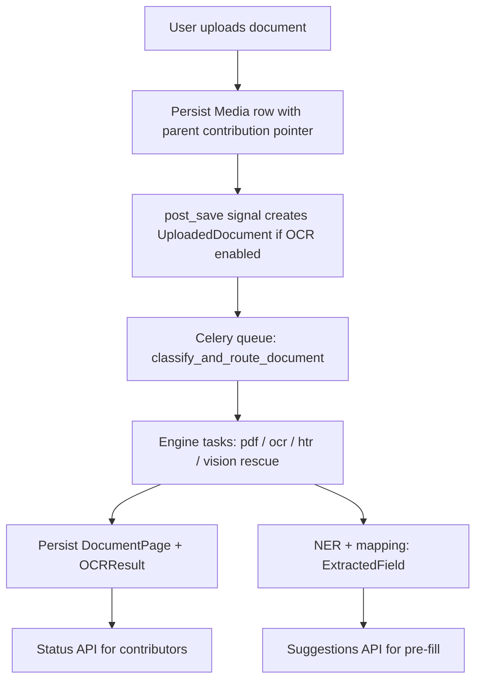

# Implementation Plan: OCR async pipeline (heritage documents)

**Branch**: `001-ocr-async-pipeline` | **Date**: 2026-04-18 | **Spec**: `specs/001-ocr-async-pipeline/spec.md`  
**Input**: Feature specification from `specs/001-ocr-async-pipeline/spec.md`

## Summary

Deliver an end-to-end, asynchronous OCR + structuring pipeline for heritage documents that:

- Triggers on document upload, processes work out-of-band, persists auditable per-page and per-engine outputs, and produces “form pre-fill suggestions” with confidence.
- Exposes a versioned, authenticated API for contributors to poll processing status and fetch extracted field suggestions, without blocking uploads.
- Provides staff/admin operational controls (status visibility, retry).

**Key repo fact** (drives the plan): the existing OCR trigger is a `post_save` signal on `heritage_data.Media` (`heritage_graph/apps/document_processing/signals.py`), but `Media` is currently **always attached to a legacy `Submission`**. The modern `CulturalEntity` flow stores payload data as JSON in revisions and (today) has **no first-class file upload model**, so the implementation must add an explicit, authenticated upload path and link it to a `CulturalEntity` (and/or `Submission` for legacy).

## Technical Context

**Language/Version**: Python 3.13 (Django/DRF), TypeScript (Next.js 15 / React 19)  
**Primary Dependencies**: Celery, Redis, existing OCR task skeletons in `apps.document_processing` plus heavy deps split in `requirements-ocr.txt` (worker image)  
**Storage**: PostgreSQL (Django models) + `FileField` media storage (uploaded binaries) + Redis (broker/results)  
**Testing**: `python manage.py test` (start with `apps.document_processing` tests + targeted integration tests)  
**Target Platform**: Linux containers (docker-compose / deployment environments), separate `ocr-worker` service in compose  
**Project Type**: web application (Django API + Next.js UI)  
**Performance Goals (initial)**:
- Upload HTTP path remains responsive: enqueue work in seconds, not minutes.
- OCR throughput scales horizontally by adding `ocr-worker` capacity (queue depth is acceptable transient state).
- Hard caps prevent pathological runtimes: max pages per document, max file size, max “vision rescue” invocations.
**Constraints**:
- No secrets in repo; new config vars in `.env.example` only.
- UI uses `process.env.NEXT_PUBLIC_*` base URLs (no hardcoded `localhost`).
- Google bearer token contract for protected endpoints in production.
- OCR dependencies primarily run in the worker image, keep API image lean.
**Scale/Scope (initial deliverable)**:
- PDFs + common raster formats used in contributions (`.pdf`, `.jpg`, `.png`, `.tif`, `.webp`).
- Mixed Devanagari/Latin is in-scope for routing/fallback; “perfect accuracy” is explicitly not a gate—confidence + human review is.

## Constitution Check

*GATE: Must pass before Phase 0 research. Re-check after Phase 1 design.*

**Pre-Phase-0 / Post-Phase-1 status: PASS (no waivers).**

- **Secrets & config**: OCR keys (e.g., third-party “vision” providers) and Celery/Redis must remain env-driven; `.env.example` must list any new variables. Frontend API base URL must remain env-driven.
- **Conventions**: Implement as DRF viewsets + `DefaultRouter` in `apps/document_processing/urls.py` and wire into the existing versioned include patterns. Frontend changes follow App Router + shadcn “wrap, don’t fork primitives” guidance.
- **Auth contract**: contributor endpoints require auth and verify access to the parent contribution object(s); avoid exposing other users’ uploads.
- **Quality gates**: ruff/TS build expectations apply to all touched code.
- **Deployability**: reuse existing `redis` + `ocr-worker` topology; if schema changes, ship reversible migrations and document rollout/ops expectations.

**Post-design notes** (Phase 1 outputs): the API contracts are versioned per `API_VERSIONING.md` and avoid breaking existing legacy routes.

## Project Structure

### Documentation (this feature)

```text
specs/001-ocr-async-pipeline/
├── plan.md
├── research.md
├── data-model.md
├── quickstart.md
├── contracts/
│   └── openapi-ocr-documents.v1.yaml
└── (generated later by /speckit.tasks) tasks.md
```

### Source Code (repository root)

```text
heritage_graph/
├── celery.py
├── settings/
│   ├── base.py
│   ├── development.py
│   └── production.py
├── apps/
│   ├── document_processing/
│   │   ├── models.py
│   │   ├── tasks.py
│   │   ├── signals.py
│   │   ├── admin.py
│   │   └── (planned) services/
│   └── heritage_data/
│       ├── models.py            # today: `Media` is submission-only; planned change for entity uploads
│       ├── views.py
│       └── urls.py
heritage_graph_ui/
└── src/
    ├── app/(dashboard)/contribute/...   # add document upload + polling UI in relevant flows
    ├── components/...                   # shadcn-wrapped field suggestions UI
    └── lib/api-client.ts
docker-compose.yml                       # redis + ocr-worker already present
Dockerfile.backend                       # runtime-lean + ocr-worker targets
```

**Structure Decision**: Implement backend work primarily in `apps.document_processing` (OCR + extraction + API), with a small, explicit extension to `heritage_data` to attach uploaded documents to `CulturalEntity` (or another contribution parent) in a way compatible with the existing `UploadedDocument` ↔ `Media` one-to-one relationship. Implement UI work in `heritage_graph_ui` in the active contribute flows, using the existing `NEXT_PUBLIC_API_URL` client patterns.

## Complexity Tracking

> **Fill ONLY if Constitution Check has violations that must be justified**

| Violation | Why Needed | Simpler Alternative Rejected Because |
|-----------|------------|-------------------------------------|
| (none) |  |  |

## Phase 0: Research (outputs)

**Artifact**: `specs/001-ocr-async-pipeline/research.md`

Consolidated decisions for routing (digital PDF vs scan), engine fallback, cost caps, and the contribution-upload integration approach.

## Phase 1: Design (outputs)

**Artifacts**:
- `specs/001-ocr-async-pipeline/data-model.md` — state transitions + data retention rules + permission model
- `specs/001-ocr-async-pipeline/contracts/openapi-ocr-documents.v1.yaml` — versioned v1 contract sketch for status + suggestions endpoints
- `specs/001-ocr-async-pipeline/quickstart.md` — how to run worker locally/docker and validate end-to-end

## Work breakdown (implementation)

### 1) Fix the “CulturalEntity upload” gap (foundational)

- **Problem**: `Media` requires a `Submission` today, but `CulturalEntity` does not have an equivalent `FileField` attach point.
- **Target behavior**: uploading a document during a `CulturalEntity` contribution creates a `heritage_data.Media` row (or a renamed successor model) with a **nullable** legacy submission FK + a **new nullable** `cultural_entity` FK (or an equivalent explicit parent pointer), with validation enforcing exactly one parent.
- **OCR link**: `UploadedDocument` remains `OneToOne` with `Media` to avoid a larger redesign.

### 2) Implement the asynchronous pipeline in `document_processing` tasks

- **State machine**:
  - `pending` → `processing` → `completed` | `failed` (no silent “stuck in processing” without timeout/repair story)
- **Core modules** (suggested module split inside `document_processing/`, not committed by this plan step):
  - `classifier.py` — file sniffing, PDF text presence checks, heuristics for “likely inscription / handwritten”
  - `pdf.py` — `pdfplumber` extraction, page split, per-page `DocumentPage` + `OCRResult`
  - `raster_ocr.py` — Tesseract + fallbacks, converts PDFs to page images as needed
  - `htr.py` — handwritten path (isolated; heavy)
  - `vision_rescue.py` — last resort, strict budget + audit metadata
  - `ner.py` + `form_mapping.py` — structured extraction; persist `ExtractedField`
- **Celery orchestration**:
  - `classify_and_route_document` chains tasks, routes engine tasks, and schedules post-processing
  - Ensure retries do not create duplicate `DocumentPage` rows (use idempotent “upsert page” pattern).

### 3) API (DRF) — versioned, authenticated, minimal

- **Status**: e.g. `GET /api/v1/data/ocr-documents/{uploaded_document_id}/`
- **Pre-fill package**: e.g. `GET /api/v1/data/ocr-documents/{uploaded_document_id}/suggestions/`
- **Optional staff**: retry endpoint (admin/reviewer only) to re-queue with explicit audit entry

**Contract sketch**: `specs/001-ocr-async-pipeline/contracts/openapi-ocr-documents.v1.yaml`

### 4) UI integration (shadcn-wrapped, env-driven)

- **Upload** UX on relevant contribute pages: multipart upload, show background processing state.
- **Form suggestions UI**: read suggestions JSON, show confidence as labels/badges (use existing `globals.css` variable styling patterns), and never clobber user edits.
- Polling with backoff; handle auth failures with existing API error message helpers.

### 5) Operations + security

- Log structured events with document IDs, engine names, durations, and error classes—**not** file contents, not tokens, minimal PII.
- Enforce max pages, max file size, max “vision” calls, and a timeout policy.

### 6) Testing

- **Unit** tests: classifier decisions with gold fixtures, mapping logic, and permission checks.
- **Integration** tests: enqueue path + API retrieval + “no access for other user”.

## Mermaid: pipeline data flow (high level)



## Post-Design Constitution Check (Phase 1)

- **Versioned APIs**: new endpoints are proposed under `/api/v1/.../data/...` per `API_VERSIONING.md`.
- **Secrets/PII logging**: “vision” integration must be optional and rate-limited; no raw tokens in logs.
- **Migrations/rollout**: if `Media` parent pointers change, document backfill/compat expectations in `data-model.md`.
