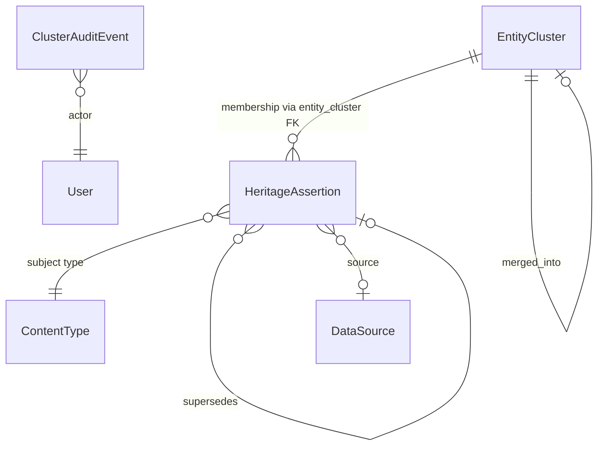

# Data Model: Identity Layer (Claim-First)

**Feature**: [spec.md](./spec.md)  
**Date**: 2026-04-25  
**Prerequisite**: [research.md](./research.md)

## Overview

Identity is modeled in **two** durable tables (`EntityCluster`, `ClusterAuditEvent`) plus **reuse** of `HeritageAssertion` for same-referent **membership** rows (see R-001). Optional queue table `IdentityResolutionCandidate` supports the workspace (R-006).

## EntityCluster

| Field | Type | Notes |
| --- | --- | --- |
| `id` | UUID PK | Default `uuid4`, `editable=False` |
| `canonical_label` | `CharField` (e.g. 500) | Human display; moderator editable |
| `type_scope` | `CharField` (e.g. 100) | **Must** match `ContentType.model` for subjects in this cluster (e.g. `person`) |
| `locked` | `BooleanField` default False | When True, merge-in denied for non-moderators |
| `notes` | `TextField` blank | Internal curator notes |
| `version` | `PositiveIntegerField` default 0 | Optimistic concurrency (R-007) |
| `merged_into` | FK `self` null, SET_NULL | Set when cluster absorbed into another; row retained for history |
| `created_at` / `updated_at` | `DateTimeField` | Auto |
| Meta | `db_table` explicit | Per constitution |

**Validation**:

- `type_scope` immutable after create (or only mutable by staff) to prevent cross-class drift.
- Cannot set `merged_into` to self.

**Indexes**: `(type_scope, locked)`, `(merged_into)`.

## HeritageAssertion (extensions)

New field:

| Field | Type | Notes |
| --- | --- | --- |
| `entity_cluster` | FK `EntityCluster` null, PROTECT or SET_NULL | **Null** for non–identity-row assertions. **Required** when `asserted_property == identity.same_referent` |

**Membership row invariants** (enforced in `clean()` / serializer):

- `asserted_property == IDENTITY_SAME_REFERENT_PROPERTY`
- `content_type` + `object_id` required; subject model’s `ContentType.model` must equal cluster’s `type_scope`
- `entity_cluster` required
- **Competing state**: if more than one **accepted**, non-superseded membership row exists for the same subject with **different** `entity_cluster_id`, derivation returns a **conflict** flag (FR-016); normal operation expects reviewers to avoid double-accept without moderator resolution, but the data model allows it for epistemic honesty.

**Indexes**: add `(asserted_property, entity_cluster_id)` composite for member listing.

## ClusterAuditEvent

Append-only audit rows.

| Field | Type | Notes |
| --- | --- | --- |
| `id` | UUID PK | |
| `action` | `CharField` choices | `merge`, `split`, `lock`, `unlock`, `lock_override_merge`, … |
| `actor` | FK `User` | Required |
| `reason` | `TextField` blank | Required for destructive actions (policy in serializer) |
| `before_state` | `JSONField` | Cluster ids, assertion ids, labels snapshot |
| `after_state` | `JSONField` | |
| `affected_cluster_ids` | `JSONField` array of UUID strings | Denormalized for filtering |
| `affected_assertion_ids` | `JSONField` array of UUID strings | |
| `created_at` | `DateTimeField` `auto_now_add` | **No** `updated_at` |

**API**: create-only; no update/delete ViewSet actions.

## IdentityResolutionCandidate (optional v1, recommended)

| Field | Type | Notes |
| --- | --- | --- |
| `id` | UUID PK | |
| `left_content_type` | FK ContentType | |
| `left_object_id` | PositiveIntegerField | |
| `right_content_type` | FK ContentType | |
| `right_object_id` | PositiveIntegerField | |
| `signal_scores` | JSONField | e.g. `{"title_jaccard": 0.86}` |
| `status` | CharField | `open`, `accepted`, `rejected`, `deferred` |
| `notes` | TextField blank | Reviewer defer notes |
| `resolved_by` | FK User null | |
| `resolved_at` | DateTimeField null | |
| `created_at` / `updated_at` | DateTimeField | |

**Constraint**: same `type_scope` for left and right in validation.

## Bootstrap (FR-010–FR-011)

For each model in the heritage assertion patch list ([models.py loop](../../heritage_graph/apps/cidoc_data/models.py) — `Person`, `Location`, `ArchitecturalStructure`, …):

1. For each row, create `EntityCluster(type_scope=model._meta.model_name, canonical_label=row’s primary title/name field best effort)`.
2. Create one `HeritageAssertion`: property `identity.same_referent`, subject = row, `entity_cluster` = new cluster, `reconciliation_status=accepted`, system `DataSource` or null source per policy, `contributed_by` system.

Command: `manage.py bootstrap_identity_clusters` idempotent by checking existing membership assertion for `(content_type, object_id)`.

## Derived membership (read model)

**Active cluster for entity E**: single query — `HeritageAssertion` where subject=E, property=`identity.same_referent`, `reconciliation_status=accepted`, `supersedes` is null **or** latest in chain (define “winning” row as leaf of supersede tree not superseded by another). If two **accepted** leaves with **different** `entity_cluster_id` → **competing** state (FR-016).

## State transitions (membership assertion)

- `pending` → `accepted` / `disputed` (reviewer)
- `accepted` → `superseded` (implicit via new row)
- Disputed rows excluded from canonical derivation

## Migrations

- Add tables + columns with reversible migrations.
- Data migration: bootstrap command may run post-deploy (document in quickstart) to avoid huge migration transaction in large DBs.
