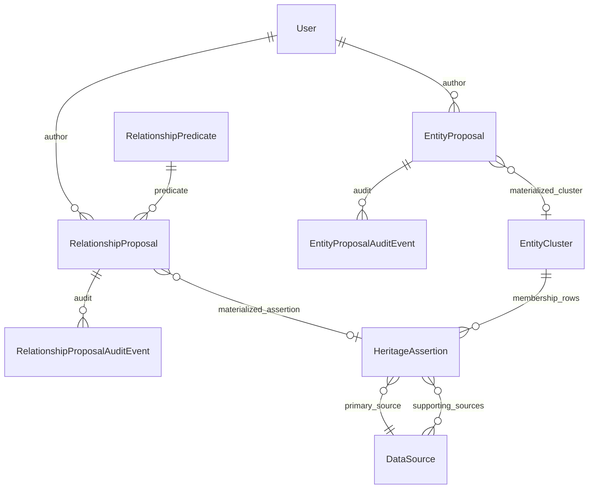

# Data Model: Entity & Relationship Proposals (007)

**Spec**: [spec.md](./spec.md)  
**Date**: 2026-05-04

## ER Overview

## EntityProposal (`heritage_data`)

| Field | Type | Notes |
| --- | --- | --- |
| `id` | UUID PK | |
| `author_id` | FK User | |
| `status` | enum | draft, submitted, approved, rejected, withdrawn |
| `canonical_label` | CharField | Target cluster display label |
| `aliases` | JSONField list[str] | Curated aliases → `EntityCluster.curated_aliases` |
| `type_scope` | CharField | Must match `ContentType.model` (e.g. `person`) |
| `anchor_records` | JSONField | `[{"entity_type":"person","entity_id":1}, …]` CIDOC anchors |
| `supporting_source_ids` | JSONField list[uuid str] | DataSource UUIDs; first used as primary on membership rows |
| `contributor_note` | TextField | |
| `external_identifiers` | JSONField dict | e.g. `{"wikidata":"Q11732"}` → cluster |
| `resolution_mode` | CharField | `new_cluster` \| `link_existing` |
| `existing_cluster_id` | UUID null | Required when `link_existing` |
| `moderator_comment` | TextField | |
| `materialized_cluster_id` | UUID null | Set after approve |
| timestamps | | submitted_at, resolved_at, created_at, updated_at |

## RelationshipProposal (`heritage_data`)

| Field | Type | Notes |
| --- | --- | --- |
| `id` | UUID PK | |
| `author_id` | FK User | |
| `status` | enum | same as entity proposals |
| `predicate_id` | FK RelationshipPredicate | |
| `subject_entity_type` | CharField | CT model string |
| `subject_entity_id` | PositiveIntegerField | |
| `object_entity_type` | CharField | |
| `object_entity_id` | PositiveIntegerField | |
| `primary_source_id` | FK DataSource | Required |
| `supporting_source_ids` | JSONField list[uuid] | Hydrated to M2M on materialize |
| `temporal_scope_edtf` | CharField blank | |
| `confidence` | CharField | Uses `HeritageAssertion` confidence choices |
| `interpretation_note` | TextField | Maps to `assertion_content` / notes |
| `moderator_comment` | TextField | |
| `materialized_assertion_id` | UUID null | |
| timestamps | | |

## RelationshipPredicate (`cidoc_data`)

| Field | Type | Notes |
| --- | --- | --- |
| `id` | UUID PK | |
| `code` | slug unique | e.g. `ruled`, `authored` |
| `label` | CharField | |
| `description` | TextField blank | |
| `active` | Boolean | |
| `sort_order` | PositiveSmallInteger | |

## EntityCluster extensions

- `curated_aliases` — JSONField default `[]`
- `external_identifiers` — JSONField default `{}`

## HeritageAssertion extensions

- `object_content_type` — FK `ContentType` null  
- `object_object_id` — PositiveIntegerField null  
- Generic FK **`asserts_object`** — pair with subject `asserts_about`  
- `temporal_scope_edtf` — TextField blank  
- `supporting_sources` — M2M `DataSource` (secondary evidence)

**Invariant**: Rows with `asserted_property` matching `relationship.*` must have subject + object + primary `source`.

## Audit

- `EntityProposalAuditEvent` — FK `EntityProposal`, actor, action, from/to status, comment, created_at  
- `RelationshipProposalAuditEvent` — same shape  

Append-only via API (no update/delete routes).
